- [为那些想了解底层的人创建C编译器的简介](#为那些想了解底层的人创建c编译器的简介)
  - [介绍](#介绍)
    - [本书中的符号](#本书中的符号)
    - [本文档假定的开发环境](#本文档假定的开发环境)
    - [关于作者](#关于作者)
  - [机器语言和汇编器](#机器语言和汇编器)
    - [CPU和内存](#cpu和内存)
    - [什么是汇编器？](#什么是汇编器)
    - [C及其对应的汇编器](#c及其对应的汇编器)
      - [简单的例子](#简单的例子)
      - [涉及函数调用的示例](#涉及函数调用的示例)
    - [本章小结](#本章小结)
  - [计算器级语言创建](#计算器级语言创建)
    - [步骤1：创建一种语言来编译一个整数](#步骤1创建一种语言来编译一个整数)
      - [创建编译器主体](#创建编译器主体)
      - [创建自动化测试](#创建自动化测试)
      - [用make构建](#用make构建)
      - [用git进行版本控制](#用git进行版本控制)
    - [步骤2：创建一个可以加减的编译器](#步骤2创建一个可以加减的编译器)
    - [步骤3：介绍词法分析器](#步骤3介绍词法分析器)
    - [步骤4：改善错误讯息](#步骤4改善错误讯息)
    - [语法描述方法和递归下降解析](#语法描述方法和递归下降解析)
      - [用树形结构表示语法结构](#用树形结构表示语法结构)
      - [通过生产规则定义语法](#通过生产规则定义语法)
      - [BNF生产规则说明](#bnf生产规则说明)
      - [简单的生产规则](#简单的生产规则)
      - [用生产规则表示操作员优先级](#用生产规则表示操作员优先级)
      - [生产规则，包括递归](#生产规则包括递归)
      - [递归下降解析](#递归下降解析)
    - [堆栈机](#堆栈机)
      - [堆栈机概念](#堆栈机概念)
      - [编译到堆栈机](#编译到堆栈机)
      - [如何在x86-64上实现堆栈机](#如何在x86-64上实现堆栈机)
    - [步骤5：创建一种可以执行四种算术运算的语言](#步骤5创建一种可以执行四种算术运算的语言)
    - [步骤6：一元加号和一元减号](#步骤6一元加号和一元减号)
    - [步骤7：比较运算子](#步骤7比较运算子)
      - [更改token生成器](#更改token生成器)
      - [新语法](#新语法)
      - [汇编代码生成](#汇编代码生成)
  - [拆分编译和链接](#拆分编译和链接)
    - [什么是拆分编译？](#什么是拆分编译)
      - [拆分编译及其需求](#拆分编译及其需求)
      - [对头文件及其内容的需求](#对头文件及其内容的需求)
      - [链接错误](#链接错误)
      - [全局变量的声明和定义](#全局变量的声明和定义)
  - [C标准库和存档文件](#c标准库和存档文件)
    - [步骤8：文件拆分和Makefile修改](#步骤8文件拆分和makefile修改)
      - [文件分割](#文件分割)
      - [Makefile更改](#makefile更改)
  - [函数和局部变量](#函数和局部变量)
    - [步骤9：1个字符的局部变量](#步骤91个字符的局部变量)
      - [堆栈上的可变区域](#堆栈上的可变区域)
      - [更改token生成器](#更改token生成器-1)
      - [变更解析器](#变更解析器)
      - [左值和右值](#左值和右值)
      - [如何从任何地址加载值](#如何从任何地址加载值)
      - [代码生成器更改](#代码生成器更改)
      - [变更主要功能](#变更主要功能)
    - [步骤10：多字符局部变量](#步骤10多字符局部变量)
    - [第11步：返回语句](#第11步返回语句)
    - [1973 C编译器](#1973-c编译器)
    - [步骤12：添加控件语法](#步骤12添加控件语法)
    - [步骤13：封锁](#步骤13封锁)
    - [步骤14：响应函数调用](#步骤14响应函数调用)
    - [步骤15：对应于功能定义](#步骤15对应于功能定义)
    - [二进制级接口](#二进制级接口)
  - [计算机中整数的表示](#计算机中整数的表示)
    - [无符号整数](#无符号整数)
    - [有符号整数](#有符号整数)
    - [标志扩展](#标志扩展)
    - [反转符号](#反转符号)
  - [指针和字符串文字](#指针和字符串文字)
    - [步骤16：一元与一元*](#步骤16一元与一元)
    - [步骤17：取消隐式变量定义，并引入关键字int](#步骤17取消隐式变量定义并引入关键字int)
    - [步骤18：介绍指针类型](#步骤18介绍指针类型)
      - [定义代表指针的类型](#定义代表指针的类型)
      - [分配给指针指向的值](#分配给指针指向的值)
    - [步骤19：实现指针的加法和减法](#步骤19实现指针的加法和减法)
    - [第20步：sizeof运算符](#第20步sizeof运算符)
    - [步骤21：实现数组](#步骤21实现数组)
      - [定义数组类型](#定义数组类型)
      - [实现从数组到指针的隐式类型转换](#实现从数组到指针的隐式类型转换)
    - [步骤22：实现数组下标](#步骤22实现数组下标)
    - [步骤23：实现全局变量](#步骤23实现全局变量)
    - [步骤24：实现字符类型](#步骤24实现字符类型)
    - [步骤25：实现字符串文字](#步骤25实现字符串文字)
    - [步骤26：从文件中读取输入](#步骤26从文件中读取输入)
    - [第27步：逐行注释](#第27步逐行注释)
    - [步骤28：用C重写测试](#步骤28用c重写测试)
  - [程序执行映像和初始化公式](#程序执行映像和初始化公式)
    - [可执行文件结构](#可执行文件结构)
    - [数据段内容](#数据段内容)
    - [初始化公式语法](#初始化公式语法)
    - [全局变量初始化表达式](#全局变量初始化表达式)
    - [局部变量初始化表达式](#局部变量初始化表达式)
  - [第29步及以后：[需要添加]](#第29步及以后需要添加)
  - [静态和动态链接](#静态和动态链接)
    - [静态链接](#静态链接)
  - [C类型语法](#c类型语法)
    - [该图显示了类型](#该图显示了类型)
    - [类型符号](#类型符号)
    - [如何阅读C型](#如何阅读c型)
      - [如何读取非嵌套类型](#如何读取非嵌套类型)
      - [如何读取嵌套类型](#如何读取嵌套类型)
    - [练习题](#练习题)
  - [综上所述](#综上所述)
  - [附录1：x86-64指令集备忘单](#附录1x86-64指令集备忘单)
    - [整数寄存器列表](#整数寄存器列表)
    - [记忆体存取](#记忆体存取)
    - [函数调用](#函数调用)
    - [条件分支](#条件分支)
    - [有条件的分配](#有条件的分配)
    - [整数/逻辑运算](#整数逻辑运算)
  - [附录2：使用Git进行版本控制](#附录2使用git进行版本控制)
    - [使用Git的工作流程](#使用git的工作流程)
    - [提交时要记住的事情](#提交时要记住的事情)
    - [Git的内部结构](#git的内部结构)
  - [附录3：使用Docker创建开发环境](#附录3使用docker创建开发环境)
    - [设定程序](#设定程序)
    - [用容器构建](#用容器构建)
    - [将新应用添加到容器](#将新应用添加到容器)

# 为那些想了解底层的人创建C编译器的简介

## 介绍

这本在线书正在编写中。它不是完整版本。反馈表

本书包含一些内容，其中有些内容过于贪婪，无法包含在一本书中。在本文档中，我们将创建一个程序，该程序将用C语言编写的源代码转换为汇编语言，即C编译器。编译器本身也是使用C开发的。近期目标是能够使用自托管，自制的编译器来编译自己的源代码。

在本书中，我决定深入研究本书中的各个主题，以使解释编译器的难度不会太快。原因如下。

编译器在概念上可以分为多个阶段，例如解析，中间路径和代码生成。普通的教科书方法涉及对每个主题进行章节介绍和解释，但是采用这种方法的书往往太狭窄和太深而无法跟上读者的步伐。

同样，对于每个阶段创建的开发方法，您都无法在所有阶段完成之前尝试运行编译器，因此，即使您的理解或代码在整个过程开始之前都是决定性的错误，您也可以注意到它。完成。首先，在我自己完成之前，我不知道下一阶段的预期输入是什么，因此我不知道上一阶段的输出。另一个问题是，很难保持动力，因为在完成代码之前，您无法编译任何代码。

在这本书中，我决定采用另一种方法来避免这种陷阱。在本书的前面，读者将使用非常简单的语言规范来实现“专有语言”。该语言非常简单，以至于您无需在实现编译器时就知道如何制作它。然后，读者将在本书中为“专有语言”添加功能，最终将其开发为与C匹配。

使用这种增量开发方法，您必须在进行精细提交的同时逐步进行编译器。从某种意义上说，在这种开发方法中，编译器总是在每次提交中“完成”。在某个阶段，它可能只是计算器级别，在某个阶段，它可能是C的一个相当有限的子集，在另一个阶段，它可能是几乎是C的语言，依此类推。关键是，在任何阶段，我们的目标都是要使用一种具有合理规格的语言，使其与当时的完善程度相匹配。在开发过程中，我们不会使某些功能脱颖而出并使它们成为C语言。

我们还将根据开发阶段依次说明数据结构，算法和计算机科学知识。

渐进式的开发将使您在阅读本书的任何时候都能全面了解如何在该级别上构建合理的语言。这比仅编译器创建的某些主题的极端偏见和详细状态要好得多。到本书结尾，您将对所有主题都有很好的了解。

这本书也是一本解释如何从头开始编写大型程序的书。编写大型程序的技能是一种独特的技能，与学习数据结构和算法不同，但是我认为没有很多书籍可以解释这种情况。另外，即使您对其进行了说明，除非您实际体验到它，否则您将无法理解开发方法的优缺点。本书的设计目的是使您将自己的语言开发为C的过程是一种良好开发方法的真实体验。

如果作者的计划成功了，那么通过阅读本书，读者不仅将了解编译器创建技术和CPU指令集，而且还将了解如何以小步长和软件方式编写大型程序，还应该学习测试技术，版本控制技术，甚至在进行雄心勃勃的项目（例如编译器编写）时的心态。

本书的目标读者是普通的C程序员。您不必是熟悉C语言规范的Super C程序员。如果您了解指针和数组，并且至少可以长时间阅读其他人编写的小型C程序，就足够了。

在编写本书时，我试图尽可能多地解释为什么选择这种设计，而不仅仅是解释语言规范和CPU规范。我还尝试通过使读者感兴趣的有关编译器，CPU，计算机行业及其历史的专栏来使阅读变得有趣。

创建一个编译器很有趣。最初，我自己的语言（仅是非常简单的一种语言）在我继续开发时迅速发展成为令人惊讶的C语言，因此它就像魔术一样工作。在实际开发中，令人惊讶的是，当时似乎编译不好的大型测试代码可以正确编译，并且不会出错。通过查看编译后的程序集，我无法立即理解此类代码。有时，您甚至可能会觉得编译器比作者具有更多的智能。即使您知道编译器是如何工作的，它还是一个使您怀疑为什么它如此工作的程序。我相信您一定会对它的魅力着迷。

现在，以此为序，让我们与作者一起深入了解编译器开发的世界！

>专栏：为什么使用C语言
>
>您为什么在本书中选择众多编程语言中的C？还是为什么不使用自己的语言？在这方面，绝对没有理由使用C，但是如果您必须选择某种语言来学习如何制作输出本机代码的编译器，则C不是一个非常合理的选择，我认为这是其中之一。
>
>您无法了解很多有关解释语言中的低层的知识。另一方面，在C语言中，通常将其编译为程序集，因此，通过创建编译器，您可以与C本身同时了解CPU的指令集和程序操作的机制。
>
>C的使用如此广泛，以至于编译器工作之后，您就可以编译并使用从网上下载的第三方源代码。例如，您可以构建并播放迷你Unix xv6。如果编译器足够成熟，那么您甚至应该能够编译Linux内核。在次要语言或自制语言中是不可能实现这种享受的。
>
>C++是一种静态类型的语言，可以编译为类似于C的本机语言，并且至少与C一样广泛地使用。但是，C ++具有如此庞大的语言规范，以致不可能轻易地创建一个自制的编译器，而且这不是一个现实的选择。
>
>在提高语言的设计感方面，设计和实现原始语言是不错的选择，但同时也有其缺陷。如果实现起来很麻烦，则可以通过在语言规范中避免实现来避免实现。对于像C这样的语言却不是这样，这些语言具有标准的语言规范。我认为在学习方面，约束力相对较好。

### 本书中的符号

函数或表达式（例如文本中的命令main或foo=3）make将以等宽字体显示，依此类推。

多行代码使用等宽字体显示在框架中，如下所示。

```c
int main() {
  printf("Hello world!\n");
  return 0;
}
```

对于打算由用户直接输入框架代码的Shell命令，以$开头的行表示提示。$在外壳中输入该行之后的行（$不要输入）。$除代表您输入的命令的输出外的其他行。例如，以下块是用户make输入字符串并按Enter时的执行示例。make命令的输出make: Nothing to be done for `all'.是。

```
$ make
make: Nothing to be done for `all'.
```

### 本文档假定的开发环境

本文档假定运行在所谓的普通PC（例如Intel和AMD）上的64位Linux环境。请安装诸如gcc之类的开发工具，并根据您使用的发行版进行预先制作。如果使用的是Ubuntu，则可以通过执行以下命令来安装本手册中使用的命令。

```
$ sudo apt update
$ sudo apt install -y gcc make git binutils libc6-dev
```

尽管macOS在汇编源代码级别与Linux相当兼容，但它并不完全兼容（具体来说，它不支持称为“静态链接”的功能）。根据本书的内容为macOS创建C编译器并不是没有可能，但是当您尝试使用它时，将会遭受各种详细的不兼容问题。不建议学习同时创建C编译器的技术以及macOS和Linux之间的差异。如果出了什么问题，很难说出哪一个是错的。

因此，本文档不包括macOS。对于macOS，请使用某种虚拟环境准备Linux环境。如果您不熟悉Linux虚拟环境，请参阅附录3了解如何使用Docker创建开发环境。

Windows在程序集源级别与Linux不兼容。但是，使用Windows 10可以像在单个应用程序上一样在Windows上运行Linux，并且通过使用它，可以继续在Windows上进行开发。Linux兼容环境是一个名为Windows Linux子系统（WSL）的应用程序。在Windows上练习本手册的内容时，请安装WSL并继续进行开发。

>专栏：交叉编译器
>
>运行编译器的计算机称为“主机”，运行编译器输出的代码的计算机称为“目标”。在本文档中，两者都是64位Linux环境，但是主机和目标不一定必须相同。
>
>具有不同主机和目标的编译器称为交叉编译器。例如，在运行Raspberry Pi可执行文件的Windows上运行的编译器是交叉编译器。当目标计算机性能较差或专用于运行编译器时，通常会使用交叉编译器。

### 关于作者

上山（@ rui314）。快速链接器lld的原始作者和当前维护者是lld的标准链接器，用于在许多操作系统和项目上创建可执行文件，例如Android（版本Q和更高版本），FreeBSD（12和更高版本），Nintendo Switch，Chrome和Firefox。它已被采用（因此，由我编写的工具创建的二进制文件很可能在您的计算机上）。他还是紧凑型C编译器8cc的作者。作文主要是关于要编写的软件说明。

>列：编译器，可编译一个编译器
>
>自我引用的情况（例如用C编写的C编译器）并不罕见。除了C之外，许多语言实现都是使用语言本身编写的。
>
>如果您已经具有X语言的实现，那么使用该语言本身创建新的X编译器就没有逻辑上的矛盾。如果您想自我托管，则可以简单地使用现有的编译器进行开发，并在完成编译后进行切换。这正是我们在本书中试图做的。
>
>但是，如果您没有现有的编译器怎么办？当时，我别无选择，只能用另一种语言写东西。当出于自托管的目的为X语言编写第一个编译器时，您需要使用不同于X的现有Y语言编写，而当编译器更完整时，则需要从Y重写编译器本身。语言到X语言。
>
>回到现代复杂编程语言的编译器，再用另一种编译器编译该语言的实现，依此类推，最终在计算机的早期人们直接使用了机器语言。你写了。我不知道汇编程序（某种意义上说是所有现有语言实现的最终祖先）是单个还是多个，但是毫无疑问，当前的编译器以很少的祖先开始。非编译器可执行文件通常是编译器生成的文件，因此几乎所有现有的可执行文件都是其原始汇编程序的间接后代。这是一个有趣的故事，就像生命的起源一样。

## 机器语言和汇编器

本章的目的是对构成计算机的组件以及应该从我们创建的C编译器输出的代码有一个大概的了解。我还没有深入了解具体的CPU指令。首先，了解该概念很重要。

### CPU和内存

组成计算机的组件可以大致分为CPU和内存。内存是可以保存数据的设备，CPU是在读取和写入内存时执行某些处理的设备。

从概念上讲，对于CPU来说，内存看起来就像是一个由大量可随机访问的字节组成的数组。当CPU访问内存时，将以数字方式指定有关要访问的内存字节数的信息，该数字值称为“地址”。例如，“从地址16到8字节读取数据”表示从存储器的第16个字节读取8个字节的数据，这看起来像一个字节数组。有时将同一件事称为“从地址16读取8个字节的数据”。

CPU执行的程序以及程序读取和写入的数据都存储在内存中。CPU将“当前正在执行的指令的地址”保存在CPU内，从该地址读取指令，在该地址执行写操作，然后读取并执行下一条指令。当前正在执行的指令的地址称为“程序计数器”（PC）或“指令指针”（IP）。将要由CPU执行的程序的形式本身称为“机器语言”（机器代码）。

程序计数器并不总是线性地前进到下一条指令。CPU“分支指令”类型的指令可用于将程序计数器设置为除以下指令以外的任何地址。此函数实现if语句和循环。将程序计数器设置到下一条指令以外的位置称为“跳转”或“分支”。

除了程序计数器外，CPU还具有少量的数据存储区。例如，Intel和AMD处理器具有16个区域，可以容纳64位整数。该区域称为“寄存器”。内存是CPU的外部设备，需要花费一些时间进行读取和写入，但是寄存器位于CPU内部，可以无延迟地进行访问。

许多机器语言都有一种格式，其中两个寄存器的值用于执行某些操作，并将结果写回到寄存器中。因此，在执行程序时，CPU从存储器中读取数据到寄存器中，在寄存器之间执行一些操作，然后将结果写回到存储器中，以便执行继续进行。

特定机器语言的指令统称为“指令集体系结构”（ISA）或“指令集”。不仅有一种指令集，而且您可以根据需要为每个CPU设计指令集。但是，指令集没有太多变化，因为没有机器语言兼容性就无法运行同一程序。PC使用Intel及其兼容芯片制造商AMD的称为x86-64的指令集。x86-64是主要的指令集之一，但x86-64并不是唯一一个主导市场的指令集。例如，iPhone和Android使用称为ARM的指令集。

>列：x86-64指令集名称
>
>x86-64有时被称为AMD64，Intel 64，x64等。历史上有这样一个事实，即同一指令集以这种方式具有多个名称。
>
>x86指令集由英特尔在1978年创建，但AMD将其扩展到64位。在2000年左右，当需要64位处理器时，英特尔正在全公司范围内开发一种全新的名为Itanium的指令集，而不敢在与之竞争的64位版本的x86上工作。借此机会，AMD制定并发布了64位版本x86的规范。那是x86-64。之后，AMD可能将x86-64重命名为AMD64，这可能是由于其品牌战略。
>
>在那之后，Itanium的失败就显而易见了，英特尔别无选择，只能制造64位版本的x86，但是到那时，已经有相当数量的实际AMD64芯片，所以类似。扩展指令集，英特尔已决定采用与AMD兼容的指令集。据说微软有压力要求保持兼容性。当时，英特尔采用了与AMD64几乎相同的指令集，名称为IA-32e。IA-32e（英特尔体系结构32扩展）的名称而不是64，似乎是通过不成功的指令集表明64位CPU的主要外壳是Itanium。之后，英特尔决定完全放弃Itanium，并将IA-32e重命名为通常的名称Intel 64。Microsoft讨厌太长的名称，或者称x86-64 x64。
>
>由于这些原因，x86-64具有许多不同的名称。
>
>开源项目通常更喜欢名称x86-64，其中不包含特定公司的名称。在本文档中，名称x86-64也被一致使用。

### 什么是汇编器？

由于机器语言是由CPU直接读取的，因此只考虑了CPU的便利性，而不考虑人类的操作便利性。如果不是不可能的话，用十六进制编辑器编写这些机器语言是一项艰巨的任务。组装工是在那里发明的。汇编语言是一种与机器语言一一对应的语言，但是人类比机器语言更容易阅读。

对于输出本机二进制文件而不是虚拟机或解释器的编译器，目标通常是输出程序集。看起来直接输出机器语言的编译器通常也会在输出汇编后在后台启动汇编器。本文档中创建的C编译器还输出程序集。

将汇编代码转换为机器语言有时是“编译的”，但有时特别是“汇编的”，以强调输入是汇编的。

读者可能在之前的某个地方看到过该组件。如果您还没有看到装配体，现在是个很好的时机。objdump使用命令来反汇编适当的可执行文件，并将该文件中包含的机器语言显示为程序集。以下是ls反汇编命令的结果。

```
$ objdump -d -M intel /bin/ls
/bin/ls:     file format elf64-x86-64

Disassembly of section .init:

0000000000003d58 <_init@@Base>:
  3d58:  48 83 ec 08           sub    rsp,0x8
  3d5c:  48 8b 05 7d b9 21 00  mov    rax,QWORD PTR [rip+0x21b97d]
  3d63:  48 85 c0              test   rax,rax
  3d66:  74 02                 je     366a <_init@@Base+0x12>
  3d68:  ff d0                 call   rax
  3d6a:  48 83 c4 08           add    rsp,0x8
  3d6e:  c3                    ret
...
```

在我的环境中，该ls命令包含约20,000种机器语言指令，因此反汇编的结果是一个长的指令，其中包含近20,000行。这里仅列出前几个。

每种机器语言的程序集基本上都由一行组成。让我们以下面的代码为例。

```
  3d58:  48 83 ec 08           sub    rsp,0x8
```

这行是什么意思？3d58是包含机器语言的内存地址。换句话说，ls执行该命令时，此行上的指令位于存储器的地址0x3d58中，并且当程序计数器为0x3d58时将执行该指令。接下来的四个十六进制数字是实际的机器语言。CPU读取该数据并作为指令执行。sub rsp,0x8那是与该机器指令相对应的程序集。CPU指令集将在不同的章节中进行说明，但是该指令是从称为RSP的寄存器中减去8（减=减）的指令。

### C及其对应的汇编器

#### 简单的例子

为了了解C编译器生成的内容，让我们将C代码与相应的汇编代码进行比较。考虑以下C程序为最简单的示例。

```c
int main() {
  return 42;
}
```

给定用于编写该程序的文件，您可以test1.c按如下所示对其进行编译，然后看到它main实际上返回了42。

```bash
$ cc -o test1 test1.c
$ ./test1
$ echo $?
42
```

在C语言中，main函数返回的值是整个程序的退出代码。该程序的退出代码将不被显示在屏幕上，但隐含的外壳$?，因为它是在一个名为变量设置，结束命令后，立即$?WOecho通过显示，查看命令我能做到这一点的退出代码。在这里您可以看到正确返回了42。

现在，与此C程序相对应的汇编程序如下。

```asm
.intel_syntax noprefix
.globl main
main:
        mov rax, 42
        ret
```

在此程序集中，main定义了全局标签，后跟main功能代码。在此，值42在寄存器RAX中设置main并从中返回。总共有16个寄存器可以保存整数，包括RAX，但是由于可以保证从函数返回时RAX中包含的值是函数的返回值，因此这里将其设置为RAX。它。

让我们实际组装并运行此组装程序。由于汇编文件的扩展名为，因此请在其中写入.s以上汇编代码test2.s并执行以下命令。

```sh
$ cc -o test2 test2.s
$ ./test2
$ echo $?
42
```

与C一样，42现在是退出代码。

粗略地说，C编译器是一种程序，test1.c它test2.s像读取C代码一样输出程序集。

#### 涉及函数调用的示例

作为一个稍微复杂的示例，让我们看一下将具有函数调用的代码转换为什么样的汇编。

函数调用不仅是跳转，还必须返回到被调用函数完成后最初执行的位置。最初执行的地址称为“返回地址”。如果只有一个函数调用，则返回地址应保存在CPU的相应寄存器中，但是由于可以尽可能深地进行函数调用，因此必须将返回地址保存在内存中。返回地址实际上存储在内存中的堆栈中。

只能使用一个保存栈顶地址的变量来实现栈。保持堆栈顶部的存储区域称为“堆栈指针”。x86-64支持仅堆栈指针寄存器，以及使用这些寄存器来支持使用函数进行编程的指令。将数据堆叠在堆栈上称为“推送”，而检索加载到堆栈上的数据称为“弹出”。

现在让我们看一个函数调用的例子。考虑下面的C代码。

```c
int plus(int x, int y) {
  return x + y;
}

int main() {
  return plus(3, 4);
}
```

与此C代码相对应的程序集如下所示：

```
.intel_syntax noprefix
.globl plus, main

plus:
        add rsi, rdi
        mov rax, rsi
        ret

main:
        mov rdi, 3
        mov rsi, 4
        call plus
        ret
```

第一行是指定程序集语法的指令。.globl从第二行开始的行告诉程序集，两个函数，plus和main对整个程序可见，而对文件范围不可见。暂时可以忽略这一点。

main请首先注意它。在C语言中，我们main从pluswith参数开始。在汇编器中，可以保证第一个参数将在RDI寄存器中，第二个参数将在RSI寄存器中，因此main值的精确设置在的前两行中。

call那就是调用函数的指令。具体来说，它call执行以下操作：

* call将下一条指令ret的地址（在这种情况下）压入堆栈
* call跳至作为以下参数的给定地址

因此，call执行该指令时，CPU将plus开始执行该功能。

plus注意功能。plus该功能有三个指令。

add是要添加的指令。在这种情况下，将RSI寄存器和RDI寄存器相加的结果写入RSI寄存器。由于x86-64整数算术指令通常仅接收两个寄存器，因此通过覆盖第一个参数的寄存器的值来保存结果。

该函数的返回值应该放在RAX中。因此，我们要将加法的结果放入RAX中，因此我们需要将值从RSI复制到RAX。我们在这里通过mov说明进行操作。mov是move的缩写，但并不是真正的move，它只是一个复制指令。

plus在函数的末尾，ret我们从函数调用并返回。具体来说，它ret执行以下操作：

* 从堆栈中弹出一个地址
* 跳到那个地址

也就是说ret，一条call撤消您所做操作并恢复执行调用函数的指令。以这种方式call和ret被定义为要被配对的指令。

plusmain该ret命令是从返回的命令。原来的C代码应该按原样返回plus返回值main。在这里，plusRAX中的返回值处于state main，因此通过按原样main返回，可以使它按原样返回值。

### 本章小结

本章概述了计算机内部的工作方式以及C编译器应该做什么。从汇编语言和机器语言的角度看，它看起来像是凌乱的数据块，与C语言相去甚远，但实际上，许多读者可能会认为它以一种直接的方式反映了C的结构。

objdump我不知道所示的汇编代码中各个指令的含义，因为我还没有在本书中介绍很多特定的机器语言，但是每个指令都做不到，我想您可以想象。在本章的阶段，足以让人有这种感觉。

本章要点如下。

* CPU通过读写存储器来推进程序的执行。
* CPU执行的程序和程序处理的数据都存储在内存中，CPU从内存中依次读取机器语言指令并执行指令。
* CPU有一个称为寄存器的小存储区，许多机器语言被定义为寄存器之间的操作。
* 汇编语言是一种使人类更容易阅读机器语言的语言，而C编译器通常会输出汇编语言。
* C函数也可以是程序集中的函数
* 使用堆栈实现函数调用

>专栏：在线编译器
>
>查看C代码及其编译结果是学习汇编语言的一种好方法，但是一遍又一遍地编辑和编译源代码以及检查其输出的汇编可能会令人厌烦。有很多很好的网站可以减少这种工作。那就是编译器资源管理器（俗称"godbolt"）。在Compiler Explorer的屏幕左半部分的文本框中输入代码，相应的程序集输出将实时显示在右半部分。如果您想查看您的C代码将被转换为哪种程序集，该站点非常适合您。

## 计算器级语言创建

在本章中，创建C编译器的第一步是支持四个算术运算和其他算术运算符，以便您可以编译如下表达式：

```
30 + (4 - 2) * -5
```

这似乎是一个孤独的目标，但这实际上是一个相当困难的目标。公式具有以下结构：括号中的公式优先于加法，乘法优先于加法，如果您不了解它，将无法正确计算。但是，作为输入给出的公式只是一串扁平字符，而不是结构化数据。为了正确评估表达式，必须分析字符序列并导出其中隐藏的结构。

没有任何先决条件知识，这些解析问题将很难解决。实际上，这些问题曾经被认为是困难的，尤其是在1950和1970年代，当时对它们进行了积极的研究并开发了各种算法。由于有了结果，只要您知道如何解析，解析就不再是一个难题。

在本章中，它是最常见的解析算法之一“递归下降解析器方法描述”（递归下降解析）。您每天使用的C / C ++编译器（例如GCC和Clang）也使用递归下降解析。

编程时经常需要读取具有某种结构的文本，而不仅仅是编译器。本章中学习的技术可以直接用于此类问题。在本章中学到的解析技术并不夸张，而是生物学技术。阅读本章以了解算法，并以程序员的身份将解析技巧放到您的工具箱中。

### 步骤1：创建一种语言来编译一个整数

考虑一下C语言的最简单子集。您想象什么语言？main它是仅具有功能的语言吗？还是只有一种表达的语言？最后，只有一个整数的语言可能是最简单的子集。

在这一步中，我们首先实现最简单的语言。

在此步骤中创建的程序是一个编译器，该编译器从输入中读取一个数字并输出以该数字结尾的程序集作为程序的退出代码。换句话说，输入就像42一个字符串，当读取它时，它将创建一个输出以下程序集的编译器。

```
.intel_syntax noprefix
.globl main

main:
        mov rax, 42
        ret
```

.intel_syntax noprefix这是一个汇编程序命令，用于从多种汇编编写方法中选择本文档中使用的Intel表示法。确保在您这次创建的编译器开始时将此行作为承诺包含在内。其他行如上一章所述。

读者在这里可能会认为“类似这样的程序不是编译器”。老实说，我是这样认为的。但是，该程序接受由一个数字组成的语言作为输入，并输出与该数字相对应的代码，从定义上来说，这是一个很好的编译器。修改后，即使是这样一个简单的程序也可能变得非常困难，因此让我们首先完成此步骤。

实际上，此步骤对于整个开发过程而言非常重要。这是因为我们将在这一步中所做的工作用作未来开发的框架。在此步骤中，除了创建编译器本身之外，您还将创建一个构建文件（Makefile），自动测试并设置一个git存储库。让我们逐一查看这些任务。

本文档中创建的C编译器名为chibicc。cc是C编译器的缩写。数字9并不代表什么，但是我之前制作的C编译器名为8cc，所以我将其命名为chibicc是因为它是下一个工作。当然，您可以给它取任何喜欢的名字。但是，不要事先考虑太多名称，您将无法开始构建编译器。您可以稍后更改名称，包括GitHub存储库，因此可以使用合适的名称开头。

>列：Intel表示法和AT＆T表示法
>
>除了本文档中使用的Intel表示法外，称为AT＆T表示法的汇编器表示法也主要在Unix上广泛使用。默认情况下，gcc和objdump输出程序集采用AT＆T表示法。
>
>在AT＆T表示法中，结果寄存器作为第二个参数。因此，在两个参数的指令中，参数以相反的顺序写入。用%前缀%rax写寄存器名称。用$前缀$42写数字，依此类推。
>
>同样，在引用内存时，请使用[]而不是()使用唯一的符号来编写表达式。以下是一些比较示例。
>```
>mov rbp, rsp   // Intel
>mov %rsp, %rbp // AT&T
>
>mov rax, 8     // Intel
>mov $8, %rax   // AT&T
>
>mov [rbp + rcx * 4 - 8], rax // Intel
>mov %rax, -8(rbp, rcx, 4)    // AT&T
>```
>
>对于这次我要制作的编译器，我决定使用Intel表示法以提高可读性。由于Intel的指令集手册使用Intel表示法，因此还有一个优点，就是可以按原样在代码中编写该手册的描述。AT＆T表示法和Intel表示法的表现力相同。无论使用哪种表示法，生成的机器语言指令序列都是相同的。

#### 创建编译器主体

通常，输入是作为文件提供给编译器的，但是由于在此处打开和读取文件很麻烦，因此我们会将代码直接提供给命令的第一个参数。将第一个参数读取为数字并将其嵌入固定短语组合中的C程序可以很容易地编写如下。

```c
#include <stdio.h>
#include <stdlib.h>

int main(int argc, char **argv) {
  if (argc != 2) {
    fprintf(stderr, "引数の個数が正しくありません\n");
    return 1;
  }

  printf(".intel_syntax noprefix\n");
  printf(".globl main\n");
  printf("main:\n");
  printf("  mov rax, %d\n", atoi(argv[1]));
  printf("  ret\n");
  return 0;
}
```

chibiccchibicc.c创建一个名为的空目录，并在其中创建包含上述内容的文件。之后，如下所示执行chibicc并检查操作。

```
$ cc -o chibicc chibicc.c
$ ./chibicc 123 > tmp.s
```

我正在创建chibicc.c在第一行中编译chibicc的可执行文件。第二行将123输入传递给chibicc以生成一个程序集，并将其tmp.s写入一个名为的文件中。tmp.s让我们检查一下的内容。

```
$ cat tmp.s
.intel_syntax noprefix
.globl main
main:
  mov rax, 123
  ret
```

如您所见，它生成良好。您可以通过将生成的汇编文件传递给汇编器来创建可执行文件。

在Unix cc（或gcc）上，它应该是许多语言的前端，而不仅仅是C和C ++，并且应该根据给定文件的扩展名确定语言，然后启动编译器或汇编器。因此，在这里，您可以通过传递.s扩展名为“ to”的汇编器文件进行汇编，就像编译chibicc时一样cc。以下是组装和执行生成的可执行文件的示例。

```
$ cc -o tmp tmp.s
$ ./tmp
$ echo $?
123
```

在外壳程序中，$?可以使用名为的变量访问上一个命令的退出代码。在上面的示例中，显示的数字123与赋予chibicc的参数相同。换句话说，它运作良好。给它一个非123的数字，范围为0-255（Unix的退出代码应该为0-255），并查看chibicc是否真正起作用。

#### 创建自动化测试

许多读者从未在他们的业余编程中编写过测试，但是在本书中，每次扩展编译器时，我们都会编写代码以测试新代码。起初编写测试可能会很麻烦，但是您很快就会发现自己对测试很感激。如果您不编写测试代码，则每次必须手动运行相同的测试来检查操作，但是手动进行操作要麻烦得多。

我认为编写测试很麻烦的印象来自测试框架的夸大和有时是教条式的测试思想。例如，诸如JUnit之类的测试框架具有许多有用的功能，但是部署和学习使用它们可能很棘手。因此，本章将不会介绍这样的测试框架。相反，我将在Shell脚本中编写一个非常简单的手写“测试框架”，并使用它来编写测试。

以下是用于测试的Shell脚本test.sh。shell函数assert接受两个参数，即输入值和期望的输出值，并实际汇编chibicc结果并将实际结果与期望值进行比较。assert定义函数后，shell脚本将使用它来验证0和42是否正确编译。

```sh
#!/bin/bash
assert() {
  expected="$1"
  input="$2"

  ./chibicc "$input" > tmp.s
  cc -o tmp tmp.s
  ./tmp
  actual="$?"

  if [ "$actual" = "$expected" ]; then
    echo "$input => $actual"
  else
    echo "$input => $expected expected, but got $actual"
    exit 1
  fi
}

assert 0 0
assert 42 42

echo OK
```

test.sh使用以上内容创建chmod a+x test.sh并执行以使其可执行。test.sh让我们实际运行它。如果没有错误发生，则如下所示：test.sh最后一个OK并退出以显示。

```
$ ./test.sh
0 => 0
42 => 42
OK
```

如果发生错误，test.sh将OK不会显示。而是test.sh显示失败测试的期望值和实际值，如下所示：

```
$ ./test.sh
0 => 0
42 expected, but got 123
```

如果要调试测试脚本，请-x使用选项bash运行脚本。-x使用该选项，bash将显示执行跟踪，如下所示。

```
$ bash -x test.sh
+ assert 0 0
+ expected=0
+ input=0
+ cc -o chibicc chibicc.c
+ ./chibicc 0
+ cc -o tmp tmp.s
+ ./tmp
+ actual=0
+ '[' 0 '!=' 0 ']'
+ assert 42 42
+ expected=42
+ input=42
+ cc -o chibicc chibicc.c
+ ./chibicc 42
+ cc -o tmp tmp.s
+ ./tmp
+ actual=42
+ '[' 42 '!=' 42 ']'
+ echo OK
OK
```

本书中使用的“测试框架”只是一个类似于上面的shell脚本。与完善的测试框架（例如JUnit）相比，该脚本似乎太简单了，但是此Shell脚本的简单性与chibicc本身的简单性保持了平衡，所以就这么简单。对于自动化测试，您所要做的就是一次移动代码并机械比较结果，因此重要的是不要太费力地思考并首先进行测试。

#### 用make构建

在整本书中，读者将构建数百次甚至数千次chibicc。每次创建chibicc可执行文件然后运行测试脚本的任务都是相同的，因此将其留给工具很方便。make命令通常用于这些目的。

Makefile执行该命令后，make会读取当前目录中一个名为的文件，并执行在该目录中编写的命令。Makefile由以冒号结尾的规则和该规则的一系列命令组成。以下Makefile是使您要在此步骤中执行的命令自动化的操作。

```Makefile
CFLAGS=-std=c11 -g -static

chibicc: chibicc.c

test: chibicc
        ./test.sh

clean:
        rm -f chibicc *.o *~ tmp*

.PHONY: test clean
```

在文件所在的chibicc.c目录中使用Makefile文件名创建上述文件。然后，make您只需make test执行即可创建chibicc，并通过执行来执行测试。由于make可以理解文件依赖关系，因此您无需chibicc.c在进行更改之后且make test在make运行之前运行它。仅当chibicc可执行文件早于chibicc.c时，Make才会在运行测试之前构建chibicc。

make clean这是擦除临时文件的规则。rm您可能需要手工暂存文件，但是由于它们不方便且意外地擦除了您不想擦除的文件，即使Makefile您必须写入这些实用程序也是如此。

请注意，缩进必须是制表符Makefile，Makefile作为编写时的警告。如果有4或8个空格，将发生错误。这只是一个不方便的语法，但是make是1970年代开发的一种旧工具，传统上就是这种方式。

cc确保-static将选项传递给。此选项在“动态链接”一章中进行了介绍。您现在不必考虑此选项的含义。

#### 用git进行版本控制

本文档使用git作为版本控制系统。在本书中，您将逐步创建一个编译器，但是对于每一步，请执行git commit并编写一条提交消息。提交消息可以用日语显示，因此请务必在单行摘要中总结您实际更改的内容。如果要编写一个或多个详细说明，请在第一行之后打开一个空白行，然后再编写说明。

只有您手动生成的文件才使用git进行版本控制。通过运行同一命令可以再次生成由于运行chibicc而生成的文件，因此无需将它们包含在版本控制中。而是，包括这些文件会不必要地延长每次提交的更改，因此您应将它们从版本控制中删除，而不要将其放在存储库中。

在git中，.gitignore您可以在文件中编写要从版本控制中删除的文件的模式。chibicc.c在相同的目录中，.gitignore创建以下内容，并将git设置为忽略临时文件，编辑器备份文件等。

```
*~
*.o
tmp*
a.out
chibicc
```

如果您不熟悉git，请告诉git您的姓名和电子邮件地址。您在此处输入git的名称和电子邮件地址将记录在提交日志中。以下是设置作者姓名和电子邮件地址的示例。鼓励读者设置他们的姓名和电子邮件地址。

```
$ git config --global user.name "Rui Ueyama"
$ git config --global user.email "ruiu@cs.stanford.edu"
```

为了使用git进行提交，您首先git add需要使用来添加修改后的文件。由于这是第一次提交git init，因此请首先创建一个git存储库，然后使用来git add添加到目前为止已创建的所有文件。

```
$ git init
Initialized empty Git repository in /home/ruiu/chibicc
$ git add chibicc.c test.sh Makefile .gitignore
```

然后git commit提交。

```
$ git commit -m "整数1つをコンパイルするコンパイラを作成"
```

-m（可选）指定提交消息。-m如果没有选项git，则启动编辑器。git log -p您可以通过执行以下命令来确认提交成功。

```
$ git log -p
commit 0942e68a98a048503eadfee46add3b8b9c7ae8b1 (HEAD -> master)
Author: Rui Ueyama <ruiu@cs.stanford.edu>
Date:   Sat Aug 4 23:12:31 2018 +0000

    整数1つをコンパイルするコンパイラを作成

diff --git a/chibicc.c b/chibicc.c
new file mode 100644
index 0000000..e6e4599
--- /dev/null
+++ b/chibicc.c
@@ -0,0 +1,16 @@
+#include <stdio.h>
+#include <stdlib.h>
+
+int main(int argc, char **argv) {
+  if (argc != 2) {
...
```

最后，让我们将到目前为止创建的git存储库上载到GitHub。没有特别的理由上传到GitHub，但是没有理由不上传到GitHub，GitHub也可以用作代码的备份。要上传到GitHub，请创建一个新的存储库（在本示例中，我们创建了一个rui314使用userchibicc调用的存储库），并使用以下命令将该存储库添加为远程存储库：

```
$ git remote add origin git@github.com:rui314/chibicc.git
```

然后git push运行它以将您的存储库的内容推送到GitHub。git push运行后，在浏览器中打开GitHub并确保您的源代码已上传。

这样就完成了创建编译器的第一步。此步骤中的编译器是一个很容易调用编译器的程序，但是它是一个很好的程序，其中包含编译器的所有必要元素。从现在开始，我们将继续扩展此编译器，尽管它仍然令人难以置信，但我们会将其发展成为一个好的C编译器。首先，请您乐意完成第一步。

### 步骤2：创建一个可以加减的编译器

此步骤扩展了在上一步中创建的编译器，以接受包含加法和减法的表达式，例如and ，42以及值例如。2+115+20-4

5+20-421可以在编译时计算这样的表达式，并将结果数量（在本例中为）嵌入到程序集中，但这会使它看起来像是解释器而不是编译器，因此执行加减法需要输出程序集我不时做的事 大会说明添加和减法add和sub是。add接受两个寄存器，将它们的内容相加，然后将结果写入第一个参数的寄存器。sub它add与减法相同，但是您要进行减法。使用这些指令，5+20-4可以如下进行编译：

```
.intel_syntax noprefix
.globl main

main:
        mov rax, 5
        add rax, 20
        sub rax, 4
        ret
```

在上述程序mov集中，将RAX设置为5，然后将RAX加到20，然后减去4。ret执行时RAX的值5+20-4应为21。让我们运行它并检查它。tmp.s将上面的文件保存到，进行组装，然后尝试运行它。

```
$ cc -o tmp tmp.s
$ ./tmp
$ echo $?
21
```

如上所述正确显示了21。

那么，如何创建该程序集文件？如果您将带有加减法的表达式视为“语言”，则可以如下定义该语言。

* 开头有一个数字
* 后跟0个或多个“条款”
* 术语是指紧随其后的数字+，或者-是指紧随其后的数字。

如果仅将此定义放入C代码中，则将获得以下程序。

```c
#include <stdio.h>
#include <stdlib.h>

int main(int argc, char **argv) {
  if (argc != 2) {
    fprintf(stderr, "引数の個数が正しくありません\n");
    return 1;
  }

  char *p = argv[1];

  printf(".intel_syntax noprefix\n");
  printf(".globl main\n");
  printf("main:\n");
  printf("  mov rax, %ld\n", strtol(p, &p, 10));

  while (*p) {
    if (*p == '+') {
      p++;
      printf("  add rax, %ld\n", strtol(p, &p, 10));
      continue;
    }

    if (*p == '-') {
      p++;
      printf("  sub rax, %ld\n", strtol(p, &p, 10));
      continue;
    }

    fprintf(stderr, "予期しない文字です: '%c'\n", *p);
    return 1;
  }

  printf("  ret\n");
  return 0;
}
```

这是一个有点长的程序，但是前半部分的ret行与以前相同。读取术语的代码添加在中间。这一次，它不是只读取一个数字的程序，因此在读取数字之后，您必须知道已读取了多远。atoi不返回读取的字符数，因此您将不atoi知道下一节的读取位置。因此，strtol我在这里使用了C标准库的功能。

strtol读取数字后，更新第二个参数的指针，使其指向最后读取的字符旁边的字符。因此，在读取一个数值后，如果下一个字符是+箭头-，则p应该指向该字符。上面的程序使用该事实while在一个循环中一个接一个地读取术语，并在每次读取一个术语时输出一行汇编。

现在，让我们运行修改后的编译器。chibicc.c更新make文件后，仅通过运行就可以创建一个新的chibicc文件。执行示例如下所示。

```
$ make
$ ./chibicc '5+20-4'
.intel_syntax noprefix
.globl main
main:
  mov rax, 5
  add rax, 20
  sub rax, 4
  ret
```

看来程序集的输出很好。要测试此新功能，test.sh让我们在下面添加一条测试线：

```
assert 21 "5+20-4"
```

完成此操作后，让我们将到目前为止的更改提交给git。为此，请执行以下命令。

```
$ git add test.sh chibicc.c
$ git commit
```

git commit执行时，编辑器将启动，因此请编写“添加加法和减法”，将其保存，然后退出编辑器。git log -p尝试使用该命令来确保提交已按预期执行。最后，git push运行提交并将其推送到GitHub，您就完成了！

### 步骤3：介绍词法分析器

上一步中创建的编译器有一个缺点。如果您的输入包含空格，那您会得到一个错误。例如，如果5 - 3给字符串提供诸如以下的空格，+或者-在尝试读取时会找到空格字符，则编译将失败。

```
$ ./chibicc '5 - 3' > tmp.s
予期しない文字です: ' '
```

有几种方法可以解决此问题。一种明显的方式是，+箭头-是和Restaurant之前跳过一个空格字符。这种方法没有错，但是在这一步中，我们将以不同的方式解决它。该方法是在读取表达式之前将输入拆分为单词。

像日语和英语一样，数学表达式和编程语言可以被认为是由一系列单词组成的。例如，5+20-4在5，+，20，-，4其可以被认为是由五个字的。这个“单词”被称为“token”。标记之间的空白字符仅用于分隔标记，而不是单词的一部分。因此，将字符串拆分为token字符串时，删除空格是很自然的。将字符串分成token字符串称为“交谈”。

将字符串拆分为token字符串还有其他好处。将表达式划分为标记时，可以分类和键入标记。例如，+箭头-是，正如您所看到的+ya-就是这样的符号，一方面，123字符串并不表示123的数值。在标记化时，不仅将输入分成字符串，而且解释每个标记可减少在使用标记字符串时进行思考的需要。

在语法的表达的情况下即可以将电流相加和相减，token类型，+，，-是三个数字。另外，为了方便编译器实现，定义一个特殊的类型来标记token字符串的结尾使程序更简单（'\0'类似于以string结尾）。让我们使token成为一个由指针连接的链表，以便它可以处理任何长度的输入。

它有点长，但是这是带有标记生成器的编译器的改进版本。

```c
#include <ctype.h>
#include <stdarg.h>
#include <stdbool.h>
#include <stdio.h>
#include <stdlib.h>
#include <string.h>

// トークンの種類
typedef enum {
  TK_RESERVED, // 記号
  TK_NUM,      // 整数トークン
  TK_EOF,      // 入力の終わりを表すトークン
} TokenKind;

typedef struct Token Token;

// トークン型
struct Token {
  TokenKind kind; // トークンの型
  Token *next;    // 次の入力トークン
  int val;        // kindがTK_NUMの場合、その数値
  char *str;      // トークン文字列
};

// 現在着目しているトークン
Token *token;

// エラーを報告するための関数
// printfと同じ引数を取る
void error(char *fmt, ...) {
  va_list ap;
  va_start(ap, fmt);
  vfprintf(stderr, fmt, ap);
  fprintf(stderr, "\n");
  exit(1);
}

// 次のトークンが期待している記号のときには、トークンを1つ読み進めて
// 真を返す。それ以外の場合には偽を返す。
bool consume(char op) {
  if (token->kind != TK_RESERVED || token->str[0] != op)
    return false;
  token = token->next;
  return true;
}

// 次のトークンが期待している記号のときには、トークンを1つ読み進める。
// それ以外の場合にはエラーを報告する。
void expect(char op) {
  if (token->kind != TK_RESERVED || token->str[0] != op)
    error("'%c'ではありません", op);
  token = token->next;
}

// 次のトークンが数値の場合、トークンを1つ読み進めてその数値を返す。
// それ以外の場合にはエラーを報告する。
int expect_number() {
  if (token->kind != TK_NUM)
    error("数ではありません");
  int val = token->val;
  token = token->next;
  return val;
}

bool at_eof() {
  return token->kind == TK_EOF;
}

// 新しいトークンを作成してcurに繋げる
Token *new_token(TokenKind kind, Token *cur, char *str) {
  Token *tok = calloc(1, sizeof(Token));
  tok->kind = kind;
  tok->str = str;
  cur->next = tok;
  return tok;
}

// 入力文字列pをトークナイズしてそれを返す
Token *tokenize(char *p) {
  Token head;
  head.next = NULL;
  Token *cur = &head;

  while (*p) {
    // 空白文字をスキップ
    if (isspace(*p)) {
      p++;
      continue;
    }

    if (*p == '+' || *p == '-') {
      cur = new_token(TK_RESERVED, cur, p++);
      continue;
    }

    if (isdigit(*p)) {
      cur = new_token(TK_NUM, cur, p);
      cur->val = strtol(p, &p, 10);
      continue;
    }

    error("トークナイズできません");
  }

  new_token(TK_EOF, cur, p);
  return head.next;
}

int main(int argc, char **argv) {
  if (argc != 2) {
    error("引数の個数が正しくありません");
    return 1;
  }

  // トークナイズする
  token = tokenize(argv[1]);

  // アセンブリの前半部分を出力
  printf(".intel_syntax noprefix\n");
  printf(".globl main\n");
  printf("main:\n");

  // 式の最初は数でなければならないので、それをチェックして
  // 最初のmov命令を出力
  printf("  mov rax, %d\n", expect_number());

  // `+ <数>`あるいは`- <数>`というトークンの並びを消費しつつ
  // アセンブリを出力
  while (!at_eof()) {
    if (consume('+')) {
      printf("  add rax, %d\n", expect_number());
      continue;
    }

    expect('-');
    printf("  sub rax, %d\n", expect_number());
  }

  printf("  ret\n");
  return 0;
}
```

它不是很短，大约150行，但是我还没有做很多棘手的事情，因此您应该可以从上面阅读它。

让我解释一下上面代码中使用的一些编程技术。

* 我token决定将解析器读取的token列表示为全局变量。解析器token将通过遵循链接列表来通读输入。使用此类全局变量的编程样式可能看起来并不漂亮。但是，实际上，如果像我们在此处一样将输入token序列视为类似于标准输入的流，解析器代码似乎通常更易于阅读。因此，我们在这里采用了这种风格。
* token将代码直接触摸consumeYaexpect分为多个功能，例如，在其他功能中token则是不直接触摸。
* tokenize该函数正在建立一个链表。构建链接列表时，head通过创建虚拟元素，将新元素连接到该元素head->next并最后返回，可以更轻松地进行编码。该方法head浪费了分配给元素的大部分内存，但是您不必担心，因为分配局部变量的成本几乎为零。
* callocToothmalloc是一种以与分配内存相同的方式分配内存的功能。malloc与之不同，calloc零清除分配的内存。在这里，calloc我决定使用它来消除将元素清除为零的麻烦。

此改进的版本应允许您跳过空格，因此在一行上test.sh添加如下测试：

```
assert 41 " 12 + 34 - 5 "
```

Unix进程的退出代码应该是0到255之间的数字，因此在编写测试时，请确保整个表达式的结果在0到255之间。

将测试文件添加到您的git存储库中，完成此步骤。

### 步骤4：改善错误讯息

到目前为止，使用我所做的编译器，如果输入在语法上不正确，则只能告诉我某个地方有错误。让我们在此步骤中解决该问题。具体来说，它使您可以显示以下直观的错误消息。

```
$ ./chibicc "1+3++" > tmp.s
1+3++
    ^ 数ではありません

$ ./chibicc "1 + foo + 5" > tmp.s
1 + foo + 5
    ^ トークナイズできません
```

为了显示这样的错误消息，您需要能够知道发生错误时输入中的字节。因此user_input，让我们将整个程序字符串保存在一个名为的变量中，并定义一个新的错误显示函数，该函数接收一个指向字符串中间的指针。代码如下所示。

```c
// 入力プログラム
char *user_input;

// エラー箇所を報告する
void error_at(char *loc, char *fmt, ...) {
  va_list ap;
  va_start(ap, fmt);

  int pos = loc - user_input;
  fprintf(stderr, "%s\n", user_input);
  fprintf(stderr, "%*s", pos, " "); // pos個の空白を出力
  fprintf(stderr, "^ ");
  vfprintf(stderr, fmt, ap);
  fprintf(stderr, "\n");
  exit(1);
}
```

error_at由接收的指针是指向表示整个输入的字符串中间的指针。通过获取该指针与指向输入开头的指针之间的差，您可以看到错误在输入字节中的位置，因此可以^用突出标记该位置。

argv[1]在user_input以保存，以error("数ではありません")这样的代码error_at(token->str, "数ではありません")，如果更新的代码，比如，这一步就完成了。

如果您的编译器正常工作，则应在输入出现错误时编写有关该行为的测试，但是在此阶段，尤其要编写该测试，因为仅输出错误消息以帮助调试。不得不。

>列：源代码格式化程序
>
>就像在标点符号级别无法读取标点符号等带有错误的日语句子一样，源代码的缩进或源代码内容之前的空格也可能不正确，这在水平上并不是一个漂亮的代码。对于所谓的代码格式化琐碎部分，请小心地机械地应用某些规则，并编写易于阅读且不会分散注意力的代码。
>
>与多人一起开发时，您必须咨询并决定使用哪种格式，但是由于本书是由一个人开发的，因此您可以从一些主要格式中选择自己喜欢的格式。
>
>一些最近开发的语言提供了官方语言格式化程序，从而消除了关于选择哪种格式的不必要的讨论。例如，在Go语言中，有一个名为gofmt的命令，可用于清除源代码。gofmt不能选择格式样式，只能将其格式化为唯一的“ Go官方格式”。由于没有选择，Go完全解决了如何处理格式的问题。
>
>C和C++具有称为clang-format的格式化程序，但是我不特别建议在本书中使用这些工具。请谨慎写从一开始就看起来一致的代码，而不要以这种格式编写奇怪的代码并在以后对其进行格式化。

>列：由缩进错误引起的安全性错误
>
>源代码缩进错误已导致iOS和macOS出现严重的安全问题。越野车部分的代码如下所示。
>
>```c
>if ((err = ReadyHash(&SSLHashSHA1, &hashCtx)) != 0)
>    goto fail;
>if ((err = SSLHashSHA1.update(&hashCtx, &clientRandom)) != 0)
>    goto fail;
>if ((err = SSLHashSHA1.update(&hashCtx, &serverRandom)) != 0)
>    goto fail;
>if ((err = SSLHashSHA1.update(&hashCtx, &signedParams)) != 0)
>    goto fail;
>    goto fail;
>if ((err = SSLHashSHA1.final(&hashCtx, &hashOut)) != 0)
>    goto fail;
>```
>
>您知道错误在哪里吗？乍一看，该代码看起来像是一段普通的代码，但是如果仔细观察，则if语句中不包括底部的第二个goto语句，它是始终执行的goto语句。
>
>不幸的是，此代码是使用TLS证书验证功能编写的，因此大多数证书验证代码在goto语句中无条件地被跳过，从而使iOS / macOS非法。我应该接受该证书作为正确的证书（允许欺骗HTTPS网站）。该错误已在2014年发现并修复。这个错误称为go to fail错误，是因为有趣的说法是程序由于额外的go to fail而失败。

### 语法描述方法和递归下降解析

嗯，括号中的下列乘法和除法和重点，即*，/，()我想补充的语言，有一个很大的技术挑战是做出来。这是因为存在一个规则，即必须首先在公式中计算乘法和除法。例如，1+2*3表达式1+(2*3)必须(1+2)*3解释为，而不是。首先将哪个操作符“粘贴”的规则称为“操作符优先级” 。

您如何处理运算符优先级？随着创建至今编译器，token字符串从一开始就阅读和组件输出，所以如果你扩展它，因为它*是/和添加的，它1+2*3会(1+2)*3被编译为。

当然，现有的编译器会处理运算符的优先级。编译器的解析功能如此强大，只要符合语法标准，任何复杂的代码都可以正确解释。该编译器的行为甚至比人类更能理解，但是实际上，计算机不具有类似于人类的阅读理解能力，因此只能通过某种机械机制来进行解析。具体来说，它起作用的机制是什么？

在本章中，让我们从编码中休息一下，学习解析技术。本章按以下顺序描述解析技术：

1. 了解解析器输出的数据结构以首先获得最终目标
2. 学习定义语法规则的规则
3. 学习基于定义语法规则的规则编写解析器的技术

#### 用树形结构表示语法结构

在编程语言解析器实现中，输入通常是标记的平面序列，而输出是表示嵌套结构的树。本文档中创建的编译器也遵循该配置。

在C语言中，语法元素（例如if和）while可以嵌套。可以说，用树形结构表达这种事物是一种自然的表达方法。

公式具有首先计算括号内部或在加法和减法之前计算乘法和除法的结构。乍一看，这些结构可能看起来不像树，但实际上，树可以用来以非常简单的方式表示表达式的结构。例如，1*(2+3)可以认为该表达式由以下树表示。

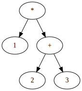

如果采用从树尾开始计算的规则，则上述树表示将1乘以2 + 3的公式。换句话说，在上述树中，1*(2+3)特定的计算顺序由树本身的形状表示。

这是另一个例子。下面的树7-3-3是代表的树。

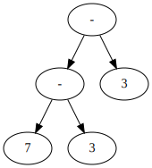

在上面的树中，应用规则“必须从左开始按顺序计算减法”的结果明确表示为树的形状。换句话说，上面的树(7-3)-3 = 1表示7-(3-3) = 7公式，而不是公式。如果是后一个方程，则表示它的树将在右侧而不是左侧更深。

必须从左侧计算出的运算符称为“左连接”运算符，而必须从右侧计算出的运算符称为“右连接”运算符。在C=中，除赋值外，大多数运算符都定义为左关联。

在树结构中，加深树可以表示任意数量的长表达式。下一个树是1*2+3*4*5代表的树。


像上面这样的树称为“语法树”。特别地，表示诸如括号之类的冗余元素的语法树被称为“抽象语法树”（AST），该冗余元素用于尽可能紧凑地分组而不将其留在树中。以上所有语法树都可以称为抽象语法树。

由于抽象语法树是编译器的内部表示形式，因此可以方便地对其进行适当定义。但是，算术运算符（如加法和乘法）被定义为左侧和右侧的运算，因此对于任何编译器而言，制作二叉树都是有意义的。另一方面，很自然地在函数主体中表示一个表达式，可以通过将所有子元素都平坦的树按顺序执行来表示任意数字。

解析的目标是构建抽象语法树。编译器将首先将输入的token字符串解析为抽象语法树，然后将该语法树转换为程序集。

#### 通过生产规则定义语法

现在让我们学习如何编写编程语言的语法。编程语言的大多数语法都是使用所谓的``生产规则''定义的。生产规则是递归定义语法的规则。

让我们考虑一下自然语言。语法嵌套在日语中。例如，如果您将句子“ flowers are beautiful”中的名词“ flower”替换为名词短语“ red flower”，则该句子将是正确的，并且“ red”将进一步扩展为“一点红色”。这仍然是正确的句子。您可以用另一句话来表达它，例如“我以为红色的花朵有些漂亮”。

这样的语法是由“主语”和“谓语”组成的“句子”或“”名词短语“由”名词“组成”或“形容词”之后是“名词短语”。然后，通过从“句子”开始并根据规则扩展，可以在定义的语法中创建无数有效的句子。

或者相反，对于已经存在的语句，可以通过考虑匹配字符串的扩展过程来考虑字符串具有什么结构。

最初，上述想法是为自然语言设计的，但是由于它们与计算机处理的数据具有非常高的亲和力，因此生成规则被用于计算机的各个部分，包括编程语言。

>专栏：乔姆斯基的生成语法
>
>生成语法的思想来自语言学家诺姆·乔姆斯基（Noam Chomsky）。他的想法对语言学和计算机科学产生了巨大影响。
>
>根据乔姆斯基的假设，人类之所以能够说话，是因为他们天生并且大脑中有自己的回路来获取生产规则。人类具有获取递归语言规则的能力，这使他们能够说一种语言。非人类动物没有语言的能力，但他将其归因于非人类动物的大脑中缺乏获取生产规则的回路。在该假设发表近60年后，Chomsky的主张没有得到证实或反驳，但仍被认为是令人信服的。

#### BNF生产规则说明

以紧凑且易于理解的方式描述生产规则的一种表示法是BNF（巴克斯-纳尔形式）和EBNF（扩展BNF），这是对它的扩展。在本书中，我们将使用EBNF解释C语法。本节首先介绍BNF，然后介绍EBNF的扩展。

在BNF中，每个生产规则都A = α₁α₂⋯以的形式表示。这意味着，符号A可以α₁α₂⋯扩展到。α₁α₂⋯是一个零个或多个符号的序列，可以同时包含不能进一步扩展的符号和可以进一步扩展的符号（在生产规则之一的左侧）。

不能进一步扩展的符号称为“终端符号”，位于任何生产规则左侧并且可以扩展的符号称为“非终端符号”。这样的生产规则定义的语法通常称为“上下文无关语法”。

非终结符可以匹配多个生产规则。例如，在同时存在两个规则A = α₁的A = α₂情况下，压力将施加在可能部署在任何一个规则中A的装置上。α₁α₂

生产规则的右侧可以为空。按照这种规则，左侧的符号将扩展为零长度的符号字符串（即什么也没有）。但是，在显示器上，省略右侧将很难理解其含义，因此，在这种情况下，通常在右侧写ε（ε）作为表示什么都没有的符号，这是正常的BNF规则。该规则也采用该规则。

"foo"编写字符串时，就好像用双引号将其引起来一样。该字符串始终是终端符号。

以上是基本的BNF规则。在EBNF中，除了BNF规则外，您还可以使用以下符号简明地写下复杂的规则。

| 怎么写	| 意义 |
|--------|-----|
| A* | A重复0次或更多次 |
| A? | A或ε |
| A \| B |	A或者B |
| ( ... ) | 分组 |

例如，A = ("fizz" | "buzz")*在Ais"fizz"或"buzz"string中重复零次或多次，即

* ""
* "fizz"
* "buzz"
* "fizzfizz"
* "fizzbuzz"
* "buzzfizz"
* "buzzbuzz"
* "fizzfizzfizz"
* "fizzfizzbuzz"
* ⋯⋯

可以扩展到任何一个。

>列：BNF和EBNF
>
>正常的BNF不扩展，*，?，|，( ... )不存在简洁的符号，例如，可以生成可被生成的语句语句和EBNF的BNF是一样的。这是因为可以通过如下重写将EBNF转换为BNF。
>
>| EBNF | 对应的BNF |
>|------|----------|
>| A = α* | A = αA 什么时候 A = ε |
>| A = α? | A = α 什么时候 A = ε |
>| A = α \| β | A = α 什么时候 A = β |
>| A = α (β₁β₂⋯) γ	A = α B γ | 什么时候 B = β₁β₂⋯ |
>
>例如，使用生成的规则进行A = αA盗窃A = ε，即A从ααα生成语句时开始，A → αA → ααA → αααA → ααα这将是部署的顺序。
>
>如您所见，诸如*和的?表示法只是一种快捷方式，但是简短的表示法更易于理解和期望，因此，如果您可以使用简短的表示法，则通常使用该表示法来简明扼要地编写。

#### 简单的生产规则

作为使用EBNF编写语法的示例，请考虑以下生产规则。

```
expr = num ("+" num | "-" num)*
```

num定义为在其他地方表示数值的符号。在这种语法expr中，首先num是一个，然后是零个或多个“+和num，或-大写num将是”存在一个。该规则实际上表示加法和减法表达式的语法。

当我们从expr开始扩展任何加减字符串（例如1或10+5arrow）时42-30+2，您可以创建类似这样的字符串。请检查以下部署结果。

```
expr → num → "1"
```

```
expr → num "+" num
     → "10" "+" "5"
```

```
expr → num "-" num "+" num
     → "42" "-" "30" "+" "2"
```

除了使用箭头以每个扩展顺序表示这些扩展步骤外，您还可以树状结构表示它们。上面的表达式的语法树如下所示。

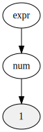

1语法树

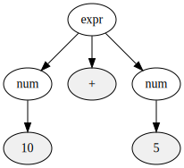

10+5语法树

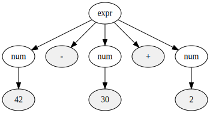

42-30+2语法树

树状结构使您更容易查看哪个非终结符扩展为哪个符号。

与语法具有完美一对一匹配的语法树，包括输入中包含的所有标记，如上所示，有时被称为“具体语法树”。当您要将其与抽象语法树进行对比时，经常使用该术语。

在上面的具体语法树中，没有以树的形式表示从左算起加法和减法的规则。在这里说明的语法中，这种规则不是使用EBNF表示的，而是在语言规范中写为“但从左开始计算加法和减法”的附加条件。解析器将同时考虑EBNF和条件，读取表示表达式的token序列，并构建一个抽象语法树，该语法树正确表示表达式的评估顺序。

因此，在以上语法中，由EBNF表示的具体语法树的形状与作为解析器输出的抽象语法树的形状仅大致匹配。可以定义语法，以使抽象语法树和具体语法树具有尽可能相同的结构，但是这使语法变得多余，并且使得难以理解如何编写解析器。上面的语法是一种易于使用的语法表达方法，它在形式语法描述的严谨性与自然语言补充性的可理解性之间取得了平衡。

#### 用生产规则表示操作员优先级

生产规则是表达语法的强大工具。通过设计语法，运算符优先级也可以在生产规则中表达。语法如下所示。

```
expr = mul ("+" mul | "-" mul)*
mul  = num ("*" num | "/" num)*
```

在以前的规则中expr，num它已经直接部署到了，但是这次expr是mul通过num现在部署的规则进行的。mul在该乘法和除法的生产操作规程，加法和减法expr是，mul可以这么说，已被用作的部分之一。在此语法中，乘法和除法首先坚持的规则在语法树中自然表达。让我们看一些具体的例子。

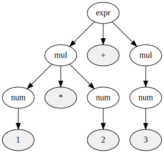

1*2+3语法树

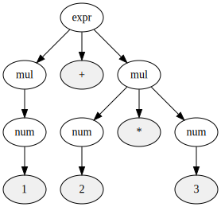

1+2*3语法树

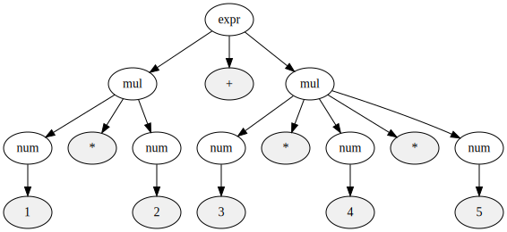

1*2+3*4*5语法树

在上面的树结构中，乘法总是出现在树的末尾，而不是加法。作为事实上，那里是没有规则返回mul到expr，所以这是不可能做出与另外一棵树乘法下，但即便如此，优先级可以表达以及树结构，这样一个简单的规则。感觉很奇怪。读者还应通过将生产规则与语法树实际匹配，尝试验证语法树是否正确。

#### 生产规则，包括递归

递归语法也可以用生成语法正常编写。下面是一个语法生成规则，在四个算术运算中添加了优先级括号。

```
expr    = mul ("+" mul | "-" mul)*
mul     = primary ("*" primary | "/" primary)*
primary = num | "(" expr ")"
```

将上述语法与先前的语法进行比较，可以认为，或者说，可能会出现到目前为止num所允许的语法。换句话说，在这种新语法中，括号内的表达式将被视为与到目前为止的单个数字相同的“粘性”。让我们来看一个例子。primarynum"(" expr ")"

下一个树是1*2其语法树。

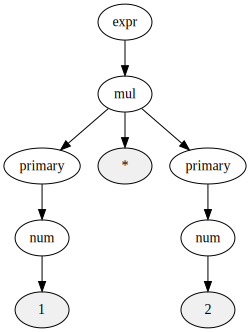

1*2语法树

下一个树是1*(2+3)其语法树。

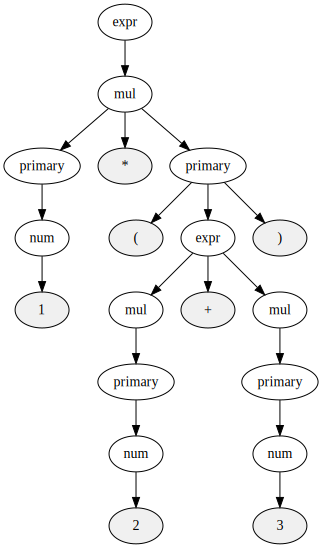

1*(2+3)语法树

如果比较两棵树，可以看到只有mul的右分支primary的扩展结果不同。primary可以将扩展结果末尾出现的规则扩展为单个数字或扩展为括号中包含的任何表达式，这些规则可以正确地反映在树结构中。能够使用如此简单的生产规则处理括号的优先级是否有点感动？

#### 递归下降解析

给定C语言生产规则，可以通过稳定扩展从生产规则的角度机械生成任何正确的C程序。但是我们想要在chibicc中做的恰恰相反。我想知道扩展过程，即语法树的结构，该语法树从外部作为字符串提供给C程序，并在扩展时成为输入的字符串。

实际上，对于某些生产规则，给定规则，您可以机械地编写代码，以找到与从该规则生成的语句匹配的语法树。这里描述的“递归下降解析方法”就是这样一种技术。

以四个算术运算的语法为例。重印了四个算术运算的语法。

```
expr    = mul ("+" mul | "-" mul)*
mul     = primary ("*" primary | "/" primary)*
primary = num | "(" expr ")"
```

编写具有递归下降解析器的解析器时，基本策略是将这些非终结符中的每一个照原样映射到每个函数。因此解析器expr，mul，primary它将有三个函数。顾名思义，每个函数都会解析一系列标记。

让我们在代码中具体考虑一下。传递到解析器的输入是token序列。由于我们想从解析器中创建一个抽象语法树并返回它，因此让我们定义抽象语法树的节点类型。节点类型如下所示。

```c
// 抽象構文木のノードの種類
typedef enum {
  ND_ADD, // +
  ND_SUB, // -
  ND_MUL, // *
  ND_DIV, // /
  ND_NUM, // 整数
} NodeKind;

typedef struct Node Node;

// 抽象構文木のノードの型
struct Node {
  NodeKind kind; // ノードの型
  Node *lhs;     // 左辺
  Node *rhs;     // 右辺
  int val;       // kindがND_NUMの場合のみ使う
};
```

lhs并且rhs每一个都表示左侧和右侧，即，意味着左侧和右侧。

还要定义一个创建新节点的函数。在此语法的四个算术运算中，有两种类型的运算符，即接收左侧和右侧的二进制运算符以及一个数值，因此请根据这两种类型准备两个函数。

```c
Node *new_node(NodeKind kind, Node *lhs, Node *rhs) {
  Node *node = calloc(1, sizeof(Node));
  node->kind = kind;
  node->lhs = lhs;
  node->rhs = rhs;
  return node;
}

Node *new_node_num(int val) {
  Node *node = calloc(1, sizeof(Node));
  node->kind = ND_NUM;
  node->val = val;
  return node;
}
```

现在，让我们使用这些函数和数据类型编写一个解析器。+箭头-应该是左联想运算符。解析左关联运算符的函数按以下方式编写为模式。

```c
Node *expr() {
  Node *node = mul();

  for (;;) {
    if (consume('+'))
      node = new_node(ND_ADD, node, mul());
    else if (consume('-'))
      node = new_node(ND_SUB, node, mul());
    else
      return node;
  }
}
```

consume这就是我们在上一步中定义的函数，该函数读取输入的一个标记，并在输入流中的下一个标记与参数匹配时返回true。

expr请仔细阅读该功能。expr = mul ("+" mul | "-" mul)*您可以看到生产规则直接映射到函数调用和循环。在上述expr函数返回的抽象语法树中，运算符是左关联的，即返回节点的左分支更深。

exprmul我们还要定义该函数正在使用的函数。*由于它/是左联想运算符，因此可以用相同的模式进行描述。功能如下所示。

```c
Node *mul() {
  Node *node = primary();

  for (;;) {
    if (consume('*'))
      node = new_node(ND_MUL, node, primary());
    else if (consume('/'))
      node = new_node(ND_DIV, node, primary());
    else
      return node;
  }
}
```

上面代码中的函数调用关系mul = primary ("*" primary | "/" primary)*直接对应于生产规则。

最后，primary让我们定义一个函数。primary由于它不是左联想运算符，因此它不会成为上述模式的代码，而是通过直接使primary = "(" expr ")" | num与函数调用相对应的生产规则，primary来描述函数。

```c
Node *primary() {
  // 次のトークンが"("なら、"(" expr ")"のはず
  if (consume('(')) {
    Node *node = expr();
    expect(')');
    return node;
  }

  // そうでなければ数値のはず
  return new_node_num(expect_number());
}
```

现在我们拥有所有功能，我们真的可以解析token序列了吗？看起来似乎并不明显，但是在使用这组函数时，您可以正确地解析标记序列。1+2*3以公式为例。

第一个被称为expr。我们假设该表达式是一个整体expr（在本例中是），然后开始读取输入。然后，expr→交通mul→交通primary和函数调用是由等，1token被读取，expr该会返回一个代表1作为返回值语法树。

然后，expr在consume('+')因为这个公式是真实的，+token被消耗的，mul但是会被再次调用。此阶段的其余输入2*3为。

mul从primary，调用2的token像以前一样被调用，但是这次mul它不会立即返回。mul由于consume('*')in中的表达式为true ，因此mul再次primary调用3以读取token。结果mul是2*3一个表示的语法树。

在返回目的地，将expr表示1的语法树和表示的语法树2*3组合以1+2*3构造表示的语法树，该语法树是expr的返回值。换句话说，它1+2*3能够正确解析。

下图显示了函数调用关系和每个函数读取的token。在下图中，有一个1+2*3相应的expr层，expr表示读取整个输入的调用。expr上面mul有两个，但它们是1大写的，2*3另一个mul代表呼叫。

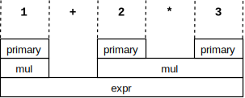

这是一个稍微复杂的例子。下图显示1*2+(3+4)了解析时的函数调用关系。

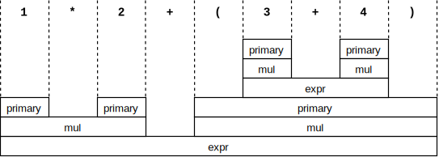

对于不熟悉递归的程序员，上述递归函数可能会造成混淆。老实说，即使我本来应该非常习惯递归，也觉得这种代码就像是一种魔术。递归代码感到奇怪，即使您知道它是如何工作的，也可能就是这样。尝试一遍又一遍地追踪代码，以确保其有效。

如上所述将一种生产规则映射到一个函数的解析方法称为“递归下降解析”。在上面的解析器中，通过仅预读一个token来确定要调用或返回的函数，而像这样仅预读一个token的递归下降解析器是LL（1）称为解析器。LL（1）解析器可以编写的语法称为LL（1）语法。

### 堆栈机

上一章介绍了将token序列转换为抽象语法树的算法。通过选择语法，考虑到运营商的优先*雅/，但+箭头-相比，我总是使我们能够创建一个抽象语法树是倾向于前者的分支来了，这棵树我怎么把它转换组装？本章介绍如何执行此操作。

首先，让我们考虑为什么无法以与加法和减法相同的方式转换成装配体。在可以加法和减法的编译器中，RAX用作结果寄存器，并在那里执行加法和减法。换句话说，编译后的程序仅保留一个中间计算结果。

但是，当包括乘法和除法时，并不总是只有一个中间计算结果。以2 * 3 + 4 * 5为例。由于必须计算双方才能进行加法运算，因此在加法运算之前必须先计算2 * 3和4 * 5。换句话说，在这种情况下，除非可以保留中间的两个计算结果，否则无法执行整个计算。

一台叫做“堆栈机”的计算机可以很容易地计算出这些东西。让我们远离解析器创建的抽象语法树，了解堆栈计算机。

#### 堆栈机概念

堆栈机是具有堆栈作为数据存储区的计算机。因此，在堆栈计算机上，两个基本操作是“推入堆栈”和“从堆栈弹出”。推入将新元素放在堆栈的顶部。Pop从堆栈顶部删除元素。

堆栈机上的算术指令作用于堆栈顶部的元素。例如，堆栈机ADD指令从堆栈顶部弹出两个元素，将其添加，然后将结果压入堆栈（为避免与x86-64指令混淆，虚拟堆栈机指令我将使用所有大写字母编写） ）。换句话说，ADD是一条指令，该指令将一个堆栈中的两个元素替换为一个元素，这是将它们加在一起的结果。

SUB，MUL，DIV指令，ADD以相同的方式如，堆栈顶部的两个元件，它们相减，相乘，将所述指令以替换元件分割中的一个。

PUSH指令应将自变量的元素堆叠在堆栈的顶部。我们不会在这里使用它，POP但是您可以考虑一条指令，从堆栈顶部删除一个元素并将其丢弃。

现在考虑使用这些指令来计算2 * 3 + 4 * 5。使用上面定义的堆栈机，您应该能够使用以下代码来计算2 * 3 + 4 * 5：

```
// 2*3を計算
PUSH 2
PUSH 3
MUL

// 4*5を計算
PUSH 4
PUSH 5
MUL

// 2*3 + 4*5を計算
ADD
```

让我们仔细看一下这段代码。假定堆栈中预先包含一些值。该值在这里并不重要，因此显示为“⋯”。堆栈应从图中的顶部延伸到底部。

前两个PUSH将2和3压入堆栈，因此MUL当紧接的第二个堆栈被执行时，堆栈的状态如下：

| 栈的状态 |
|--|
| ··· |
| 2   |
| 3   |

MUL删除堆栈顶部的两个值3和2，并将它们相乘，将6推入堆栈。因此MUL，执行后，堆栈状态如下。

| 栈的状态 |
|--|
| ··· |
| 6   |

然后PUSH按4和5，因此MUL在执行第二个之前，堆栈应如下所示：

| 栈的状态 |
|--|
| ··· |
| 6   |
| 4   |
| 5   |

如果在此处MUL运行，则将5和4删除并替换为乘以20的结果。所以MUL执行后看起来像这样：

| 栈的状态 |
|--|
| ··· |
| 6   |
| 20   |

请注意，2 * 3和4 * 5计算在堆栈上很好。如果ADD在此状态下运行，将计算20 + 6并将结果推入堆栈，因此堆栈应以下一个状态结束：

| 栈的状态 |
|--|
| ··· |
| 26   |

假设堆栈机的计算结果是堆栈顶部剩余的值，则26是2 * 3 + 4 * 5的结果，因此可以正确地计算公式。

堆栈机不仅可以计算此公式，还可以计算具有多个中间结果的任何公式。使用堆栈机，只要您保证执行一个结果就可以在堆栈上保留一个元素，那么任何子表达式都可以通过上述方式成功编译。

>专栏：CISC和RISC
>
>x86-64是从1978年推出的8086逐渐演变而来的指令集，是典型的“ CISC ”风格的处理器。CISC处理器的功能是：机器语言操作可以占用存储器地址和寄存器，机器语言指令的长度是可变的，并且复杂的操作方便汇编程序员使用，它具有许多由指令执行的指令。
>
>“ RISC ”（风险）是1980年代为CISC发明的。RISC处理器的特征是，操作始终仅在寄存器之间执行，内存上唯一的操作是加载到寄存器中并从寄存器中存储，机器语言指令的长度对于所有指令和汇编都是相同的。具有便于程序员使用的复合指令，仅具有由编译器生成的简单指令，依此类推。
>
>x86-64是CISC少数幸存者之一，除x86-64之外，几乎所有主要处理器都基于RISC。具体来说，ARM，PowerPC，SPARC，MIPS，RISC-V（风险五）等都是RISC处理器。
>
>RISC没有像x86-64这样的内存寄存器操作。也没有寄存器别名。不存在在特定指令中专门使用特定整数寄存器的规则。在这种指令集成为主流的现代人看来，x86-64指令集看起来是过时的。
>
>RISC处理器由于其简单的设计而易于加速，并且已主导了处理器行业。那么为什么x86-64能够生存呢？市场对可利用现有软件资产的高速x86处理器的巨大需求，以及英特尔和与英特尔兼容的芯片制造商的技术创新可以满足这些需求。英特尔在CPU的指令解码器内部将x86指令转换为某种RISC指令，从而在内部将x86转换为RISC处理器。这使得可以应用与RISC成功加速到x86相同的技术。

#### 编译到堆栈机

本节介绍如何将抽象语法树转换为堆栈计算机代码。只要有可能，就可以解析一个由四个算术运算组成的表达式，以构建一个抽象语法树，使用x86-64指令将其编译到堆栈计算机中并执行它。换句话说，您将能够编写可以执行四个算术运算的编译器。

在堆栈计算机上，无论计算什么子表达式，无论是什么子表达式，结果值之一都将保留在堆栈顶部。例如，考虑下面的一棵树。

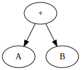

用于添加的抽象语法树

AYaB被赋予了抽象零件树的表示，它实际上意味着某种类型的节点。但是，在编译整个树时，其特定类型和树形状并不重要。要编译此树，请执行以下操作：

1. 编译左子树
2. 编译右子树
3. 输出代码替换堆栈上的两个值并加上它们的结果

执行1的代码后，无论特定的代码是什么，堆栈顶部应有一个值表示左子树的结果。类似地，在2中运行代码之后，您应该在堆栈顶部拥有一个值，该值代表右子树的结果。因此，为了计算整棵树的值，可以将两个值替换为总值。

如您所见，当在堆栈计算机上编译抽象语法树时，您会递归地思考，并且在沿着该树下降时会输出越来越多的程序集。对于刚接触递归概念的读者来说似乎有点困难，但是递归是处理诸如树之类的自相似数据结构时的经典技术。

让我们具体考虑以下示例。

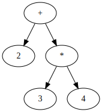

加法和乘法的抽象语法树

代码生成功能在树的根节点接收节点。

按照上述步骤，该函数要做的第一件事是编译左子树。换句话说，您将编译数字2。计算2的结果原为2，因此该子树的编译结果PUSH 2为。

然后，代码生成功能尝试编译正确的子树。这将递归地编译子树的左侧，并PUSH 3输出结果。接下来，我们将编译子树的右侧，并将PUSH 4其输出。

之后，代码生成函数返回递归调用，并输出与子树的运算符类型匹配的代码。第一个输出是用其乘积替换堆栈顶部的两个元素的代码。然后，输出用它们的总和替换堆栈顶部的两个元素的代码。结果，将输出以下组件。

```
PUSH 2
PUSH 3
PUSH 4
MUL
ADD
```

使用此技术，您可以将抽象语法树机械地拖放到程序集中。

#### 如何在x86-64上实现堆栈机

到目前为止，我们已经讨论了虚拟堆栈机。实际的x86-64是寄存器机，而不是堆栈机。x86-64操作通常在两个寄存器之间定义，而不是在堆栈顶部的两个值之间定义。因此，为了在x86-64上使用堆栈计算机技术，寄存器计算机需要以某种方式模拟堆栈计算机。

用套准机模拟堆栈机相对容易。堆栈机上的一条指令可以使用多条指令来实现。

让我解释一下具体的方法。

首先，准备一个指向堆栈第一个元素的寄存器。该寄存器称为堆栈指针。如果要在堆栈顶部弹出两个值，请取出堆栈指针指向的两个元素，然后仅更改从中取出堆栈指针的元素。同样，在压入时，您可以更改堆栈指针的值并写入其指向的内存区域。

在设计x86-64 RSP寄存器时，请牢记将它们用作堆栈指针。x86-64push箭头pop指令，例如在更改其值的同时隐式使用RSP作为堆栈指针，是访问RSP指向的内存的指令。因此，当像堆栈计算机一样使用x86-64指令集时，将RSP用作堆栈指针很简单。现在，1+2假设x86-64为堆栈计算机，让我们编译表达式。x86-64组件如下所示。

```
// 左辺と右辺をプッシュ
push 1
push 2

// 左辺と右辺をRAXとRDIにポップして足す
pop rdi
pop rax
add rax, rdi

// 足した結果をスタックにプッシュ
push rax
```

由于x86-64没有命令“将RSP指向的两个元素相加”，因此您需要将其加载到寄存器中，进行添加，然后将结果压入堆栈。add这就是上面的说明。

同样，2*3+4*5如果您尝试在x86-64上实现它，将如下所示。

```
// 2*3を計算して結果をスタックにプッシュ
push 2
push 3

pop rdi
pop rax
mul rax, rdi
push rax

// 4*5を計算して結果をスタックにプッシュ
push 4
push 5

pop rdi
pop rax
mul rax, rdi
push rax

// スタックトップの2つの値を足す
// つまり2*3+4*5を計算する
pop rdi
pop rax
add rax, rdi
push rax
```

这样，即使在x86-64上，x86-64堆栈操作指令也允许您运行与堆栈计算机非常接近的代码。

以下gen函数按原样是此技术的C函数实现。

```c
void gen(Node *node) {
  if (node->kind == ND_NUM) {
    printf("  push %d\n", node->val);
    return;
  }

  gen(node->lhs);
  gen(node->rhs);

  printf("  pop rdi\n");
  printf("  pop rax\n");

  switch (node->kind) {
  case ND_ADD:
    printf("  add rax, rdi\n");
    break;
  case ND_SUB:
    printf("  sub rax, rdi\n");
    break;
  case ND_MUL:
    printf("  imul rax, rdi\n");
    break;
  case ND_DIV:
    printf("  cqo\n");
    printf("  idiv rdi\n");
    break;
  }

  printf("  push rax\n");
}
```

在解析或代码生成中，这不是特别重要的一点，但是由于idiv上面的代码中使用了带有棘手规范的指令，因此让我们对其进行解释。

idiv是一个签名的除法指令。如果x86-64idiv具有简单明了的规范，我希望在上面的代码中idiv rax, rdi编写它，但是在x86-64中没有除法指令会占用这两个寄存器。取而代之的是，idiv隐式地将RDX和RAX取为128位整数，将其除以自变量寄存器的64位值，将商除以RAX，将余数除以RDX。设置。cqo您可以使用一条指令将RAX中包含的64位值扩展为128位并将其设置为RDX和RAX，因此上述代码在idiv调用之前进行cqo调用。

好了，这就是堆栈机解释的结尾。通过阅读本文，您应该能够将复杂的解析和解析所得的抽象语法树放入您的机器代码中。要利用这些知识，让我们回到创建编译器的任务！

>列：优化编译器
>
>我在本章中曾经描述过的x86-64程序集似乎效率很低。例如push，pop一条指令将一个数字放在堆栈上，mov如果将它直接写入寄存器作为该值的指令，那么它应该是一条指令。某些阅读器可能会被鼓励从此类组件中删除冗余并对其进行优化。但是不要屈服于这种诱惑。在最开始的代码生成中，希望优先考虑编译器的易于实现和输出冗余代码。
>
>如有必要，您可以在以后将优化路径添加到chibicc。再次扫描生成的程序集并将出现在特定模式中的指令序列替换为另一指令序列并不困难。例如，“push用pop牙齿mov替换后立即”或“是连续的add，但是如果要在同一寄存器中添加立即数（大地坐标），则将其立即add替换之和的值相加之一”，即这样的规则可以机械地应用，以更有效的代码替换冗余代码，而无需更改其含义。
>
>混合代码生成和优化会使编译器复杂化。一旦从一开始就很难编写代码，以后就很难添加优化路径。正如Donald Knuth所说：“过早的优化是万恶之源。” 即使在您的编译器中，也请确保仅考虑实现的难易程度。不用担心，输出中明显的冗余可以在以后删除。

### 步骤5：创建一种可以执行四种算术运算的语言

在本章中，我们将修改在上一章之前创建的编译器，并将其扩展为处理包括优先级括号在内的四个算术运算的表达式。我们具有所有必要的部分，因此仅需编写少量新代码。main尝试更改编译器功能以使用新创建的解析器和代码生成器。该代码应类似于以下代码。

```c
int main(int argc, char **argv) {
  if (argc != 2) {
    error("引数の個数が正しくありません");
    return 1;
  }

  // トークナイズしてパースする
  user_input = argv[1];
  token = tokenize(user_input);
  Node *node = expr();

  // アセンブリの前半部分を出力
  printf(".intel_syntax noprefix\n");
  printf(".globl main\n");
  printf("main:\n");

  // 抽象構文木を下りながらコード生成
  gen(node);

  // スタックトップに式全体の値が残っているはずなので
  // それをRAXにロードして関数からの返り値とする
  printf("  pop rax\n");
  printf("  ret\n");
  return 0;
}
```

到此阶段时，您应该可以将括号中的表达式编译为加，减，乘，除和优先级。让我们添加一些测试。

```
assert 47 '5+6*7'
assert 15 '5*(9-6)'
assert 4 '(3+5)/2'
```

在这里，最多说明的方便，同时*，/，()而是成为了故事的脉络，如实现，实际上会越好，以避免一旦实施。最初，有一个可以加减的函数，因此首先尝试引入一个抽象语法树和一个使用它而不破坏该函数的代码生成器。那时不需要新的测试，因为我们没有添加任何新功能。在这之后，*，/，()，请进入包括测试来实现。

>列：chibicc中的内存管理
>
>到目前为止，读完本书之后，您可能会想知道此编译器中的内存管理是什么样的。到目前为止的代码使用calloc（malloc的变体），但没有免费调用。也就是说，分配的内存不会释放。这不是遗漏吗？
>
>实际上，“内存管理策略不执行内存管理”的设计是我在考虑各种折衷之后有意选择的设计。
>
>这种设计的优点是，通过不释放内存，您可以像垃圾收集器使用某种语言一样编写代码。这不仅消除了编写内存管理代码的需要，而且从根本上消除了与手动内存管理相关的神秘错误。
>
>另一方面，当考虑在像普通PC这样的计算机上运行时，由不释放引起的问题实际上很少。编译器是一个短暂的程序，仅读取单个C文件并输出程序集。OS会自动释放程序末尾保留的所有内存。因此，唯一的问题是总共分配了多少内存，但是我的实际测量显示，即使编译相当大的C文件，内存使用也仅约为100 MiB。因此，不免费是一种切实有效的策略。例如，D语言编译器DMD也采用仅分配而不放弃相同思想的策略。

### 步骤6：一元加号和一元减号

执行减法的-运算符可以写在单个术语之前，也可以写在5-3两个术语之间-3。类似地，可以将+运算符+3写成好像省略了左侧。像这样仅取一个术语的运算符称为“一元运算符”。另一方面，采用两个项的运算符称为“二元运算符”。

的C+以及-另外，获得的指针&取消引用指针，*虽然一元运算符，如存在，在这一步+，并-您决定只实现。

一元+和一元-是，二项+箭头-是相同的符号，因为定义不同。第二项-被定义为从左侧减去右侧的操作，但是由于一元词-首先没有左侧-，因此第二项的定义实际上是没有意义的。在C语言中，一元-定义为将右手边的正负取反的运算。一元运算+符是按原样返回右侧的运算符。这不是必须的运算符，-但是除了一元运算符之外，它还存在。

+这-是合理的，认为有多个运营商使用相同的名称，诸如一元和二元，具有相似和不同的定义。可以通过上下文区分一元还是二进制。包含一元+/的-新语法为：

```
expr    = mul ("+" mul | "-" mul)*
mul     = unary ("*" unary | "/" unary)*
unary   = ("+" | "-")? primary
primary = num | "(" expr ")"
```

以上是一个新的语法，unary有越来越多的新的非终结符，mul但primary反而unary成为了使用。X?是XEBNF语法，表示出现0或1次的可选元素。unary = ("+" | "-")? primary在规则中，可能带有或不带有一个unary非终结符的符号表示以下内容。+-primary

-3确保表达式，如，和-(3+5)，-3*+5符合这一新的语法。下面-3*+5显示了语法树。

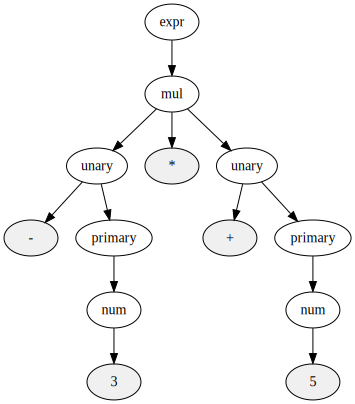

-3 * + 5语法树

让我们更改解析器以遵循此新语法。与往常一样，将语法直接映射到函数调用应该可以完成解析器更改。unary解析功能如下所示。

```c
Node *unary() {
  if (consume('+'))
    return primary();
  if (consume('-'))
    return new_node(ND_SUB, new_node_num(0), primary());
  return primary();
}
```

在这里，我决定更换+x与x使用，并-x与在角度阶段0-x。因此，此步骤不需要更改代码生成器。

编写一些测试，检查代码以添加一元+/ -，就可以了。编写测试时，请尝试将测试结果保持在0-255的范围内。-10+20像这样的表达式-使用一元数，但总值是一个正数，因此请使用这些测试。

>专栏：一元加法和语法的好坏
>
>一元+运算符在原始C编译器中不存在，并在1989年由ANSI（美国国家标准学会）标准化C语言时正式添加到该语言中。只要是有一元，那肯定是最好有-一元+，因为它具有更高的对称性，但在现实中，一元+不具有特定的用途。
>
>另一方面，+将一元加到语法上有副作用。假设不熟悉C的人+=意外地i =+ 3写了一个运算符，就好像它是被编写的一样。+没有一元，这只是一个无效的表达式，+但是由于一元，它的i = +3解释与我编写的解释相同，并且i被编译器静默接受为将3分配给的合法赋值表达式。
>
>ANSI的C语言标准委员会在理解了上述问题后，+决定在该语言中添加一元语言，您如何看待读者？如果您当时属于C标准化委员会，您是否同意？你不同意吗？

### 步骤7：比较运算子

在这一<节，<=，>，>=，==，，!=和实现。这些比较运算符似乎具有特殊含义，但是实际上，以一种相同的方式+杀死-它的是一种普通的二进制运算符，该运算符返回一个整数以接收两个整数。+返回两边相加的结果，例如，==如果两边相同，则为1；如果两边不同，则为0。

#### 更改token生成器

到目前为止，我们已经处理过的所有符号标记的长度均为一个字符，并且我们已经假设在代码中，但是==为了处理诸如此类的比较运算符，我们需要对代码进行概括。让我们将len成员Token保存在struct中，以便可以将字符串的长度保存在token中。新结构的类型如下所示。

```c
struct Token {
  TokenKind kind; // トークンの型
  Token *next;    // 次の入力トークン
  int val;        // kindがTK_NUMの場合、その数値
  char *str;      // トークン文字列
  int len;        // トークンの長さ
};
```

在进行此更改的同时，我们需要对诸如之类的函数进行更改，consume并对其expect进行改进，以使它们采用字符串而不是字母。更改示例如下所示。

```c
bool consume(char *op) {
  if (token->kind != TK_RESERVED ||
      strlen(op) != token->len ||
      memcmp(token->str, op, token->len))
    return false;
  token = token->next;
  return true;
}
```

在对多字符符号进行标记时，必须首先对最长的标记进行标记。例如，字符串的其余部分（>如果它从头开始），首先strncmp(p, ">=", 2)是>=不首先从可能性中进行检查，>从而由此检查了可能性是否开始，>=但是作为两个标记的不正确>准备=将被Talk It亲吻。

#### 新语法

要向解析器添加对比较运算符的支持，请考虑使用比较运算符的语法是什么样的。到目前为止出现的运算符按优先级升序排列，如下所示。

1. == !=
2. < <= > >=
3. + -
4. * /
5. 一+元一元-
6. ()

优先级可以用生成语法表示，并且将具有不同优先级的运算符映射到不同的非终结符。expr是的，mul如果以同样的方式考虑语法，则新语法加一个比较运算符如下。

```
expr       = equality
equality   = relational ("==" relational | "!=" relational)*
relational = add ("<" add | "<=" add | ">" add | ">=" add)*
add        = mul ("+" mul | "-" mul)*
mul        = unary ("*" unary | "/" unary)*
unary      = ("+" | "-")? primary
primary    = num | "(" expr ")"
```

equality在==资本!=，并relational为<，<=，>，>=代表了。这些非终结符可以使用解析左关联运算符的模式直接映射到函数。

请注意，在上面的语法中equality，expr和equality被分隔以指示整个表达式为。我可以写右边expr的侧equality右侧直接，但我觉得上面的语法可能是更容易阅读。

>列：简单详细的代码和高级简洁的代码
>
>递归下降解析编写的代码几乎完全与生产规则相对应，因此解析相似规则的函数看起来很相似。我写了这么远relational，equality，add，mul也应该有同样的功能的神色。
>
>考虑如何使用元编程技术（例如C宏，C ++模板，高阶函数和代码生成）成功抽象出此类函数共有的模式是一个自然的想法。实际上，这样做是可能的。但是，这本书不敢做这样的事情。原因如下。
>
>即使有些冗长，简单的代码也易于理解。如果您以后决定对类似的功能进行类似的更改，那么实际上没什么大不了的。另一方面，高度抽象的代码可能是深奥的，因为您需要首先了解其抽象机制，然后才能使用它。例如，如果我是通过编写使用元编程来生成递归下降解析的函数的函数来开始编写本书的，那么这本书就更加困难了。
>
>您不必总是以编写简洁明了的代码为目标。为此，很容易使代码变得更难，甚至更难。
>
>由于编写代码的人会成为代码方面的专家，因此从专家的角度来看，简单而精简的代码很容易成为好代码，但是大多数代码阅读者与作者有相同的感觉。您不必一开始就那么熟练，因此您需要对自己作为代码编写者的感受持怀疑态度。根据需要编写“看起来更好的简单代码”是创建易于理解和维护的程序的重要技术之一。

#### 汇编代码生成

在x86-64上，使用cmp指令进行比较。下面的代码从堆栈中弹出两个整数，进行比较，如果相同则将1设置为RAX，否则将0设置为RAX。

```
pop rdi
pop rax
cmp rax, rdi
sete al
movzb rax, al
```

这段代码是简短的汇编，但是有点混乱，所以让我们逐步看一下代码。

前两行将值弹出堆栈。第三行比较这些弹出的值。比较结果将流向何处？在x86-64上，比较指令的结果在特殊的“标志寄存器”中设置。标志寄存器是每次执行整数运算或比较运算指令时都会更新的寄存器，例如结果是否为0，是否发生溢出等位，结果是否小于0等位，等。我在等。

由于标志寄存器不是普通的整数寄存器，因此，如果要在RAX中设置比较结果，则需要将标志寄存器的特定位复制到RAX。sete命令是这样做的。如果sete前cmp一条指令中检查的两个寄存器的值相同，则指令在指定的寄存器（在这种情况下为AL）中设置1。否则，将其设置为0。

AL是一个新的寄存器名称，到目前为止还没有出现在本书中，但是AL实际上只是另一个指向RAX的低8位的名称寄存器。因此sete，如果将值设置为AL，RAX将自动更新。但是，通过AL更新RAX时，高56位保持其原始值，因此，如果要将整个RAX设置为0或1，则需要将高56位清零。movzb命令是这样做的。sete如果可以将指令直接写入RAX会很好，但是sete由于规范中只能将8位寄存器用作参数，因此在比较指令中，决定使用两个指令将值设置为RAX，例如：这个。

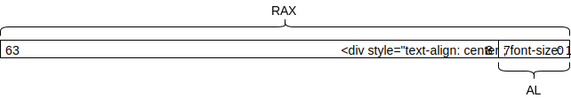

sete可以通过使用其他指令代替来实现其他比较运算符。<在setl，<=中setle，!=中setne，请使用。

>并且>=您不需要代码生成器的支持。双方由解析器<Ya互换，<=请替换为as。

>列：标志寄存器和硬件
>
>这种x86-64规范（其中值比较隐式存储在与普通整数寄存器不同的特殊寄存器中）一开始似乎令人困惑。实际上，某些RISC处理器不喜欢具有标志寄存器，而具有将值比较结果设置为常规寄存器的指令集。例如，RISC-V就是这样的指令集。
>
>但是，从硬件实现的角度来看，对于简单的实现而言，创建标志寄存器非常容易。换句话说，当执行整数运算时，结果布线将分支并连接到另一个逻辑，并且结果是否为零（是否所有行均为0）或结果是否为负（最高有效）。通过检查该位的行是否为1来将其与标志寄存器的每个位连接。带有标志寄存器的CPU正是以这种方式实现的，并且每次执行整数运算时也会更新标志寄存器。
>
>在这种机制中，cmp不仅addYasub标志寄存器也被更新。实际上，cmp该实体sub应该是仅更新标志寄存器的特殊指令。sub rax, rdi之后，如果查看标志寄存器，则可以看到RAX和RDI之间的幅度关系，但是由于在这种sub情况下RAX将被更新，因此cmp准备不写入整数寄存器。
>
>对于软件而言，“同时计算某些东西”总是要花费额外的时间，但是在硬件中，分支线和使用额外的晶体管不会浪费时间，因此每次更新标志寄存器的成本不会增加目前仅适用于简单的硬件实现。

## 拆分编译和链接

到现在为止，我们一直在开发一种只有一个C文件和一个测试Shell脚本的文件结构。并不是说此配置存在问题，而是源代码越来越长，所以让我们将其拆分为多个C文件以提高可见性。在此步骤中，一个名为chibicc.c的文件分为以下五个文件。

* chibicc.h：头文件
* main.c：main功能
* parse.c：解析器
* codegen.c： 代码生成器

main由于该函数很小，因此最好放入另一个C文件，但从语义上讲parse.c，codegen.c它不属于任何一个，并且可以分成一个单独的文件。

在本章中，我们将说明拆分编译的概念及其意义，然后说明具体过程。

### 什么是拆分编译？

#### 拆分编译及其需求

拆分编译是在多个源文件中编写程序并分别编译的过程。在拆分编译中，编译器读取程序的一部分，然后输出相应的部分，而不是整个程序。包含无法单独执行的程序片段的文件称为“目标文件”（扩展名.o）。在拆分编译中，最终将目标文件连接在一起以创建一个文件。将目标文件组合成一个可执行文件的程序称为“链接器”。

了解为什么需要单独编译。实际上，从技术上讲，无需拆分源。如果您一次将所有源代码传递给编译器，则从逻辑上讲，编译器可以在没有链接器帮助的情况下输出完整的可执行文件。

但是，以这种方式，编译器确实需要知道程序正在使用的所有代码。例如printf，标准库中的函数通常是标准库的作者用C编写的函数，但是为了省略链接步骤，每次也必须将此类函数的源代码提供给编译器的输入。我会来的。一遍又一遍地编译相同的函数通常只是浪费时间。因此，标准库通常以预编译的目标文件格式分发，因此您不必每次都重新编译。换句话说，即使一个程序由一个源代码组成，只要使用标准库，它实际上也会使用拆分编译。

如果没有拆分编译，只更改一行就可以重新编译整个代码。编译成千上万的代码行可能要花费数十秒的时间。在一个大型项目中，源代码可能有超过一千万行，因此将其作为一个单元进行编译不会一天之内就结束。还需要以100 GiB为单位的内存。这样的构建过程是不切实际的。

另一个问题是，简单地将所有函数和变量一起写在一个文件中对人类来说是很难管理的。

由于上述原因，需要拆分编译。

>列：链接器的历史记录
>
>自计算机诞生以来，就需要链接器能够将多个零散的机器语言例程拼接成一个程序。在1947年John Mauchly（第一台数字计算机，ENIAC的项目负责人）中，我们将该程序描述为一个程序，以重新定位从磁带2读取的子程序。
>
>即使在最早的计算机中，我也只想编写一个通用子例程一次，并在各种程序中使用它，但是在那种情况下，我需要一个将程序片段组合成可执行程序的链接器。由于1947年是一个尚未使用汇编程序并且直接用机器语言编写代码的时代，因此链接程序实际上是程序员希望在汇编程序之前创建的程序。

#### 对头文件及其内容的需求

在拆分编译中，编译器仅看到程序中的一部分代码，但是编译器无法编译程序的任何小片段。例如，考虑以下代码。

```c
void print_bar(struct Foo *obj) {
  printf("%d\n", obj->bar);
}
```

在上面的代码中，如果知道结构Foo的类型，则可以输出与此代码相对应的程序集，但否则将无法编译此函数。

单独编译时，每个文件必须包含足够的信息才能编译单个C文件。但是，如果您编写的所有代码都写在另一个文件中，则一开始它不会是拆分编译，因此您需要在某种程度上对信息进行整理。

例如，考虑需要包含哪些信息才能输出在另一个C文件中调用函数的代码。编译器需要以下信息：

* 我们首先需要标识符是函数名称的信息。
* 编译器输出的函数调用的代码以固定call顺序在寄存器中设置其参数，并使用一条指令跳转到另一个函数的开头。根据参数类型，它还将整数转换为浮点数。如果参数类型或数字不正确，您还应该显示一条错误消息。因此，我们需要函数参数的数量和每个参数的类型。
* 编译调用函数时，无需为调用函数编写任何代码，因为在调用函数之前发生的任何事情都将简单地返回给调用者。
* call在拆分编译时不知道call要跳转到的地址，但是汇编器暂时输出一条指令跳转到地址0 ，并且在目标文件中，“目标文件的第X个字节是名为Y的函数” 。您可以保留信息“使用地址修复”。链接器查看该信息，确定可执行文件的布局，然后对程序片段进行二进制修补以更正跳转目标地址（此操作称为“重新定位”）。因此，您需要函数的名称来单独编译它，而不需要函数的地址。

总结上述要求，{ ... }如果省略函数主体，则您有足够的信息来调用该函数。省略此类函数主体的函数称为该函数的“声明”。该声明仅告诉编译器的类型和名称，不包含该函数的代码。例如，以下是strncmp声明。

```c
int strncmp(const char *s1, const char *s2, size_t n);
```

通过查看以上一行，编译器strncmp可以知道它的存在和类型。包含函数代码的声明称为“定义”。

在函数声明中，extern添加一个关键字来表示该声明，

```c
extern int strncmp(const char *s1, const char *s2, size_t n);
```

但是，在使用函数的情况下，extern不必添加它，因为可以通过省略函数体来区分声明和定义。

由于参数仅需要知道类型，因此可以在声明中省略名称，但是为了便于理解，通常在声明中写入名称。

作为另一个示例，请考虑结构的类型。如果您有多个使用相同结构的C文件，则必须在每个C文件中编写相同的结构声明。如果仅一个C文件使用该结构，则其他C文件不需要知道其存在。

在C中，以这种方式编译其他C文件时所需的声明放在一起放在头文件中（扩展名.h）。foo.h如果在其中写入声明，然后将其写入另一个需要#include "foo.h"该声明的C文件中，则#include该行将foo.h替换为该文件的内容。

typedef等等还用于教导编译器类型信息。如果这些文件也用在多个C文件中，则需要将它们写在头文件中。

特别是在编译器读取声明时，它不会打印任何程序集。声明是使用包含在另一个文件中的函数或变量所需的信息，并且它本身并未定义函数或变量。

根据到目前为止的拆分编译故事，您可以看到诸如“printf使用时#include <stdio.h>写为咒语”之类的故事实际上正在做什么。C标准库被隐式传递给链接器，该链接器允许链接器printf链接包含函数调用的目标文件以创建可执行文件。另一方面，printf默认情况下，编译器对此没有特别的了解。printf它不是内置函数，也没有规范会自动读取标准库的头文件，因此编译器在启动它后立即对其printf一无所知。在这种状态下，通过包含C标准库随附的头文件，printf编译器可以知道的存在和类型，并可以printf编译函数的调用。

>列：一遍编译器和前向声明
>
>在C语言中，即使将所有功能一起写入一个文件中，也可能需要声明。C语言规范允许编译器从头开始按顺序编译每个函数，而不必读取整个文件。因此，每个函数必须只能编译直到文件中出现的信息。因此，如果要使用文件末尾定义的函数，则需要事先编写该函数的声明。这样的声明称为“前向声明”。
>
>通过设计函数写入文件的顺序，可以省略大多数前向声明，但是如果要编写相互递归的函数，则前向声明是必不可少的。
>
>C规范允许您在不读取整个文件的情况下进行编译，这在主内存很小的时代就很有意义，但是现在它已经过时了。如果编译器更聪明，则应该能够避免在同一文件中编写定义的声明。但是，这种行为应该是语言规范的一部分，因此您需要牢记。

#### 链接错误

当您最终将目标文件一起传递给链接器时，它们必须仅包含足够的信息以构成整个程序。

如果您的程序foo仅包含函数声明而没有定义，foo则可以正常编译单个C文件，包括调用它们的代码。但是，当链接器最终尝试创建一个完整的程序时，会发生错误，因为没有foo要通过其地址进行更正的部分，foo因此没有办法对其进行更正。

在时的错误链接称为链接错误。

如果多个目标文件包含相同的函数或变量，也会发生链接错误。这是因为链接器不确定如果有重复项，则选择哪个。当您不小心在头文件中写入定义时，经常会发生类似的重复错误。这是因为头文件包含在多个C文件中，因此，如果头文件中有一个定义，则其状态与在多个C文件中重复定义的状态相同。要消除此类错误，请仅在头文件中写入声明，然后将实体移至C文件之一。

>列：重复的定义和链接错误
>
>当存在重复的定义时，链接程序可以选择一个并忽略其余的定义。在这样的链接器中，重复的定义不会导致错误。
>
>即使在实际的目标文件中，也可以为每个定义选择是否允许重复，并且内联函数和C++模板扩展结果以允许重复的形式包含在目标文件中。目标文件的格式和链接器的行为异常复杂，并且有许多例外，但是这种行为是例外。默认情况下，重复定义通常会导致错误。

#### 全局变量的声明和定义

我们的编译器中还没有全局变量，因此我们还没有给出与全局变量相对应的程序集示例，但是全局变量与程序集级别的函数几乎相同。因此，像函数一样，全局变量在定义和声明之间有区别。如果变量的主体在多个C文件中重复，则通常会导致链接错误。

默认情况下，全局变量分配在不可执行的内存区域中，因此跳转到该位置将导致程序因段错误而崩溃，但是在其他方面，数据和代码之间基本上没有区别。您可以像全局变量一样在运行时将函数作为数据读取，也可以通过更改内存属性以允许执行并跳转到数据的方式将数据作为代码运行。

让我们在真实的代码中看到，函数和全局变量本质上只是驻留在内存中的数据。在下面的代码中，main标识符定义为全局变量。main的内容是x86-64的机器语言。

```c
char main[] = "\x48\xc7\xc0\x2a\x00\x00\x00\xc3";
```

foo.c将上面的C代码保存在一个名为的文件中，进行编译，objdump并用于检查内容。objdump默认情况下，全局变量的内容仅以十六进制显示，但是如果-D传递选项，则可以强制将数据反汇编为代码。

```
$ cc -c foo.c
$ objdump -D -M intel foo.o
Disassembly of section .data:

0000000000000000 <main>:
   0:   48 c7 c0 2a 00 00 00    mov    rax,0x2a
   7:   c3                      ret
```

-Wl,--omagic可以通过传递compile-time选项来更改将数据映射到禁止区域的默认行为。让我们使用此选项来生成可执行文件。

```
$ cc -static -Wl,--omagic -o foo foo.o
```

由于函数和变量只是程序集中的标签，并且属于同一名称空间，因此链接器不在乎将多个目标文件组合在一起时是哪个函数和哪个数据。因此，即使main将其定义为C级别的数据，该main链接也将成功执行，就好像它是一个函数一样。

让我们运行生成的文件。

```
$ ./foo
$ echo $?
42
```

如上所述，正确返回了值42。main被调用的全局变量的内容作为代码执行。

在C语法中，对于全局变量，extern添加是一个声明。以下是int类型的全局变量foo的声明。

```c
extern int foo;
```

foo编写包含以下内容的程序时，应将以上行写在头文件中。然后，您foo将在其中一个C文件中进行定义。下面是foo定义。

```c
int foo;
```

在C中，对于没有初始化表达式给出的全局变量都应该与0进行初始化，因此它是有意义的，这些变量被初始化所用0 {0, 0, ...}，"\0\0\0\0..."等是相同的。

int foo = 3当像这样编写初始化表达式时，仅在定义中写入初始化表达式。该声明旨在仅告诉编译器变量的类型，因此不需要特定的初始化表达式。编译器在看到全局变量的声明时不会专门输出程序集，因此它不需要知道如何动态地初始化其内容。

如果省略初始化表达式，extern则全局变量的声明和定义只是存在或不存在，因此它们看起来相似，但是声明和定义不同。在这里跟踪。

列：Intel CPU F00F错误

在1997年之前，英特尔奔腾处理器F0 0F C7 C8存在一个严重的错误，该错误导致执行4字节指令时CPU完全挂起。

没有与此4字节指令相对应的正式汇编指令，但是如果您敢将其编写为汇编，则它将是lock cmpxchg8b eax一条指令。0F C7 C8这是cmpxchg8b eax一条指令，它是一条指令（状态的中间状态对于多核中的另一个核来说是无法观察的形式），以在8字节寄存器的值和存储器之间交换原子。F0这lock是称为前缀的附加信息，具有使紧随其后的指令原子化的作用。但是，由于它原本cmpxchg8b是原子的，因此lock cmpxchg8b eax是一种冗长且非法的指令编写方式。因此，这样的汇编指令应该在语法上是不存在的，并且F0 0F C7 C8字节串不会出现在普通程序中，并且在批量生产处理器之前，英特尔并未意识到这一错误。

利用将主要功能作为数据编写的技巧，可以在下一行用C语言编写重现F00F错误的代码。

```c
char main[] = "\xf0\x0f\xc7\xc8";
```

尽管此功能在现代x86上是无害的，但在1997年的Pentium中，此单行程序使任何人都可以轻松挂起整个系统。

F00F错误对于个人PC而言并不是什么大问题，但是如果您使用它来共享CPU（例如我们现在谈论的云），那将是致命的。但是，起初似乎无法修复F00F错误，只能恢复和更换CPU，但是此后，在OS内核的异常处理程序级别创建了一个棘手的方法来避免该错误，这是幸运的。最重要的是，我能够避免产品更换。

## C标准库和存档文件

### 步骤8：文件拆分和Makefile修改

#### 文件分割

尝试使用本章开头所示的配置拆分文件。chibicc.h那是头文件。根据程序配置，可以.c为每个.h文件准备一个文件，但是即使有额外的声明也没有特别的危害，因此有必要在这里如此精细地管理依赖项。请chibicc.h准备一个文件，并将其#include "chibicc.h"包括在所有C文件中。

#### Makefile更改

现在，Makefile即使您将程序更改为多个文件，也让我们对其进行更新。下面Makefile是编译和链接位于当前目录中的所有.c文件，以创建名为chibicc的可执行文件的过程。假定只有一个文件chibicc.h作为项目头文件，并且该头文件包含在所有.c文件中。

```Makefile
CFLAGS=-std=c11 -g -static
SRCS=$(wildcard *.c)
OBJS=$(SRCS:.c=.o)

chibicc: $(OBJS)
        $(CC) -o chibicc $(OBJS) $(LDFLAGS)

$(OBJS): chibicc.h

test: chibicc
        ./test.sh

clean:
        rm -f chibicc *.o *~ tmp*

.PHONY: test clean
```

Makefile请注意，缩进必须是制表符。

make是一种高性能的工具，您不必精通它，但是如果您Makefile可以阅读上述内容，则它在各种情况下都将很有用。因此，本节Makefile将对以上内容进行说明。

Makefile现在，用冒号分隔的行和零个或更多命令的制表符缩进的行构成一个规则。冒号之前的名称称为“目标”。冒号后面的零个或多个文件名称为相关文件。

make foo当你运行，make将foo尝试创建一个名为文件。如果指定的目标文件已经存在，则仅在目标文件早于从属文件时才make重新运行目标规则。结果，实现了仅在源代码改变时才重新生成二进制文件的操作。

.PHONY是代表虚拟目标的特殊名称。make testYamake clean是testYa clean，例如，我并不是要为了创建文件而运行，通常make是因为不知道是testYa，clean如果文件名如偶然存在，则make test杀死make clean不再做任何事情，我将结束向上。.PHONY通过指定这些虚拟目标，您实际上并不想创建具有该名称的文件，无论指定的目标文件是否存在，都应执行rule命令make。

CFLAGS并且SRCS，OBJS它是一个变量。

CFLAGS是make的内置规则可识别的变量，您可以在其中编写命令行选项以传递给C编译器。在这里，传递以下标志。

* -std=c11：讲述用C11（C的最新标准）编写的源代码
* -g：输出错误信息
* -static：静态链接

SRCS右侧使用wildcard的函数是make提供的函数，并且将其扩展为与该函数的参数匹配的文件名。$(wildcard *.c)当前已main.c parse.c codegen.c部署。

OBJS在右侧，我们使用了一个变量替换规则，该规则创建了一个值，该值将SRC中的.c替换为.o。SRCS是main.c parse.c codegen.c这样，OBJS牙齿main.o parse.o codegen.o也会。

考虑到这一点，make chibicc让我们追踪一下运行时会发生什么。由于make尝试生成指定为参数的目标chibicc，因此制作文件是命令的最终目标（如果没有参数，则选择第一个规则，因此在这种情况下，将指定为chibicc。不必这样做）。 。make遵循该依赖关系，并尝试构建丢失或过时的文件。

chibicc依赖文件是与当前目录中的.c文件相对应的.o文件。如果最后一次运行make的.o文件仍然存在，并且.c时间戳比相应文件新，则make不会费心重新执行同一命令。仅当文件.o不存在或.c较新时，才运行编译器.o来生成文件。

$(OBJS): chibicc.h该规则表明所有.o文件都chibicc.h依赖。因此chibicc.h，如果您进行更改，.o则将重新编译所有文件。

>列：静态关键字的各种含义
>
>Cstatic关键字用于两个主要目的：
>
> 1. static附加一个局部变量，以便即使退出该函数也可以保存该值
> 2. static附加全局变量或函数以使变量或函数的范围成为文件范围。
> 
>尽管它们没有共同点，但是它们使用相同的关键字，这是学习C时的困惑点之一。理想情况下，use 1应该使用了另一个关键字，例如persistentuse 2 private。更理想的情况是，最好private默认使用2public并将其附加到全局范围内的变量和函数。
>
>C重用关键字的原因是与过去编写的代码资产兼容。private例如，如果您在语言中添加了新的关键字，则将无法编译使用该关键字作为变量或函数名称的现有程序。C讨厌它，并决定在不同的上下文中重用现有的关键字，而不是添加更多的关键字。
>
>在1970年代的某个时候，static如果我决定添加新的关键字而不是重复使用它们，那么我就不必更改很多代码，而是思考我会怎么做，这是一个难题。

## 函数和局部变量

在本章中，我们将实现函数和局部变量。它还实现了简单的控制结构。在本章的最后，您应该能够编译如下代码：

```c
// mからnまでを足す
sum(m, n) {
  acc = 0;
  for (i = m; i <= n; i = i + 1)
    acc = acc + i;
  return acc;
}

main() {
  return sum(1, 10); // 55を返す
}
```

上面的代码与C仍有差距，但仍然与C相当。

### 步骤9：1个字符的局部变量

到上一章为止，我们已经为语言创建了一个编译器，可以执行四种算术运算。在本节中，我们将向语言添加功能以使变量可用。具体来说，目标是能够编译包含变量的多个语句，如下所示：

```c
a = 3;
b = 5 * 6 - 8;
a + b / 2;
```

假设最后一个表达式的结果是整个程序的计算结果。可以说，这种语言比只有四个算术运算的语言具有更多的“真实语言”氛围。

在本章中，我们将首先解释如何实现变量，然后逐步实现变量。

#### 堆栈上的可变区域

C中的变量存在于内存中。可以说变量被称为内存地址。通过给存储器地址命名，a可以将其表示为“访问变量”，而不是将其表示为“访问存储器的地址0x6080” 。

但是，对于每个函数调用，函数的局部变量必须分别存在。仅考虑实现的便利性，似乎很容易制作一个固定的地址，例如“将函数f的局部变量a放在地址0x6080处”，但f在递归调用时效果很好。在C语言中，将局部变量放在堆栈上，以便每个函数调用都有一个单独的局部变量。

考虑一个具体示例的堆栈内容。假设您有一个带有局部变量的函数，a而其他一些函数调用了它。函数调用指令将返回地址压入堆栈，因此调用时的堆栈顶部将包含该返回地址。除此之外，假定堆栈最初包含一些值。由于此处的具体值并不重要，因此我们将使用“⋯⋯”。下图如下。bffcallf

<div>
<table>
<tbody>
<tr class="odd">
<td style="text-align: center;">⋯⋯</td>
<td></td>
</tr>
<tr class="even">
<td style="text-align: center;">返回地址</td>
<td>← RSP</td>
</tr>
</tbody>
</table>
</div>

此处，符号“←RSP”用于指示RSP寄存器的当前值指向该地址。a并且b每个您的大小为8个字节。

堆栈向下生长。从该状态开始a，b为了确保2个变量的面积，换句话说，您总共需要下推16字节的RSP。当您这样做时，您将获得：

<div>
<table>
<tbody>
<tr class="odd">
<td style="text-align: center;">⋯⋯</td>
<td></td>
</tr>
<tr class="even">
<td style="text-align: center;">返回地址</td>
<td></td>
</tr>
<tr class="odd">
<td style="text-align: center;">a</td>
<td></td>
</tr>
<tr class="even">
<td style="text-align: center;">b</td>
<td>← RSP</td>
</tr>
</tbody>
</table>
</div>

使用上面的布局，您可以a使用RSP + 8值和RSP值来访问b。以这种方式为每个功能调用分配的存储区称为“功能帧”或“激活记录”。

更改RSP的字节数以及以这种方式将变量放置在这样保护的区域中的顺序对于其他功能是不可见的，因此可以方便地确定它们的大小，以方便编译器实现。

基本上，局部变量就是这么简单地实现的。

但是，此方法有一个缺点，因此您将必须使用另一个寄存器来实现实际的实现。回想一下，我们的编译器（和其他编译器）可以在执行函数时更改RSP。由于chibicc使用RSP将计算结果推入/弹出到堆栈的中间，因此RSP的值经常变化。因此，a杀死b该用户将无法以相对于RSP的固定偏移量进行访问。

解决此问题的一种常见方法是拥有一个与RSP分开的寄存器，该寄存器始终指向当前功能帧的开始。这种寄存器称为“基址寄存器”，其中包含的值称为“基址指针”。x86-64习惯将RBP寄存器用作基址寄存器。

基本指针在函数执行期间不得更改（这就是我们拥有基本指针的原因）。从一个函数调用另一个函数并在返回时获得不同的值是不好的，因此您需要为每个函数调用保存原始的基本指针，并在返回之前将其写回。

下图显示了使用基本指针的函数调用中的堆栈状态。带有is的局部变量x和y函数让我们假设您调用了。在执行期间，堆栈如下所示：gfg

<div>
<table>
<tbody>
<tr class="odd">
<td style="text-align: center;">⋯⋯</td>
<td></td>
</tr>
<tr class="even">
<td style="text-align: center;">gのリターンアドレス</td>
<td></td>
</tr>
<tr class="odd">
<td style="text-align: center;">gの呼び出し時点のRBP</td>
<td>← RBP</td>
</tr>
<tr class="even">
<td style="text-align: center;">x</td>
<td></td>
</tr>
<tr class="odd">
<td style="text-align: center;">y</td>
<td>← RSP</td>
</tr>
</tbody>
</table>
</div>

如果f您从此处致电，它将处于以下状态。

<div>
<table>
<tbody>
<tr class="odd">
<td style="text-align: center;">⋯⋯</td>
<td></td>
</tr>
<tr class="even">
<td style="text-align: center;">gのリターンアドレス</td>
<td></td>
</tr>
<tr class="odd">
<td style="text-align: center;">gの呼び出し時点のRBP</td>
<td></td>
</tr>
<tr class="even">
<td style="text-align: center;">x</td>
<td></td>
</tr>
<tr class="odd">
<td style="text-align: center;">y</td>
<td></td>
</tr>
<tr class="even">
<td style="text-align: center;">fのリターンアドレス</td>
<td></td>
</tr>
<tr class="odd">
<td style="text-align: center;">fの呼び出し時点のRBP</td>
<td>← RBP</td>
</tr>
<tr class="even">
<td style="text-align: center;">a</td>
<td></td>
</tr>
<tr class="odd">
<td style="text-align: center;">b</td>
<td>← RSP</td>
</tr>
</tbody>
</table>
</div>

这样，您始终可以访问aRBP-8和bRBP-16。考虑到创建此类堆栈状态的程序集，编译器应在每个函数的开头输出以下程序集。

```
push rbp
mov rbp, rsp
sub rsp, 16
```

这样的编译器在函数开始时输出的标准指令称为“序言”。请注意，实际上16必须是一个与每个函数的变量的数量和大小相匹配的值。

让我们确保当我们使用指向返回地址的RSP运行上面的代码时，我们得到了我们期望的功能框架。每个指令的堆栈状态如下所示。

1. f该call叫出后，立即栈

<div>
<table>
<tbody>
<tr class="odd">
<td style="text-align: center;">⋯⋯</td>
<td></td>
</tr>
<tr class="even">
<td style="text-align: center;">gのリターンアドレス</td>
<td></td>
</tr>
<tr class="odd">
<td style="text-align: center;">gの呼び出し時点のRBP</td>
<td>← RBP</td>
</tr>
<tr class="even">
<td style="text-align: center;">x</td>
<td></td>
</tr>
<tr class="odd">
<td style="text-align: center;">y</td>
<td></td>
</tr>
<tr class="even">
<td style="text-align: center;">fのリターンアドレス</td>
<td>← RSP</td>
</tr>
</tbody>
</table>
</div>

2. push rbp执行后堆栈

<div>
<table>
<tbody>
<tr class="odd">
<td style="text-align: center;">⋯⋯</td>
<td></td>
</tr>
<tr class="even">
<td style="text-align: center;">gのリターンアドレス</td>
<td></td>
</tr>
<tr class="odd">
<td style="text-align: center;">gの呼び出し時点のRBP</td>
<td>← RBP</td>
</tr>
<tr class="even">
<td style="text-align: center;">x</td>
<td></td>
</tr>
<tr class="odd">
<td style="text-align: center;">y</td>
<td></td>
</tr>
<tr class="even">
<td style="text-align: center;">fのリターンアドレス</td>
<td></td>
</tr>
<tr class="odd">
<td style="text-align: center;">fの呼び出し時点のRBP</td>
<td>← RSP</td>
</tr>
</tbody>
</table>
</div>

3. mov rbp, rsp执行后堆栈

<div>
<table>
<tbody>
<tr class="odd">
<td style="text-align: center;">⋯⋯</td>
<td></td>
</tr>
<tr class="even">
<td style="text-align: center;">gのリターンアドレス</td>
<td></td>
</tr>
<tr class="odd">
<td style="text-align: center;">gの呼び出し時点のRBP</td>
<td></td>
</tr>
<tr class="even">
<td style="text-align: center;">x</td>
<td></td>
</tr>
<tr class="odd">
<td style="text-align: center;">y</td>
<td></td>
</tr>
<tr class="even">
<td style="text-align: center;">fのリターンアドレス</td>
<td></td>
</tr>
<tr class="odd">
<td style="text-align: center;">fの呼び出し時点のRBP</td>
<td>← RSP, RBP</td>
</tr>
</tbody>
</table>
</div>

4. sub rsp, 16执行后堆栈

<div>
<table>
<tbody>
<tr class="odd">
<td style="text-align: center;">⋯⋯</td>
<td></td>
</tr>
<tr class="even">
<td style="text-align: center;">gのリターンアドレス</td>
<td></td>
</tr>
<tr class="odd">
<td style="text-align: center;">gの呼び出し時点のRBP</td>
<td></td>
</tr>
<tr class="even">
<td style="text-align: center;">x</td>
<td></td>
</tr>
<tr class="odd">
<td style="text-align: center;">y</td>
<td></td>
</tr>
<tr class="even">
<td style="text-align: center;">fのリターンアドレス</td>
<td></td>
</tr>
<tr class="odd">
<td style="text-align: center;">fの呼び出し時点のRBP</td>
<td>← RBP</td>
</tr>
<tr class="even">
<td style="text-align: center;">a</td>
<td></td>
</tr>
<tr class="odd">
<td style="text-align: center;">b</td>
<td>← RSP</td>
</tr>
</tbody>
</table>
</div>

从函数返回时，将原始值写回RBP，以​​便RSP指向返回地址ret并调用该指令（该ret指令是从堆栈中弹出地址并跳转到该地址的指令）。可以将代码编写为：

```
mov rsp, rbp
pop rbp
ret
```

这样的编译器在函数末尾输出的标准指令称为“结尾”。

执行结语时的堆栈状态如下所示。RSP指向的地址下方的堆栈区域不再被视为无效数据，因此在图中将其省略。

1. mov rsp, rbp运行前堆叠

<div>
<table>
<tbody>
<tr class="odd">
<td style="text-align: center;">⋯⋯</td>
<td></td>
</tr>
<tr class="even">
<td style="text-align: center;">gのリターンアドレス</td>
<td></td>
</tr>
<tr class="odd">
<td style="text-align: center;">gの呼び出し時点のRBP</td>
<td></td>
</tr>
<tr class="even">
<td style="text-align: center;">x</td>
<td></td>
</tr>
<tr class="odd">
<td style="text-align: center;">y</td>
<td></td>
</tr>
<tr class="even">
<td style="text-align: center;">fのリターンアドレス</td>
<td></td>
</tr>
<tr class="odd">
<td style="text-align: center;">fの呼び出し時点のRBP</td>
<td>← RBP</td>
</tr>
<tr class="even">
<td style="text-align: center;">a</td>
<td></td>
</tr>
<tr class="odd">
<td style="text-align: center;">b</td>
<td>← RSP</td>
</tr>
</tbody>
</table>
</div>

2. mov rsp, rbp执行后堆栈

<div>
<table>
<tbody>
<tr class="odd">
<td style="text-align: center;">⋯⋯</td>
<td></td>
</tr>
<tr class="even">
<td style="text-align: center;">gのリターンアドレス</td>
<td></td>
</tr>
<tr class="odd">
<td style="text-align: center;">gの呼び出し時点のRBP</td>
<td></td>
</tr>
<tr class="even">
<td style="text-align: center;">x</td>
<td></td>
</tr>
<tr class="odd">
<td style="text-align: center;">y</td>
<td></td>
</tr>
<tr class="even">
<td style="text-align: center;">fのリターンアドレス</td>
<td></td>
</tr>
<tr class="odd">
<td style="text-align: center;">fの呼び出し時点のRBP</td>
<td>← RSP, RBP</td>
</tr>
</tbody>
</table>
</div>

3. pop rbp执行后堆栈

<div>
<table>
<tbody>
<tr class="odd">
<td style="text-align: center;">⋯⋯</td>
<td></td>
</tr>
<tr class="even">
<td style="text-align: center;">gのリターンアドレス</td>
<td></td>
</tr>
<tr class="odd">
<td style="text-align: center;">gの呼び出し時点のRBP</td>
<td>← RBP</td>
</tr>
<tr class="even">
<td style="text-align: center;">x</td>
<td></td>
</tr>
<tr class="odd">
<td style="text-align: center;">y</td>
<td></td>
</tr>
<tr class="even">
<td style="text-align: center;">fのリターンアドレス</td>
<td>← RSP</td>
</tr>
</tbody>
</table>
</div>

4. ret执行后堆栈

<div>
<table>
<tbody>
<tr class="odd">
<td style="text-align: center;">⋯⋯</td>
<td></td>
</tr>
<tr class="even">
<td style="text-align: center;">gのリターンアドレス</td>
<td></td>
</tr>
<tr class="odd">
<td style="text-align: center;">gの呼び出し時点のRBP</td>
<td>← RBP</td>
</tr>
<tr class="even">
<td style="text-align: center;">x</td>
<td></td>
</tr>
<tr class="odd">
<td style="text-align: center;">y</td>
<td>← RSP</td>
</tr>
</tbody>
</table>
</div>

这样，执行结尾g可以恢复调用函数的堆栈状态。call指令将指令call的地址堆栈在指令本身旁边。结语会ret弹出该地址并跳转到该地址，因此call功能g执行将在下一条指令处恢复。这些行为与我们所知道的功能的行为完全相同。

通过这种方式，可以实现函数调用和函数局部变量。

>列：堆栈增长方向
>
>如上所述，x86-64堆栈从较大的地址增长到较小的地址。堆叠沿相反的方向（即向上）延伸更自然，但是为什么堆叠设计为向下延伸呢？
>
>实际上，堆栈没有增长的技术上的必要性。在实际的CPU和ABI中，主流是将堆栈的起点设置为高位地址，然后向下扩展，但是也有一些体系结构，其中堆栈朝相反的方向增长，尽管极小。例如，使用8051微处理器，PA-RISC ABI 3，Multics 4等，堆栈向高位地址增长。
>
>但是，堆栈的向下设计并非不自然。
>
>刚接通电源后，CPU从空白状态开始执行程序时，通常由CPU的规格决定开始执行的地址。CPU的常见设计是从较低的地址（例如地址0）开始执行。通常，这会将程序代码放在一个较低的地址处。如果将堆栈放置得尽可能远，以使其不会与程序代码重叠并与程序代码重叠，则将堆栈放置在较高的地址处并设计为向地址空间的中心扩展。这将导致堆栈变小。
>
>当然，您可以想到与上面的CPU不同的设计，然后将堆栈扩展很自然。老实说，这是双方的事，而且事实是，业界普遍认为机器堆栈会减少。

#### 更改token生成器

现在您知道如何实现变量，让我们实现它。但是，突然变得难以支持任何数量的变量，因此我们决定在此步骤中将变量限制为一个小写字母，aRBP-8代表变量b，RBP-16代表变量c，RBP-24代表变量。变量始终存在，依此类推。字母有26个字符，因此，如果您决定将RSP下推26x8（即208个字节），则在调用该函数时，将为所有单字符变量留出空间。

让我们现在实施它。首先，我们将修改分词器，以便除了常规的语法元素外，还可以对单字符变量进行分词。为此，您需要添加一个新的token类型。str成员可以读取变量名，因此Token无需在类型中添加新成员。结果，token类型如下所示：

```c
enum {
  TK_RESERVED, // 記号
  TK_IDENT,    // 識別子
  TK_NUM,      // 整数トークン
  TK_EOF,      // 入力の終わりを表すトークン
} TokenKind;
```

如果TK_IDENTtoken使用小写字母，则对token生成器进行更改以创建类型的token。if您应该在token生成器中添加如下语句：

```c
if ('a' <= *p && *p <= 'z') {
  cur = new_token(TK_IDENT, cur, p++);
  cur->len = 1;
  continue;
}
```

#### 变更解析器

在递归下降解析中，如果您知道语法，则可以将其机械地映射到函数调用。因此，为了考虑应该对解析器进行的更改，有必要考虑具有变量名（identifier）的新语法是什么。

ident让我们使用一个标识符。这也是一个num终端符号。我可以在任何可以用于该变量的数值，所使用num的地方num | ident等等地方使用语法变量，该语法变量可以在与该数值相同的位置使用。

除此之外，您还需要在语法中添加一个赋值表达式。除了分配变量别无选择，因此a=1我想使语法允许像这样的表达式。在这里，a=b=1让我们使用可以根据C编写如下的语法。

另外，我希望能够编写由分号分隔的多个语句，因此结果是一个新的语法：

```
program    = stmt*
stmt       = expr ";"
expr       = assign
assign     = equality ("=" assign)?
equality   = relational ("==" relational | "!=" relational)*
relational = add ("<" add | "<=" add | ">" add | ">=" add)*
add        = mul ("+" mul | "-" mul)*
mul        = unary ("*" unary | "/" unary)*
unary      = ("+" | "-")? primary
primary    = num | ident | "(" expr ")"
```

首先42;，a=b=2; a+b;请编程例如，以确保您与该语法一致。之后，修改到目前为止创建的解析器，以便您可以解析上述语法。在此阶段，a+1=5您可以解析类似的表达式，但这是正确的。在以下路径中可以消除此类语义无效的表达式：修改解析器没有什么特别棘手的地方，您应该能够像以前一样直接将语法元素映射到函数调用。

现在，我们有多个用分号分隔的表达式，作为解析的结果，我们需要将多个节点保存在某处。现在，准备以下全局数组并按顺序存储解析的结果节点。用NULL填充最后一个节点，以便您可以看到它的结束位置。以下是新添加的代码的一部分。

```c
Node *code[100];

Node *assign() {
  Node *node = equality();
  if (consume("="))
    node = new_node(ND_ASSIGN, node, assign());
  return node;
}

Node *expr() {
  return assign();
}

Node *stmt() {
  Node *node = expr();
  expect(";");
  return node;
}

void program() {
  int i = 0;
  while (!at_eof())
    code[i++] = stmt();
  code[i] = NULL;
}
```

抽象语法树需要能够重新表示“表示局部变量的节点”。为此，我们添加一种新的局部变量类型和该节点的新成员。例如，它应如下所示：在此数据结构中，解析器将ND_LVAR创建并返回一个类型为标识符token的节点。

```c
typedef enum {
  ND_ADD,    // +
  ND_SUB,    // -
  ND_MUL,    // *
  ND_DIV,    // /
  ND_ASSIGN, // =
  ND_LVAR,   // ローカル変数
  ND_NUM,    // 整数
} NodeKind;

typedef struct Node Node;

// 抽象構文木のノード
struct Node {
  NodeKind kind; // ノードの型
  Node *lhs;     // 左辺
  Node *rhs;     // 右辺
  int val;       // kindがND_NUMの場合のみ使う
  int offset;    // kindがND_LVARの場合のみ使う
};
```

offset它是代表局部变量与基本指针的偏移量的成员。目前，变量a位于b固定位置，例如RBP-8，RBP-16⋯⋯等，因此可以在解析阶段确定偏移量。以下是读取标识符并ND_LVAR返回类型节点的代码。

```c
Node *primary() {
  ...

  Token *tok = consume_ident();
  if (tok) {
    Node *node = calloc(1, sizeof(Node));
    node->kind = ND_LVAR;
    node->offset = (tok->str[0] - 'a' + 1) * 8;
    return node;
  }

  ...
```

>列：ASCII码
>
>在ASCII代码中，字符分配给0到127之间的数字。下表是ASCII代码中的字符分配表。
>
<div>
<table>
<tbody>
<tr class="odd">
<td style="text-align: right;">0</td>
<td style="text-align: center;">NUL</td>
<td style="text-align: center;">SOH</td>
<td style="text-align: center;">STX</td>
<td style="text-align: center;">ETX</td>
<td style="text-align: center;">EOT</td>
<td style="text-align: center;">ENQ</td>
<td style="text-align: center;">ACK</td>
<td style="text-align: center;">BEL</td>
</tr>
<tr class="even">
<td style="text-align: right;">8</td>
<td style="text-align: center;">BS</td>
<td style="text-align: center;">HT</td>
<td style="text-align: center;">NL</td>
<td style="text-align: center;">VT</td>
<td style="text-align: center;">NP</td>
<td style="text-align: center;">CR</td>
<td style="text-align: center;">SO</td>
<td style="text-align: center;">SI</td>
</tr>
<tr class="odd">
<td style="text-align: right;">16</td>
<td style="text-align: center;">DLE</td>
<td style="text-align: center;">DC1</td>
<td style="text-align: center;">DC2</td>
<td style="text-align: center;">DC3</td>
<td style="text-align: center;">DC4</td>
<td style="text-align: center;">NAK</td>
<td style="text-align: center;">SYN</td>
<td style="text-align: center;">ETB</td>
</tr>
<tr class="even">
<td style="text-align: right;">24</td>
<td style="text-align: center;">CAN</td>
<td style="text-align: center;">EM</td>
<td style="text-align: center;">SUB</td>
<td style="text-align: center;">ESC</td>
<td style="text-align: center;">FS</td>
<td style="text-align: center;">GS</td>
<td style="text-align: center;">RS</td>
<td style="text-align: center;">US</td>
</tr>
<tr class="odd">
<td style="text-align: right;">32</td>
<td style="text-align: center;">sp</td>
<td style="text-align: center;">!</td>
<td style="text-align: center;">&quot;</td>
<td style="text-align: center;">#</td>
<td style="text-align: center;">$</td>
<td style="text-align: center;">%</td>
<td style="text-align: center;">&amp;</td>
<td style="text-align: center;">&#39;</td>
</tr>
<tr class="even">
<td style="text-align: right;">40</td>
<td style="text-align: center;">(</td>
<td style="text-align: center;">)</td>
<td style="text-align: center;">*</td>
<td style="text-align: center;">+</td>
<td style="text-align: center;">,</td>
<td style="text-align: center;">-</td>
<td style="text-align: center;">.</td>
<td style="text-align: center;">/</td>
</tr>
<tr class="odd">
<td style="text-align: right;">48</td>
<td style="text-align: center;">0</td>
<td style="text-align: center;">1</td>
<td style="text-align: center;">2</td>
<td style="text-align: center;">3</td>
<td style="text-align: center;">4</td>
<td style="text-align: center;">5</td>
<td style="text-align: center;">6</td>
<td style="text-align: center;">7</td>
</tr>
<tr class="even">
<td style="text-align: right;">56</td>
<td style="text-align: center;">8</td>
<td style="text-align: center;">9</td>
<td style="text-align: center;">:</td>
<td style="text-align: center;">;</td>
<td style="text-align: center;">&lt;</td>
<td style="text-align: center;">=</td>
<td style="text-align: center;">&gt;</td>
<td style="text-align: center;">?</td>
</tr>
<tr class="odd">
<td style="text-align: right;">64</td>
<td style="text-align: center;">@</td>
<td style="text-align: center;">A</td>
<td style="text-align: center;">B</td>
<td style="text-align: center;">C</td>
<td style="text-align: center;">D</td>
<td style="text-align: center;">E</td>
<td style="text-align: center;">F</td>
<td style="text-align: center;">G</td>
</tr>
<tr class="even">
<td style="text-align: right;">72</td>
<td style="text-align: center;">H</td>
<td style="text-align: center;">I</td>
<td style="text-align: center;">J</td>
<td style="text-align: center;">K</td>
<td style="text-align: center;">L</td>
<td style="text-align: center;">M</td>
<td style="text-align: center;">N</td>
<td style="text-align: center;">O</td>
</tr>
<tr class="odd">
<td style="text-align: right;">80</td>
<td style="text-align: center;">P</td>
<td style="text-align: center;">Q</td>
<td style="text-align: center;">R</td>
<td style="text-align: center;">S</td>
<td style="text-align: center;">T</td>
<td style="text-align: center;">U</td>
<td style="text-align: center;">V</td>
<td style="text-align: center;">W</td>
</tr>
<tr class="even">
<td style="text-align: right;">88</td>
<td style="text-align: center;">X</td>
<td style="text-align: center;">Y</td>
<td style="text-align: center;">Z</td>
<td style="text-align: center;">[</td>
<td style="text-align: center;">\</td>
<td style="text-align: center;">]</td>
<td style="text-align: center;">^</td>
<td style="text-align: center;">_</td>
</tr>
<tr class="odd">
<td style="text-align: right;">96</td>
<td style="text-align: center;">`</td>
<td style="text-align: center;">a</td>
<td style="text-align: center;">b</td>
<td style="text-align: center;">c</td>
<td style="text-align: center;">d</td>
<td style="text-align: center;">e</td>
<td style="text-align: center;">f</td>
<td style="text-align: center;">g</td>
</tr>
<tr class="even">
<td style="text-align: right;">104</td>
<td style="text-align: center;">h</td>
<td style="text-align: center;">i</td>
<td style="text-align: center;">j</td>
<td style="text-align: center;">k</td>
<td style="text-align: center;">l</td>
<td style="text-align: center;">m</td>
<td style="text-align: center;">n</td>
<td style="text-align: center;">o</td>
</tr>
<tr class="odd">
<td style="text-align: right;">112</td>
<td style="text-align: center;">p</td>
<td style="text-align: center;">q</td>
<td style="text-align: center;">r</td>
<td style="text-align: center;">s</td>
<td style="text-align: center;">t</td>
<td style="text-align: center;">u</td>
<td style="text-align: center;">v</td>
<td style="text-align: center;">w</td>
</tr>
<tr class="even">
<td style="text-align: right;">120</td>
<td style="text-align: center;">x</td>
<td style="text-align: center;">y</td>
<td style="text-align: center;">z</td>
<td style="text-align: center;">{</td>
<td style="text-align: center;">|</td>
<td style="text-align: center;">}</td>
<td style="text-align: center;">~</td>
<td style="text-align: center;">DEL</td>
</tr>
</tbody>
</table>
</div>
>
>控制字符在0到31之间。如今，除了NUL字符和换行符之外，几乎没有使用这种控制字符的机会，并且大多数控制字符仅占据了字符代码的主要位置，但是，当ASCII代码在1963年开发时，这些控制字符角色实际上很受欢迎。在ASCII标准制定时，甚至有一个提案试图将更多的控制字符放到小写字母5上。
>
>48-58被分配了数字，65-90被分配了大写字母，97-122被分配了小写字母。请注意，这些字符已分配给连续的代码。换句话说，0123456789和abcdefg ...在字符代码上是连续的。将定义顺序的字符放在这样一个连续的位置似乎是很自然的，但是在当时主要的字符代码（如EBCDIC）中，由于打孔卡的影响，字母在代码上是连续的。 。
>
>在C语言中，字符只是一个小整数类型，其含义与将对应于该字符的代码写为数字相同。换句话说，假设ASCII，例如'a'97'0'等于48。在上面的代码中，a有一个表达式可以从一个字符中减去一个数字，但是这样做可以让您计算一个给定字符与a相距多少个字符。这是一项只能完成的技术，因为字母是在ASCII码上连续排列的。

#### 左值和右值

与其他二进制运算符不同，赋值表达式需要专门处理左侧的值，因此让我们在此处进行说明。

并非所有表达式都可以在赋值表达式的左侧使用。例如1=2，不能将1更改为2。a=2允许使用类似的赋值，但(a+1)=2类似的语句无效。指针和结构在chibicc中尚不存在，但是如果确实存在*p=2，则对指针所指向的点的赋值（例如），或a.b=2对结构成员的赋值（例如，您必须原谅它是合法的）。我们如何区分合法和无效表达？

这个问题有一个简单的答案。在C语言中，赋值表达式的左侧基本上只能是指定内存地址的表达式。

由于变量存在于内存中并具有地址，因此可以将变量写在赋值的左侧。类似地，*p诸如的指针引用p也可以写在左侧，因为的值是地址。a.b结构的成员访问（例如也是存储器地址）a从b成员存在于内存中结构的起始位置开始偏移成员的地址，因此可以将其写在左侧。

另一方面，a+1这样的表达式的结果不是变量，因此不能用作指定内存地址的表达式。这些临时值实际上可能仅存在于寄存器中而不存在于内存中，即使它们确实存在于内存中，也只能以与已知变量的固定偏移量进行访问，通常是不行的。因此，&(a+1)即使编写，例如，a+1也不允许获得结果地址，并且会出现编译错误。此类表达式不能写在赋值语句的左侧。

可以写在左侧的值称为左值（sahenchi，左值），不可以写的值称为右值（uhenchi，右值）。左值和右值有时分别称为左值和右值。在我们目前的语言中，只有变量是左值，而所有其他值都是右值。

生成变量的代码时，可以从左值开始。如果变量显示在分配的左侧，则将变量的地址计算为左侧的值，并为该地址存储右侧的评估结果。这使您可以实现赋值表达式。如果变量出现在其他任何上下文中，则可以通过以相同方式计算变量的地址，然后从该地址加载值，将左值转换为右值。这使您可以获取变量的值。

#### 如何从任何地址加载值

到目前为止，在代码生成中，仅访问了堆栈顶部的内存，但是使用局部变量，必须访问堆栈上的任何位置。本节介绍如何访问内存。

CPU可以从内存中的任何地址加载和存储值，而不仅仅是堆栈的顶部。

从内存加载值时mov dst, [src]，请使用以下语法：该指令的意思是“将src寄存器的值视为一个地址，从中加载该值，然后将其保存在dst中”。例如mov rdi, [rax]，您可以从RAX中的地址中加载值，并在RDI中进行设置。

存储时mov [dst], src，请使用语法。该指令的意思是“将dst寄存器的值视为一个地址，并将src寄存器的值存储在该地址中”。例如mov [rdi], rax，您将RAX值存储在RDI包含的地址中。

push由于和pop是隐式将RSP视为地址并访问内存的指令，因此实际上可以使用普通的内存访问指令用多条指令重写这些指令。换句话说，例如，pop rax它是

```
mov rax, [rsp]
add rsp, 8
```

它与两条指令相同，push rax即

```
sub rsp, 8
mov [rsp], rax
```

它与两条指令相同。

#### 代码生成器更改

有了这些知识，让我们修改代码生成器以处理包含变量的表达式。此更改添加了一个将表达式评估为左值的函数。下面代码中gen_lval的函数可以做到这一点。gen_lval计算给定变量的地址，并在给定节点指向它时将其压入堆栈。否则，将显示错误。这(a+1)=2将消除这种表达。

当使用变量作为右值时，首先将其评估为右值，然后将堆栈顶部的计算结果视为一个地址，然后从该地址加载该值。代码如下所示。

```c
void gen_lval(Node *node) {
  if (node->kind != ND_LVAR)
    error("代入の左辺値が変数ではありません");

  printf("  mov rax, rbp\n");
  printf("  sub rax, %d\n", node->offset);
  printf("  push rax\n");
}

void gen(Node *node) {
  switch (node->kind) {
  case ND_NUM:
    printf("  push %d\n", node->val);
    return;
  case ND_LVAR:
    gen_lval(node);
    printf("  pop rax\n");
    printf("  mov rax, [rax]\n");
    printf("  push rax\n");
    return;
  case ND_ASSIGN:
    gen_lval(node->lhs);
    gen(node->rhs);

    printf("  pop rdi\n");
    printf("  pop rax\n");
    printf("  mov [rax], rdi\n");
    printf("  push rdi\n");
    return;
  }

  gen(node->lhs);
  gen(node->rhs);

  printf("  pop rdi\n");
  printf("  pop rax\n");

  switch (node->kind) {
  case '+':
    printf("  add rax, rdi\n");
    break;
  case '-':
    printf("  sub rax, rdi\n");
    break;
  case '*':
    printf("  imul rax, rdi\n");
    break;
  case '/':
    printf("  cqo\n");
    printf("  idiv rdi\n");
  }

  printf("  push rax\n");
}
```

#### 变更主要功能

现在我们已经拥有了所有的部分，main让我们更改功能并实际运行编译器。

```c
int main(int argc, char **argv) {
  if (argc != 2) {
    error("引数の個数が正しくありません");
    return 1;
  }

  // トークナイズしてパースする
  // 結果はcodeに保存される
  user_input = argv[1];
  tokenize();
  program();

  // アセンブリの前半部分を出力
  printf(".intel_syntax noprefix\n");
  printf(".globl main\n");
  printf("main:\n");

  // プロローグ
  // 変数26個分の領域を確保する
  printf("  push rbp\n");
  printf("  mov rbp, rsp\n");
  printf("  sub rsp, 208\n");

  // 先頭の式から順にコード生成
  for (int i = 0; code[i]; i++) {
    gen(code[i]);

    // 式の評価結果としてスタックに一つの値が残っている
    // はずなので、スタックが溢れないようにポップしておく
    printf("  pop rax\n");
  }

  // エピローグ
  // 最後の式の結果がRAXに残っているのでそれが返り値になる
  printf("  mov rsp, rbp\n");
  printf("  pop rbp\n");
  printf("  ret\n");
  return 0;
}
```

### 步骤10：多字符局部变量

在上一章中，我们决定将变量名设置为一个字符，并将其视为始终存在从a到z的26个局部变量。本节支持名称长于一个字符的标识符，以便您可以编译如下代码：

```c
foo = 1;
bar = 2 + 3;
return foo + bar; // 6を返す
```

假定变量无需定义即可使用。因此，解析器需要确定每个标识符是否以前都曾见过，如果是新变量，则会自动将其分配给堆栈区域。

首先，更改TK_IDENTtoken生成器以读取多字符标识符作为类型token。

变量将由链表表示。让我们LVar用structure表示一个变量locals，让我们第一个带有指针的元素。代码如下。

```c
typedef struct LVar LVar;

// ローカル変数の型
struct LVar {
  LVar *next; // 次の変数かNULL
  char *name; // 変数の名前
  int len;    // 名前の長さ
  int offset; // RBPからのオフセット
};

// ローカル変数
LVar *locals;
```

在解析器中，当TK_IDENT出现类型的token时，它会检查其标识符是否曾经出现过。locals您可以通过关注并查看变量名称来判断它是否为现有变量。如果该变量以前出现过，请按原样offset使用该变量。对于新变量，请LVar创建一个新变量，设置一个新的偏移量，然后使用该偏移量。

按名称搜索变量的功能如下所示。

```c
// 変数を名前で検索する。見つからなかった場合はNULLを返す。
LVar *find_lvar(Token *tok) {
  for (LVar *var = locals; var; var = var->next)
    if (var->len == tok->len && !memcmp(tok->str, var->name, var->len))
      return var;
  return NULL;
}
```

解析器应添加类似于以下内容的代码：

```c
Token *tok = consume_ident();
if (tok) {
  Node *node = calloc(1, sizeof(Node));
  node->kind = ND_LVAR;

  LVar *lvar = find_lvar(tok);
  if (lvar) {
    node->offset = lvar->offset;
  } else {
    lvar = calloc(1, sizeof(LVar));
    lvar->next = locals;
    lvar->name = tok->str;
    lvar->len = tok->len;
    lvar->offset = locals->offset + 8;
    node->offset = lvar->offset;
    locals = lvar;
  }
  return node;
}
```

>列：机器语言指令的出现频率
>
>当您查看9​​cc的程序集时，它是输出的，movYapush和许多数据移动指令，例如，addyamul做“实际计算”，例如，我认为这些指令相对较少。原因之一是chibicc不会优化并输出无用的数据移动指令，但实际上，优化编译器输出最多的是数据移动指令。/bin下图显示了在我的环境中反汇编所有可执行文件并计算指令数的结果。
>

命令出现频率
>如您所见，mov仅这些指令就占所有指令的30％。计算机是数据处理机，但是数据处理中最常见的部分是数据的移动。考虑到“将数据移到正确的位置”是数据处理的本质之一，看来mov指令的数量是合理的结果，但是有些读者感到惊讶，我认为有很多。

### 第11步：返回语句

在本章中，我们return将添加语句以允许您编译如下所示的代码：

```c
a = 3;
b = 5 * 6 - 8;
return a + b / 2;
```

return该语句可以写在程序的中间。与普通C一样，程序的执行是return您首先要从中止返回的功能。例如，以下程序return返回第一个值，即5。

```c
return 5;
return 8;
```

为了实现此功能，return我们首先考虑添加的语法会发生什么。过去，语句本来只是表达式，但新的语法return <式>;允许它们成为表达式。因此，新语法如下所示：

```
program = stmt*
stmt    = expr ";"
        | "return" expr ";"
...
```

为了实现这一点，标记器，解析器和代码生成器都需要一点一点地进行调整。

首先，让return标记器可识别TK_RETURN，并用类型的标记表示它。return并且while，int具有特殊含义的语法的（称为关键字）token，因为只有有限的个数，所以以这种方式为每个token创建不同的类型是容易的。

下一个tokenreturn是输入字符串token生成器的其余部分，return是否仅仅是从检查它看起来是否良好开始的，而是returnxtoken（例如偶然的return资本）x将被token化为“成为”。因此，在这里我们return需要确保除了输入的开头之外，下一个字符不是组成token的字符。

下面是确定给定字符是否是组成标记的字符的函数：字母数字或下划线。

```c
int is_alnum(char c) {
  return ('a' <= c && c <= 'z') ||
         ('A' <= c && c <= 'Z') ||
         ('0' <= c && c <= '9') ||
         (c == '_');
}
```

使用此功能，tokenize在添加辅助代码，return在TK_RETURN你将能够讨论奈斯为。

```c
if (strncmp(p, "return", 6) == 0 && !is_alnum(p[6])) {
  tokens[i].ty = TK_RETURN;
  tokens[i].str = p;
  i++;
  p += 6;
  continue;
}
```

接下来，让我们修改解析器，以便它可以解析包含TK_RETURN的token序列。为此，首先添加return代表语句ND_RETURN的节点类型。然后修改读取该语句的函数，以便可以对该语句return进行解析。像往常一样，您可以通过简单地将语法映射到函数调用来进行解析。新stmt功能如下所示。

```c
Node *stmt() {
  Node *node;

  if (consume(TK_RETURN)) {
    node = calloc(1, sizeof(Node));
    node->kind = ND_RETURN;
    node->lhs = expr();
  } else {
    node = expr();
  }

  if (!consume(';'))
    error_at(tokens[pos].str, "';'ではないトークンです");
  return node;
}
```

ND_RETURN由于节点的类型不仅在此处生成，因此，在此处malloc决定将值设置为，而不是在此处创建新函数。

最后，修改代码生成器ND_RETURN以为类型节点输出适当的汇编代码。gen以下是一些新功能：

```c
void gen(Node *node) {
  if (node->kind == ND_RETURN) {
    gen(node->lhs);
    printf("  pop rax\n");
    printf("  mov rsp, rbp\n");
    printf("  pop rbp\n");
    printf("  ret\n");
    return;
  }
  ...
```

上面代码的gen(node->lhs)函数调用return输出作为返回值的表达式的代码。该代码应在堆栈的顶部保留一个值。gen(node->lhs)在随后的程序集中，该值从堆栈中弹出，设置为RAX，然后从函数中返回。

在上一章实现的功能中，始终ret在功能末尾输出一条指令。如果return按照本章中的描述执行语句，最终return将为每个语句提供更多的额外ret说明。可以合并这些指令，但是为了简单起见，我们决定ret可以输出多个指令。在这一点上，不必担心这些细节，因此优先考虑实现的简单性很重要。编写困难的代码是一项有用的技能，但一开始就不让它变得太困难有时是一项更有用的技能。

>列：语法层次结构
>
>正则表达式通常用于确定输入是否符合某些规则，但是较复杂的语法不能用正则表达式表示。例如，原则上不能编写确定括号在字符串中是否平衡的正则表达式。
>
>与上下文无关的语法（可以用BNF表示的语法）比正则表达式更强大，例如，它们只能表示带有平衡括号的字符串（用BNF编写S → SS | "(" S ")" | ε）。但是，与正则表达式一样，上下文无关文法也有其局限性，并且上下文无关文法不能表达普通编程语言中出现的复杂规则。例如，规则“变量必须在使用前必须声明”是C语法的一部分，但是这些规则不能用上下文无关的语法表示。
>
>如果编写C语言编译器，除非编译器中存在错误，否则可以说“编译器接受的输入是正确的C程序，不接受的输入是无效的C程序”。换句话说，如果您有普通计算机的能力，则可以判断问题“它是否与C语法匹配”，并且可以说编译器是一种语法判断机器，它比上下文无关的功能更强大。整个语法，我会的。这样，可以始终判断是否与YES / NO匹配的文法称为Decidable。
>
>您还可以想到不可判定的语法。例如，exit问题“当给出计算机程序作为输入并执行它时，该程序最终执行一个功能并退出还是继续无限期执行？”事实证明，没有它，就不可能确定是/否（假设您是在具有无限内存的虚拟计算机上运行它）。换句话说，当程序停止时，您可以在程序停止时回答“是”，但是如果不停止它，则无法回答“否”，因为它会无限期地运行。以此方式，其中判断机器不仅返回是/否而且判断机器的执行可能不结束的语法类别被称为图灵可识别。
>
>换句话说，这里有一个语法层次结构：正则表达式<无上下文语法<Declarable <Turing-recognizable。这些语法层次结构作为计算机科学的一部分被广泛研究。众所周知的未解决问题P≟NP也是语法层次问题。

### 1973 C编译器

到目前为止，我们已经逐步制作了编译器。从某种意义上说，这个开发过程可以追溯C的历史。

如果查看当前的C，您会发现一些没有意义或不必要复杂的部分，但是没有历史就无法理解那些部分。当前C的奥秘在于，如果您阅读早期C的代码并查看早期C的形状以及该语言和编译器的后续开发，将会想到很多事情。

C于1972年作为Unix语言首次开发。1972年或1973年的早期源代码（即C的历史）留在磁带上，从中读取的文件发布在Internet上。让我们看看当时的C编译器的代码。以下是printf采用消息格式的功能，并将其显示为编译错误消息。

```c
error(s, p1, p2) {
  extern printf, line, fout, flush, putchar, nerror;
  int f;

  nerror++;
  flush();
  f = fout;
  fout = 1;
  printf("%d: ", line);
  printf(s, p1, p2);
  putchar('\n');
  fout = f;
}
```

它看起来像是一种奇怪的非C语言，例如C。当时的C就是这样一种语言。在阅读此代码时，您会注意到的第一件事是该函数的返回值和参数是无类型的，就像在我们创建的编译器的早期阶段一样。这里s应该是一个指向字符串p1或p2整数的指针，但是在当时的机器上，它们的大小都是相同的，因此像这样不对变量进行类型化。

第二行包含error所引用的全局变量和函数的声明。当时的C编译器没有头文件或C预处理器，因此程序员必须以这种方式告诉编译器变量和函数的存在。

像我们当前的编译器一样，该函数仅检查名称的存在，而不检查匹配的参数的类型或数量。在将预期数量的参数堆叠到堆栈上之后，如果您跳转到函数主体，则函数调用将成功，因此可能就可以了。

fout这是一个全局变量，具有输出文件描述符的编号。到那时，fprintf它还不存在，为了将字符串写入标准错误而不是标准输出，必须通过全局变量切换输出目标。

error被printf称为两次。第二个printf除了格式字符串外还传递两个值。那么，当您收到一条仅包含一个值的错误消息时，您怎么办？

实际上，error即使您仅强制使用几个参数来读取该函数，该函数也能正常工作。回想一下，此时函数参数检查不存在。s，p1，p2这样的参数简单地指向所述第一，第二，和第三从栈指针字，实际上p2对应于该值是否通过了编译器并不关心。printf它包含在第一个自变量%dYa的字符串中，%s因为在仅%d包含一个消息的情况下，p2根本无法访问唯一的额外自变量句子编号。因此，参数数量是否不匹配都没有关系。

如您所见，早期的C编译器与当前的chibicc有很多相似之处。

让我们看另一个代码示例。下面的代码是一个函数，该函数将传递的字符串复制到静态分配的区域中，并返回一个指向该区域开头的指针。因此，这strdup就像使用静态区域一样。

```c
copy(s)
char s[]; {
  extern tsp;
  char tsp[], otsp[];

  otsp = tsp;
  while(*tsp++ = *s++);
  return(otsp);
}
```

当时，int *p还没有设计出形式为的声明语法。而是，int p[]如下声明指针类型。在函数的参数列表和函数主体之间有一个类似变量的定义，s用于声明为指针类型。

关于这个早期的C编译器，还有一些其他注意事项。

* 此时该结构尚不存在。
* &&呀||，如运营商还没有。目前&雅|，但if已成为对上下文敏感的，只有成为条件表达式逻辑运算符，如操作。
* +=运算符如=+被写为。该语法存在一个问题，如果i您打算用-1代替i=-1并且在不使用空格的情况下编写它，那么它将被i =- 1考虑并i减少，这是意外的行为。
* 唯一的整数类型是char和int，并且没有空头或多头。没有类型声明语法，例如“函数指针数组”，我无法编写复杂类型。

除上述内容外，C在70年代初还缺少各种功能。但是，此C编译器是用C编写的，从上面的源代码中可以看到。在一个没有结构的时代，C已经可以自我托管了。

如果您查看旧的源代码，您还可以猜测为什么C语言中一些令人困惑的语法已成为其当前形式。extern或auto或int或char总是变量名的后面，如果语法珀斯的变量定义很容易。[]如果指针紧随变量名之后，就很容易解析它。但是，我也感到，如果我们按照早期编译器所看到的方向来发展这种语法，那么今天它将变得不必要地复杂。

顺便说一下，在1973年左右，Unix和C的联合开发者Dennis Ritchie只是在进行增量开发。他与开发C本身同时使用C编写了编译器。当前的C语言并不是一个完整的形式，在继续添加语言功能时已经达到了一个特殊的点，但只是丹尼斯·里奇（Dennis Ritchie）认为在某种程度上，语言功能已经足够，并且已经作为一种语言完成了，最终成为现实。

甚至我们的编译器也没有从一开始就追求最终产品。C的完成形式没有特殊含义，因此专门对其进行追求没有多大意义。在任何给定时间继续以具有合理功能集的语言进行开发，并最终使之成为C，是原始C编译器使用的一种古老的开发方法。让我们充满信心地进行开发！

>专栏：Rob Pike的五个编程规则
>
>chibicc受Rob Pike关于编程的思考方式的影响。Rob Pike是C语言作者Dennis Ritchie的前同事，Go语言作者，并且与Unix作者Ken Thompson一起创建了Unicode UTF-8。
>
>我引用了Rob Pike的5条编程规则。
>
> 1. 无法预测程序的哪个部分将花费时间。瓶颈发生在令人惊叹的地方，因此在您知道瓶颈所在之前，不要盲目预测瓶颈位置并添加性能黑客。
> 2. 措施。测量之前不要尝试优化。同样，即使您对其进行了度量，也不要尝试对其进行优化，除非在代码中非常慢的地方。
> 3. 当n很小时，花式算法很慢，通常n很小。精心设计的算法具有很大的常数部分。除非您知道n通常很大，否则不要僵硬。（即使n大，也应首先应用规则2。）
> 4. 花哨的算法比简单的算法更容易出错，更难以实现。您应该使用简单的算法和数据结构。
> 5. 数据很重要。如果您可以选择正确的数据结构并很好地表示数据，则该算法几乎总是微不足道的。数据结构而非算法是编程的核心。

### 步骤12：添加控件语法

后续章节正在编写中。我打算到目前为止仔细地写这些章节，但是老实说，我认为从这里开始的这些章节还没有达到出版的水平。但是，如果您已经读了那么多内容，可能无法补充所需的内容并阅读它，并且有些人可能想要有关执行哪些步骤的指南，我将在某种意义上予以发布。

在本节中if，if ... else，while，for如给控制结构添加到语言。这些控制结构乍看之下似乎很复杂，但是如果直接将它们编译到程序集中，则它们相对容易实现。

由于程序集中没有相应的C控制结构，因此C控制结构在程序集中由分支指令和标签表示。从某种意义上讲，这goto与使用控制结构进行重写相同。goto就像人类可以将控制结构手动重写为语句一样，只需根据模式生成代码就可以合理地实现控制结构。

另一个是在控制的语法do ... while，goto，continue，break但各种语法，如存在，他们并不需要在这个时候没有实现。

if，while，for以下是加入一个新的语法。

```
program = stmt*
stmt    = expr ";"
        | "if" "(" expr ")" stmt ("else" stmt)?
        | "while" "(" expr ")" stmt
        | "for" "(" expr? ";" expr? ";" expr? ")" stmt
        | ...
...
```

expr? ";"当您阅读遗嘱，1和token前瞻时，;如果expr事实上不存在下一个token，则expr阅读下一个token，可以吗？

if (A) B编译成如下所示的程序集：

```
  Aをコンパイルしたコード // スタックトップに結果が入っているはず
  pop rax
  cmp rax, 0
  je  .LendXXX
  Bをコンパイルしたコード
.LendXXX:
```

堵塞if (A) B是，

```
  if (A == 0)
    goto end;
  B;
end:
```

它的扩展方式与相同。XXX使用序列号确保所有标签都是唯一的。

if (A) B else C编译成如下所示的程序集：

```
  Aをコンパイルしたコード // スタックトップに結果が入っているはず
  pop rax
  cmp rax, 0
  je  .LelseXXX
  Bをコンパイルしたコード
  jmp .LendXXX
.LelseXXX
  Cをコンパイルしたコード
.LendXXX
```

换句话说if (A) B else C，它扩展如下。

```
  if (A == 0)
    goto els;
  B;
  goto end;
els:
  C;
end:
```

if当您阅读该语句时，else会先查找一个token以检查是否存在，是否有else遗嘱if ... else，else是否没有if遗漏，就是没有编译。

while (A) B编译如下：

```
.LbeginXXX:
  Aをコンパイルしたコード
  pop rax
  cmp rax, 0
  je  .LendXXX
  Bをコンパイルしたコード
  jmp .LbeginXXX
.LendXXX:
```

换句话说，while (A) B它将以与以下代码相同的方式进行扩展。

```
begin:
  if (A == 0)
    goto end;
  B;
  goto begin;
end:
```

for (A; B; C) D编译如下：

```
  Aをコンパイルしたコード
.LbeginXXX:
  Bをコンパイルしたコード
  pop rax
  cmp rax, 0
  je  .LendXXX
  Dをコンパイルしたコード
  Cをコンパイルしたコード
  jmp .LbeginXXX
.LendXXX:
```

for (A; B; C) D对应的C代码如下所示。

```
  A;
begin:
  if (B == 0)
    goto end;
  D;
  C;
  goto begin;
end:
```

此外，以.L汇编程序专门识别的名称开头的标签将自动归档作用域。可以从同一文件中引用文件作用域标签，但不能从另一个文件中引用。因此，如果从编译器为if或for创建的标签.L开始，则不必担心与其他文件中包含的标签冲突。

用cc编译一个小循环，并参考程序集进行编译。

>列：编译器检测到运行时错误
>
>用C编写程序时，通常会在数组末尾写数据，或者由于指针错误而破坏不相关的数据结构。这些错误也可能是安全漏洞，因此我们的想法是在编译器的帮助下在运行时主动检测错误。
>
>例如，如果-fstack-protector将选项传递给GCC ，则编译后的函数将在函数框的序言中输出一个随机指针大小的整数，即“ canary ”，表明尾声未更改canary值。确认。这样，如果数组缓冲区溢出在不知不觉中覆盖了堆栈的内容，则canary值几乎肯定会发生变化，因此您可以在函数返回时检测到错误。如果检测到错误，程序通常会立即终止。
>
>LLVM具有TSan（ThreadSanitizer），它可以输出代码，这些代码在运行时检测到多个线程正在访问共享数据结构而没有适当的锁定。另外，LLVM的UBSan（UndefinedBehaviorSanitizer）可以输出在运行时检测您是否无意间踩到了C的未定义行为的代码。例如，有符号整数溢出是C中未定义的行为，因此，如果发生有符号整数溢出，UBSan将报告错误。
>
>由于诸如TSan之类的程序的运行速度要慢几倍，因此无法将其添加到您经常使用的程序的编译选项中，但是可能会添加运行时成本相对较低的诸如栈金丝雀之类的功能。根据环境而定，默认情况下可能会启用。
>
>近年来，借助于这样的编译器进行的动态错误检测已经得到了积极的研究，并且为使用不安全的C和C ++语言编写合理安全的程序做出了巨大贡献。

### 步骤13：封锁

此步骤支持{ ... }“块” ，您可以在它们之间编写多个语句。正式将“阻塞”称为“复杂句子称为a”（复合语句），但是由于它是一个长词，因此通常被称为简单阻塞。

块具有将多个语句组合成单个语句的作用。在上面的步骤ifYa中实现while，尽管条件不允许在满足时仅执行一个语句，但是通过在此步骤中以与C相同的方式实现块，{}de You将能够编写多个语句。

函数体实际上是一个块。在语法上，函数体必须始终是一个块。函数的定义{ ... }实际上if和while在{ ... }语法上和之后是相同的。

带有添加块的语法如下所示。

```
program = stmt*
stmt    = expr ";"
        | "{" stmt* "}"
        | ...
...
```

在此语法中，stmt但"{"如果您"}"是从零开始，请零个或多个直到出现为止stmt。stmt* "}"要解析，请反复调用该语句"}"直到出现，然后将结果作为向量返回。whilestmt

要实现一个块ND_BLOCK，请添加代表该块的节点的类型。Node您需要将一个包含块中包含的表达式的向量添加到表示该节点的结构中。在代码生成器中，如果节点类型为ND_BLOCK，请确保按顺序生成该节点中包含的语句的代码。请注意，每个语句都会在堆栈上留下一个值，因此请不要忘记每次都将其弹出。

### 步骤14：响应函数调用

此步骤的目标是foo()进行不带参数的函数调用，call foo并将其编译为。

带有函数调用的新语法如下所示。

```
...
primary = num
        | ident ("(" ")")?
        | "(" expr ")"
```

ident通过在读取后预读一个token，ident可以知道它是变量名还是函数名。

在测试中，int foo() { printf("OK\n"); }准备内容如下的C文件，将其cc -c编译为目标文件，然后将其与编译器的输出链接。然后，您应该能够正确地整体链接，并确保正确调用了要调用的函数。

一旦工作foo(3, 4)，让我们编写一个如下的函数调用：无需检查参数数量或类型。只需按顺序评估参数即可创建应传递给堆栈上函数的参数，因此请按x86-64 ABI指定的顺序将其复制到寄存器中并调用该函数。不必支持6个以上的参数。

在测试中，如上所述，int foo(int x, int y) { printf("%d\n", x + y); }您应该能够通过准备类似上面的功能并将其链接来检查操作。

x86-64函数调用的ABI很容易（只要您执行上述操作即可），但有一个警告。进行函数调用之前，RSP必须为16的倍数。push由于popRSP以8字节为单位更改，因此call发出指令时RSP并不总是16的倍数。如果不遵守这一承诺，则假定RSP为16的倍数的函数将遭受一种神秘的现象，这种现象的发生几率会降低一半。调用函数之前，请尝试调整RSP，以使RSP为16的倍数。

### 步骤15：对应于功能定义

一旦完成，下一步就是能够定义功能。但是，C函数定义很难解析，因此我不会一次全部实现它们。当前，在我们的语言中仅存在int类型，因此我们将实现int foo(int x, int y) { ... }省略类型名称foo(x, y) { ... }的语法，而不是of的语法。

被叫方必须能够使用诸如x或y的名称访问参数，但是目前无法按名称访问在寄存器中传递的值。因此，要做的就是像编译本地变量那样编译它，x然后在y函数序言中将寄存器的值写入该局部变量的堆栈区域。然后，您应该能够处理它，而无需区分参数和局部变量。

到目前为止main() { ... }，它的行为与隐式封装整个事件相同，但是它已过时，所有代码都写在某个函数中。然后，在解析顶层时，当您第一次读取token时，它应该始终是函数名称，后跟参数列表，然后是函数主体，易于阅读。

在此步骤结束时，您将能够递归地计算和显示斐波那契数列，这应该非常有趣。

### 二进制级接口

C语言规范指定了源代码级别的规范。例如，语言规范规定了如何编写函数以及应包含哪个文件来声明哪个函数。另一方面，语言规范未指定为符合标准而编写的源代码将转换为哪种机器语言。这并不奇怪，因为在设置C标准时并未考虑到特定的指令集。

因此，乍一看似乎没有必要适当地确定机器语言级别的规范，但实际上，为每个平台确定了一些规范。该规范称为ABI（应用程序二进制接口）。

在本书到目前为止所描述的函数调用中，应将参数以特定顺序放置在寄存器中。另外，承诺在RAX中设置返回值。这些调用函数的规则称为“函数调用约定”。函数调用约定是ABI的一部分。

除了如何传递参数和返回值外，C语言ABI还包括以下内容：

* 通过函数调用更改的寄存器和未更改的寄存器（RBP等在返回之前返回到其原始值，但是某些寄存器不必返回到其原始值）
* int和long大小的类型，例如
* 结构布局规则（有关如何将结构成员实际放置在内存中的规则）
* 位域布局规则（例如，位域是从最低有效位开始还是从最高有效位开始排列）

ABI只是软件级的承诺，因此可能会想到与本书中所描述的有所不同的东西，但是由于ABI兼容的代码无法相互调用和使用，因此，基本上，CPU供应商和OS供应商定义了平台-标准ABI。在x86-64上，在Unix和macOS上使用的System V ABI和在Windows上使用的Microsoft ABI被广泛使用。请注意，这两个调用约定不必分开，它们只是分别开发约定的不同人员。

到目前为止，本书已经完成了一些工作，例如从我们自己的编译器中调用另一个编译器编译的函数。这是可能的，因为我们的C编译器和另一个编译器具有相同的ABI。

## 计算机中整数的表示

现在让我们了解计算机如何表示整数，尤其是负整数。在本章中，无符号数，并表示，“方法二的补码表示，由于”（补）是符号的数量描述如何表示。

在本文档中，二进制位模式以0b为前缀，并且每隔4个数字用下划线分隔，以方便查看，并表示为0b0001_1010。0b前缀实际上可以在许多C编译器中作为编译器特定的扩展名使用（尽管通常不允许使用下划线）。

### 无符号整数

无符号整数的表示形式与常规二进制数相同。十进制数字是从下面的1位数字开始的，依次是10位数字，100位数字，1000位数字，⋯⋯（即10 0位，10 1位，10 2位，10 3位，就好像它们代表⋯⋯）一样。二进制数，从2位，4位，8位，below以下的数字开始的第一位（即2 0位，2代表1位，2 2位，2 3位，⋯⋯）。

例如，通过查看位的位置1可以找到由位模式0b1110表示的无符号整数的值。在这种情况下，第二，第三和第四位数字，即第二，第四和第八位数字为1，因此0b1110表示2 + 4 + 8 = 14。下面是一些示例的图表。

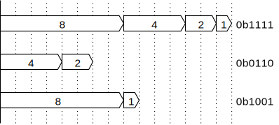

如果将1加到无符号整数，则值将如下图所示循环。这是一个4位整数的示例。


当运算结果溢出且结果与无穷大位不同时，称为“溢出”。例如，一个8位整数不会溢出1 + 3，但是会溢出200 + 100和20-30，分别为44和246。从数学上讲，它等于余数除以2 8 = 256。

>专栏：由溢出引起的有趣错误
>
>数值溢出有时会导致意外的错误。在这里，我们将介绍游戏“文明”的第一版中的错误。
>
>《文明》是一种战略模拟游戏，您可以在这些文明之间进行战斗，选择成吉思汗和伊丽莎白女王等玩家赢得世界或太空竞赛的胜利。
>
>原始文明中的错误是非暴力的甘地突然发起了核攻击。原因是这样的逻辑，即如果文明采用民主，那么侵略就会减少2倍。在最初的《文明》中，甘地的侵略性是所有玩家中最小的，但是随着游戏的发展和印度文明采用民主制，侵略性从2减少到255，而甘地也在游戏中。极具侵略性的球员。到那个时候，游戏通常已经发展到每个文明在科学和技术上都拥有核武器的水平，结果，甘地突然在某个转折点发动了核战争。这种“核甘地”非常有趣，并且在此后成为“文明”系列的标准，但是在第一代中，这是一个意想不到的错误。

### 有符号整数

在有符号整数（有符号整数）中，使用特殊的“二进制补码表示形式”（二进制补码）中处理的最高有效位（最高有效位）。2的补码表示形式中的n位整数，尽管其他n位数字表示与无符号相同的数字，但只有最高有效位的n位数字表示为2 n-1 -2而不是n-1 a。规则应表示。

具体而言，考虑到4位二进制数，每个数字和该数字表示的数字如下表所示。

<div>
<table>
<tbody>
<tr class="odd">
<td></td>
<td style="text-align: center;">4</td>
<td style="text-align: center;">3</td>
<td style="text-align: center;">2</td>
<td style="text-align: center;">1</td>
</tr>
<tr class="even">
<td>符号なしの場合</td>
<td style="text-align: center;">8</td>
<td style="text-align: center;">4</td>
<td style="text-align: center;">2</td>
<td style="text-align: center;">1</td>
</tr>
<tr class="odd">
<td>符号ありの場合</td>
<td style="text-align: center;">-8</td>
<td style="text-align: center;">4</td>
<td style="text-align: center;">2</td>
<td style="text-align: center;">1</td>
</tr>
</tbody>
</table>
</div>

与无符号一样，通过查看位的位置1可以找到由位模式表示的有符号值。例如，如果将0b1110视为4位带符号整数，则第二，第三和第四位（即第二，第四和-8位）为1，则0b1110为2 +。这表示4 + （-8）= -2。下面是一些示例的图表。

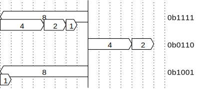

在此规则中，除非打开最高有效位，否则带符号整数表示的数字与其解释为无符号整数的数字相同。对于4位整数，0-7具有相同的位模式（带或不带符号）。另一方面，如果第4位打开，则位模式表示从-8到-1（0b1000到0b1111）中的任何数字。最高有效位有时称为“符号位”，因为当最高有效位打开时它为负。

如果将1加到有符号整数中，则值将如下图所示循环。这是一个4位整数的示例。


理解以上规则将为您解释在编程中通常会发现的各种有符号整数的看似奇怪的行为。

读者可能已经体验到，有符号整数加1会使大量数字溢出时变成非常小的数字。通过考虑两者的补码表示可以理解这一点。例如，对于8位带符号整数，最大数量为0b0111_1111或127。将其加1得到0b1000_0000，在2的补码表示中为-128。这是具有最高绝对值的负数。

例如，如果您从一元-测试main返回-3，则整个程序的退出代码应为253。这是main因为RAX设置为-3，即0b1111_ 111​​1_ 111​​1_ 111​​1_ 111​​1_ 111​​1_ 111​​1_1 1101，而仅RAX的低8位被认为是接收方的有意义的值。无符号整数，结果就像返回值0b1111_1101或253一样。

这样，位模式代表哪种数字取决于读者的假设。例如，一本纸质书中的字符毕竟是墨水渍，而计算机内存中的那些渍也被打开和关闭，因此这是有道理的，因为有些人认为它们是句子并可以阅读它们。一串比特，不是它自己的意思。为了传递一定的数字，设置值的一侧和读取值的一侧的解释方法必须相同。

在二进制补码表示中，可以表示的负数数量比可以表示的正数数量多一。例如，对于8位整数，可以表示-128，但+128恰好在可表示范围之外。就机制而言，不可避免的是，正负范围会以这种方式变得不平衡。有2 n个可以用n位表示的模式，即始终有偶数，但是如果将1位模式分配给0，则将保留奇数个模式，因此将为正数或负数增加，它将结束。

### 标志扩展

计算机经常使用加宽数字位数的操作。例如，如果要从内存中读取8位数字并将其设置在64位寄存器中，则需要将8位值扩展为64位。

处理无符号整数时，只需将零填充高阶位就很容易扩展值。例如，将4位值0b1110 = 14扩展为8位将产生0b0000_1110 = 14。

另一方面，在处理带符号整数时，如果高阶位用0填充，则数字将更改。例如，如果您打算将4位值0b1110 = -2扩展到8位并将其设置为0b0000_1110，则它将为14。这甚至不是负数，因为首先没有设置符号位。

扩展有符号整数时，如果符号位为1，则所有新的高位必须用1填充；如果符号位是0，则所有新高位必须用0填充。此操作称为“符号扩展称为”（符号扩展）。例如，如果将4位值0b1110 = -2符号扩展为8位，则会得到0b1111_1110 = -2，并且可以看到位宽度已成功扩展。

对于无符号整数，您可以想到在数字的左侧无限的零，在扩展时将检索该零。


类似地，对于有符号整数，您可以认为该数字在该数字的左边具有与符号位相同的无数个值，并在扩展时提取它。


这样，如果您要使数字适合更宽的位宽，则需要知道要处理的值是无符号的还是有符号的。

>列：表示符号扩展的不必要负数
>
>二进制补码表示法是计算机中广泛使用的带符号整数表示法，但是当您考虑如何将正整数和负整数映射到位模式时，这不是唯一的方法。例如，负二进制考虑所谓的，从较低的（-2）0，（-2）1，（-2）2的数字开始，它表示⋯⋯。以下是在4位情况下每个数字表示的数字的比较表。
>
<div>
<table>
<tbody>
<tr class="odd">
<td></td>
<td style="text-align: center;">4</td>
<td style="text-align: center;">3</td>
<td style="text-align: center;">2</td>
<td style="text-align: center;">1</td>
</tr>
<tr class="even">
<td>符号なし</td>
<td style="text-align: center;">8</td>
<td style="text-align: center;">4</td>
<td style="text-align: center;">2</td>
<td style="text-align: center;">1</td>
</tr>
<tr class="odd">
<td>2の補数</td>
<td style="text-align: center;">-8</td>
<td style="text-align: center;">4</td>
<td style="text-align: center;">2</td>
<td style="text-align: center;">1</td>
</tr>
<tr class="even">
<td>マイナス2進数</td>
<td style="text-align: center;">-8</td>
<td style="text-align: center;">4</td>
<td style="text-align: center;">-2</td>
<td style="text-align: center;">1</td>
</tr>
</tbody>
</table>
</div>
>
>一个4位减二进制数可以表示从-10到5的总共16个整数，如下所示：
>
<div>
<table>
<tbody>
<tr class="odd">
<td style="text-align: center;">5</td>
<td style="text-align: center;">0b0101</td>
</tr>
<tr class="even">
<td style="text-align: center;">4</td>
<td style="text-align: center;">0b0100</td>
</tr>
<tr class="odd">
<td style="text-align: center;">3</td>
<td style="text-align: center;">0b0111</td>
</tr>
<tr class="even">
<td style="text-align: center;">2</td>
<td style="text-align: center;">0b0110</td>
</tr>
<tr class="odd">
<td style="text-align: center;">1</td>
<td style="text-align: center;">0b0001</td>
</tr>
<tr class="even">
<td style="text-align: center;">0</td>
<td style="text-align: center;">0b0000</td>
</tr>
<tr class="odd">
<td style="text-align: center;">-1</td>
<td style="text-align: center;">0b0011</td>
</tr>
<tr class="even">
<td style="text-align: center;">-2</td>
<td style="text-align: center;">0b0010</td>
</tr>
<tr class="odd">
<td style="text-align: center;">-3</td>
<td style="text-align: center;">0b1101</td>
</tr>
<tr class="even">
<td style="text-align: center;">-4</td>
<td style="text-align: center;">0b1100</td>
</tr>
<tr class="odd">
<td style="text-align: center;">-5</td>
<td style="text-align: center;">0b1111</td>
</tr>
<tr class="even">
<td style="text-align: center;">-6</td>
<td style="text-align: center;">0b1110</td>
</tr>
<tr class="odd">
<td style="text-align: center;">-7</td>
<td style="text-align: center;">0b1001</td>
</tr>
<tr class="even">
<td style="text-align: center;">-8</td>
<td style="text-align: center;">0b1000</td>
</tr>
<tr class="odd">
<td style="text-align: center;">-9</td>
<td style="text-align: center;">0b1011</td>
</tr>
<tr class="even">
<td style="text-align: center;">-10</td>
<td style="text-align: center;">0b1010</td>
</tr>
</tbody>
</table>
</div>
>
>负二进制数的缺点是难以携带，并且0不在可表示范围的中心附近，但是另一方面，它们不需要符号位，这是一个有趣的功能。因此，当将数字减二进制扩展为更大的数字时，高位总是可以用零填充。
>
>这样，计算机上的整数表示不限于二进制补码表示，而是可以考虑各种方法。二进制补码表示形式是硬件中最易管理的表示形式，几乎在所有现有计算机中都使用。

### 反转符号

2的补码表示形式的细节并非始终是创建编译器所必需的知识，但是记住一些与2的补码表示形式有关的技术很有用。在这里，我们将解释一种简单的方法来反转正数和负数。

在2的补码表示中，如果执行“取反所有位并加1”运算，则数值的正负将被反转。例如，对于8位带符号整数，查找从3到-3的位模式的过程如下。

1. 用二进制表示一个数字。对于3，0b0000_0011。
2. 反转所有位。在这种情况下，它变为0b1111_1100。
3. 加一。在这种情况下，它变为0b1111_1101。这是-3位模式。

如果您记住上述方法，则可以轻松找到负位模式。

此外，通过执行相同的操作来将符号位设置为正数的位模式改变，可以容易地获得由该位模式表示的数值。例如，简单地将0b1111_1101表示的内容加起来很麻烦，但是如果将这些位取反并加1，则变成0b0000_0011，很容易说出来它表示3或-3的反符号。

上述技巧起作用的原因非常简单。到目前为止，我还没有在数学上正确定义2的补码表示形式的运算，因此有点模糊，但是想法如下。

反转所有位与从1的位模式中减去-1或所有位相同。例如，位模式0b0011_0011可以如下反转。

```
  1111 1111
- 0011 0011
= 1100 1100
```

换句话说，反转代表数字n的位模式与计算-1 --n相同。如果将其加1，则正在计算（-1 --n）+ 1 = -n，并且可以找到-n表示n。

>列：文字的基数
>
>C标准允许数字以八进制，十进制或十六进制形式编写。通常，如果您写一个像123这样的数字，它将是一个十进制数字；如果您写一个像0x8040这样的前导0x，它将是一个十六进制数；如果您写一个像0737这样的前导0，它将是一个十进制数字。八进制数。
>
>许多读者可能认为他们从未使用过用C用八进制写数字的功能，但是在这种语法中，0只是八进制表示法，因此任何C程序员实际上都是八进制数字，我经常写。这有点琐事，但是当您考虑它时，有一些原因使它不深入。
>
>首先，0作为数字符号有点特殊。通常，仅仅因为第10位或第100位是0，所以不会像01或001这样写数字，但是如果将规则照原样应用于0，它将是一个空字符串。当您想写0时，实际上什么都不写很困难，因此在那种情况下，我决定写0作为特殊规则，但这将是C语法中一个有点特殊的类别。

## 指针和字符串文字

在到目前为止的章节中，我们正在开发一种Hello world可以进行有意义的计算的语言，但是我们甚至还不能以我们的语言来显示它。现在是时候添加一个字符串，以便程序可以输出有意义的消息了。

C语言中的字符串文字char与类型，全局变量和数组密切相关。以下面的功能为例。

```c
int main(int argc, char **argv) {
  printf("Hello, world!\n");
}
```

上面的代码将以与下面的代码相同的方式进行编译。但是msg，这是唯一的标识符，不会与其他标识符重叠。

```c
char msg[15] = "Hello, world!\n";

int main(int argc, char **argv) {
  printf(msg);
}
```

我们的编译器仍然缺少一些支持字符串文字的功能。在printf本章中，让我们依次实现以下功能，以便我们可以通过支持字符串文字等来显示消息。

1. 一元&和一元*
2. 指针
3. 大批
4. 全局变量
5. 字符类型
6. 字符串字面量

我们还将在本章中添加测试上述功能所需的功能。

### 步骤16：一元与一元*

在此步骤中，实现指针的第一步是实现返回&地址的一元*和引用地址的一元。

这些运算符最初是返回指针类型值或采用指针类型值的运算符，但由于我们的编译器尚没有整数以外的类型，因此我们将整数类型替换为指针类型。即，仅&x将变量x的地址返回为整数。另外，*x是将x的值视为地址并从该地址读取该值的操作。

如果实现这样的运算符，则以下代码将起作用。

```c
x = 3;
y = &x;
return *y; // 3を返す
```

您还可以使用以下事实：局部变量在内存中连续分配，从而间接地通过指针强制访问堆栈上的变量。下面的代码假定该变量比堆栈上的y变量x高8个字节。

```c
x = 3;
y = 5;
z = &y + 8;
return *z; // 3を返す
```

例如，在这种不区分指针类型和整数类型的实现中，*4该表达式是一个从地址4读取值的表达式，但是暂时来说是好的。

它相对容易实现。一元&和\*添加一元的语法如下所示。除了根据语法，一元的变化给解析器&和一元\*每个ND_ADDR和ND_DEREF请读取为类型节点的那个。

```
unary = "+"? primary
      | "-"? primary
      | "*" unary
      | "&" unary
```

对代码生成器的更改很少。更改如下所示。

```c
  case ND_ADDR:
    gen_lval(node->lhs);
    return;
  case ND_DEREF:
    gen(node->lhs);
    printf("  pop rax\n");
    printf("  mov rax, [rax]\n");
    printf("  push rax\n");
    return;
```

### 步骤17：取消隐式变量定义，并引入关键字int

到目前为止，变量和函数的所有返回值都是隐式的int。因此，我int x;不必费心定义变量的类型名称，并假设所有新的标识符都是新的变量名称。您不能再做出这样的假设。因此，我将首先修改这一点。请实现以下功能。

* 停止将新标识符视为变量名，如果出现未定义的变量，则出错。
* int x;确保以的形式定义变量。int x = 3;不必支持诸如的初始化表达式。int x, y;你甚至都不需要的东西那样。仅实施最简单的方法。
* 我曾经像以前一样以这种形式foo(x, y)编写函数int foo(int x, int y)，但是我将对其进行修改，使其以类似形式的形式进行编写。当前，顶层仅应具有函数定义，因此解析器应首先int读取，然后读取函数名称，因此先读取它，然后读取int <引数の名前>列。您不必处理更困难的语法，也不必做任何事情，以防万一“为将来的扩展做准备”。编写足够的代码以简单地阅读“ int <函数名称>（由重复的<int <变量名称>组成的参数列表）”。

### 步骤18：介绍指针类型

#### 定义代表指针的类型

在此步骤中，我们将int允许类型名称int后面跟*0或更大，而不是仅允许类型名称到now 。也就是说int *x，它int ***x支持解析诸如ya的定义。

当然，诸如“指向整数的指针”之类的类型必须由编译器处理。例如，如果变量x是指向int的指针，则编译器*x必须知道该表达式的类型为int。这不能仅由固定大小的类型来表示，因为类型可以像您想要的那样复杂，例如“指向int的指针”。

所以要做的就是使用指针。到目前为止，通过映射与变量相关联的唯一信息是堆栈上距基本指针（RBP）的偏移量。对此进行更改，以便可以使用变量的类型。粗略地说，变量类型应具有以下结构。

```c
struct Type {
  enum { INT, PTR } ty;
  struct Type *ptr_to;
};
```

在这里，ty您可以具有int类型或“ pointer to”类型。ptr_to是ty一个成员是有意义的，只有当它的类型是“指向〜”，在那个时候，请假，把一个指针类型指向的对象“〜”。例如，在“指向int的指针”的情况下，表示类型的数据结构在内部如下。


表示int指针的数据结构

“指向int的指针”看起来像这样：


表示指向int指针的指针的数据结构

这样，您可以在编译器内表示任意数量的困难类型。

#### 分配给指针指向的值

\*p=3如何编译左侧不是简单变量名的表达式，例如？这些表达式与左侧是简单变量时具有相同的基本概念。在这种情况下，您可以将其作为左值进行编译，p以便生成的地址\*p。

\*p=3在编译表示的语法树时，代码会沿着该树递归地生成，但是首先要调用的是\*p用于生成为左值的代码生成器。

代码生成器将根据给定的语法树类型进行分支。如上所述，一个简单的变量将输出代码，该代码输出该变量的地址，但是由于在此给出了取消引用运算符，因此它的行为必须有所不同。如果给出了取消引用运算符，则将其中的语法树编译为“ rvalue”。然后，应将其编译为计算某个地址的代码（否则您将无法取消引用结果）。您可以将该地址原样保留在堆栈上。

达到此阶段后，您应该可以编译如下语句：

```c
int x;
int *y;
y = &x;
*y = 3;
return x; // → 3
```

### 步骤19：实现指针的加法和减法

此步骤使您可以p为指针类型的值p+1和p-5编写类似的表达式。这看起来像是添加一个整数，但实际上是一个完全不同的操作。并不意味着向具有的地址添加1 p+1，p而是p使其成为指向下一个元素的指针，因此p您必须添加指向。。的指针所指向的数据类型的宽度。例如，p如果指向一个int，则在我们的ABI中，我们p+1将在地址中添加4作为字节数。如果一个p是指向int的指针，p+1则加8。

因此，在增加或减少指针时，您需要一种方法来知道类型的大小，但目前对于int为4，对于指针为8，因此以这种固定方式编写代码。

在这个阶段编写测试有些棘手，因为仍然没有办法连续分配内存（我们的编译器还没有数组）。尝试在外部编译器的帮助下将其分配到那里，然后在编译器的输出中使用该辅助函数来编写测试。例如，您可以像这样测试它。

```c
int *p;
alloc4(&p, 1, 2, 4, 8);
int *q;
q = p + 2;
*q;  // → 4
q = p + 3;
return *q;  // → 8
```

>列：整型和长型
>
>具有32位int，64位长和指针的数据模型（例如x86-64 System V ABI）称为LP64。这意味着long和指针是64位的。即使在同一x86-64上使用ABI，Windows仍使用LLP64（一种数据模型，其中int和long是32位，long long和指针是64位）。
>
>由于长尺寸不同，LP64和LLP64不兼容ABI。例如，如果您创建一个包含长成员的结构，将整个结构原样写入文件，并且在读取时将文件上的数据直接投射到该结构，则可以使用Unix和Windows创建文件。不能互相传递以供阅读。
>
>C规范指出int为“ A”普通“ int对象具有执行环境的体系结构建议的自然大小”。当我这样说时，我认为int必须在64位计算机上为64位，但是自然是一个主观问题，即使在64位计算机上，通常也可以自然地处理32位操作。使int 32位甚至在64位计算机上也可以。实际上，将int设置为64位会导致以下问题。
>
>* 在少数情况下，int需要最大为64位，因此将int设置为64位只会浪费内存。
>* 如果short是16位，而int和long是64位，则没有类型表示32位整数。
>
>由于这些原因，大多数现有的64位计算机都具有32位整数。但是，还存在具有64位int的ILP64。例如，旧的Cray超级计算机是ILP64。

### 第20步：sizeof运算符

sizeof看起来像一个函数，但从语法上讲它是一元运算符。大多数运算符都是C语言中的符号，但从语法上讲，没有特殊原因使它们成为符号，实际上，它们sizeof是例外。

sizeof让我们回顾一下操作员的操作。sizeof是一个运算符，它返回参数表达式类型在内存中的字节数。例如，在我们的ABI中，sizeof(x)它是，x但int如果为4，x但如果为8 ，则返回一个指针。sizeof您可以在参数的参数中编写任何表达式，例如sizeof(x+3)，如果x+3表达式的类型整体为int，则它将返回4；如果它是指针，则将返回8。

我们的编译器还没有数组sizeof(x)，x但是如果是数组，它将x以字节为单位返回整个大小。例如，x但是int x[10]如果已定义等等，sizeof(x)它将返回40。x如果int x[5][10]定义为，sizeof(x)则为200，sizeof(x[0])为40，sizeof(x[0][0])为4。

sizeof编写操作符参数只是为了知道类型，而不是实际执行的表达式。例如sizeof(x[3])，编写表达式x[3]实际上并不会导致访问。x[3]由于我们在编译时就知道整个表达式的类型，因此在编译时sizeof(x[3])将用该类型的大小替换表达式。因此x[3]，sizeof在运行时不存在赋予等的具体表达式。

sizeof的操作如下所示。

```c
int x;
int *y;

sizeof(x); // 4
sizeof(y); // 8

sizeof(x + 3); // 4
sizeof(y + 3); // 8
sizeof(*y);    // 4

// sizeofに渡す式は何でもよい
sizeof(1); // 4

// sizeofの結果は現在int型なのでsizeof(int)と同じ
sizeof(sizeof(1)); // 4
```

现在，sizeof让我们实现此运算符。sizeof为了实现运算符，我们必须同时修改标记器和解析器。

首先，对token生成器进行更改，以使其sizeof将关键字TK_SIZEOF识别为类型的token。

然后对解析器进行更改，sizeofaint将被替换为类型常量。sizeof添加了运算符的语法如下所示。在下面的语法中，sizeof是一元运算符，并且定义为与一元加号和一元减号具有相同的优先级。这与C语法相同。

```
unary = "sizeof" unary
      | ("+" | "-")? primary
```

在此语法中，语法sizeof(x)不仅sizeof x允许像这样的写作风格，而且还允许像这样的写作风格，但在实际的C语言中是相同的。

在解析器中，当出现sizeof运算符时，它将照常解析作为其参数的表达式，int如果与结果语法树关联的类型是4，则将其替换为4，如果是指针，则将其替换为8。您无需对代码生成树进行任何更改，因为它将被解析器中的常量替换。

### 步骤21：实现数组

#### 定义数组类型

此步骤实现一个数组。到现在为止，我们只处理足够大的数据以适合寄存器的数据，但是这是第一次，较大的数据将出现。

但是，C语法只适用于数组。您不能将数组作为函数参数传递，也不能将数组作为函数返回值返回。如果您出于这种意图编写代码，则数组本身将不会按值传递，但是将自动创建并传递指向该数组的指针。还不支持将数组直接分配给数组并进行复制（必须使用memcpy）。

因此，无需在函数和变量之间交换不适合寄存器的数据。在堆栈上分配一个以上的内存字的能力已足够。

确保您可以阅读以下变量定义。

```c
int a[10];
```

上面的类型a是一个数组，该数组的长度为10，元素类型为int。与指针类型一样，数组类型可以任意复杂，因此ptr_to应该指向数组中元素的类型，如步骤7所示。表示类型的结构应如下所示：

```c
struct Type {
  enum { INT, PTR, ARRAY } ty;
  struct Type *ptr_to;
  size_t array_size;
};
```

该array_size字段仅在为数组类型时才有意义，并且是具有数组中元素数量的变量。

此时，应该很容易为堆栈上的数组分配空间。要找到以字节为单位的数组大小，只需将以字节为单位的数组元素的大小乘以数组元素的数量即可。我们应该保留所有变量作为一个单词的堆栈区域，但是请对其进行更改，以使数组具有所需的数组大小。

#### 实现从数组到指针的隐式类型转换

数组和指针经常结合使用，因此在C语言中，指针和指针的工作没有太大区别，但是事与愿违，数组和指针之间的关系又是什么呢？似乎程序员很难理解。因此，在这里我们将解释数组和指针之间的关系。

首先，在C语言中，数组和指针是完全独立的类型。

指针的类型为8字节值（在x86-64上）。就像为整数定义了+和-等运算符一样，为指针定义了+和-（以稍有不同的方式）。除此之外，*还为指针定义了一元运算符，您可以使用它们来引用指针所指向的点。一元*除了以外，指针没有什么特别的。指针可以说是int之类的普通类型。

另一方面，数组的类型可以是任意数量的字节。与指针不同，为数组定义的运算符很少。定义的唯一运算符是返回sizeof数组大小的运算符和＆运算符返回数组的第一个元素的指针。除此之外，没有适用于数组的运算符。

那么为什么a[3]可以编译这样的表达式呢？在C语言中，a[3]它*(a+3)被定义为等价的。不是为数组定义了+运算符吗？

这就是将数组隐式转换为指针的语法的地方。假定将数组隐式转换为指向数组第一个元素的指针，但用作一sizeof元&操作数时除外。因此，*(a+3)表达式将指向数组第一个元素的指针取消引用，然后再加上三个，这又与访问数组的第三个元素具有相同的含义。

C中[]没有用于数组访问的运算符。C[]只是用于通过指针访问数组元素的简单表示法。

同样，如果将数组作为函数参数传递，则它成为指向数组第一个元素的指针，或者可以像直接将数组分配给指针一样编写它，但这也如上所述。取决于原因。

因此，在大多数运算符实现中，编译器必须将数组类型转换为指针。这不应该是太难以实施。sizeof除非&您实现一元，如果您解析操作的操作数，你会得到一个指向T的指针结束，如果它是T的数组 在代码生成器中，数组类型值应生成将该值的地址压入堆栈的代码。

一旦你做到了这一点，你应该有这样的代码：

```c
int a[2];
*a = 1;
*(a + 1) = 2;
int *p;
p = a;
return *p + *(p + 1)  // → 3
```

>专栏：语言律师
>
>通过将语言规范作为法律，对正式语言规范有很好理解的人有时被称为“语言律师”。在程序员的lang语词典Jargon File中，语言律师解释道：
>
>* 语言律师[名词]：一位经验丰富或资深的软件工程师，几乎（几乎）熟悉一种或多种编程语言的所有有用和奇怪的功能及其局限性。一个人是否是语言律师，可以通过以下方式确定：一个人是否可以回答问题，方法是在200多页的手册中显示五个句子，然后回答“我希望我在这里看到了”。
>
>语言律师一词有时被用作动词来表示语言律师。
>
>熟练的语言律师经常被其他程序员所见。当我在Google的C ++编译器团队工作时，我经常得出这样的结论：团队中有人可能是最终的语言律师，如果我对C ++有任何疑问，我会问他（还有很多东西，甚至使C ++编译器的人都不了解C ++规范）。实际上，他是实现Clang主要部分的人，一个主要的C ++编译器，C ++规范的主要作者以及世界上最了解C ++的人。 ，“因此我记得当时认为C ++语言规范的庞大性和复杂性是相当大的。
>
>除非编译器更完整，否则本文档故意不涉及C语言规范的详细信息。这是有原因的。如果要实现具有规范的编程语言，则在某种程度上需要成为语言律师，但是作为一种开发方法，从一开始就过多担心细节是不可取的。如果您正在实现一种编程语言，以便在绘制图片时首先完成整个过程的草图，而不是仅详细绘制一个部分，则要对其进行平衡，这样一开始您就不会成为一名语言律师。在保持它的同时进行开发是必需的。

### 步骤22：实现数组下标

在Cx[y]中*(x+y)已定义为等效。因此，下标的实现相对容易。只需x[y]在解析器中*(x+y)阅读即可。例如，a[3]牙齿*(a+3)会。

在这种语法，3[a]牙齿*(3+a)，因为它们被部署到，a[3]是如果移动3[a]，但它也应该工作，在什么C3[a]表达式，比如实际上是合法的。试试吧。

### 步骤23：实现全局变量

它是关于时间，我希望能在我的计划写文字字符串。在C中，文字串是字符的阵列。这没关系，因为我们已经实施的阵列，除了文字字符串不是在堆栈上存在的价值。字符串文字是在存储器中的固定位置，而不是在堆栈。因此，为了实现一个字符串，我们将首先添加全局变量。

到现在为止，只有函数定义应该已经在顶层允许的。更改它的语法，让你在顶层写全局变量。

解析有点棘手，因为变量定义看起来与函数定义相似。例如，比较以下四个定义。

```c
int *foo;
int foo[10];
int *foo() {}
int foo() {}
```

前两名的Foo变量定义和底部的两个是函数定义，但它们可以被区分，直到到达函数名称或成为变量的名称和读取下一个标记标识。不。所以，你需要首先调用“读取类型名称上半年”功能，然后读取标识符，它应该来后，再向前看一个token。如果预读标记为“（”，则您正在读取函数定义，否则您正在读取变量定义。

把解析的全局变量的名称在地图，使您可以通过名称查找。只有当变量名称不能被解析为一个局部变量，它会尝试解决它作为一个全局变量。这可以让你自然实现局部变量隐藏全局变量具有相同名称的行为。

在语法分析器，局部变量的引用和全局变量引用被翻译成抽象语法树的另一个节点。由于这个名称可以在透视阶段解决，类型也在这个阶段分开。

所有变量应该已经在堆栈上，因为他们，所以读取和写入变量相对于RBP（基址指针）已完成。全局变量是在一个固定的内存位置是在堆栈中值，而不是值，因此直接编译到访问该地址。请参阅GCC的实际输出。

当你实现它，你会在全局变量是如何不同的地方，并感到惊讶。为什么你可以无需视觉区分写的原因是，C语言是很好抽象。实际上，局部变量和全局变量在内部实现的方式完全不同。

### 步骤24：实现字符类型

数组是一个类型，可能是大于一个字，但字是一种比一个字小的。当您到达这一步时，您可能必须编写一个函数，该函数接受一个代表某种类型的对象，并以该类型的大小返回字节数。首先添加字符类型，然后修改函数以返回1作为字符类型。

你并不需要实现这一步的文字字符（单引号字符）。抑制来实现它一下子，并保留更改尽可能小的愿望。

因此，在这一步的字符是真的只是一个小的整数类型。movsx ecx, BYTE PTR [rax]然后，你可以通过RAX指向的地址读取1个字节，并把它放在ECX。使用说明movzx ecx, BYTE PTR [rax]等，好像不需要符号扩展movzx。mov [rax], cl使用一个8位寄存器作为源寄存器，如书写时。

实际编译器输出请参考。

如果可以执行此步骤，则应具有以下代码：

```c
char x[3];
x[0] = -1;
x[1] = 2;
int y;
y = 4;
return x[0] + y;  // → 3
```

>列：8位寄存器和32位寄存器之间的差异
>
>为什么在读取1字节值时应该使用movsx或movzx？当读取一个4字节的值时，用普通mov将其读入较低的32位别名（例如EAX）的寄存器中就足够了，因此，在读取char时，似乎用普通mov将其加载到AL中就足够了。 。但这是行不通的。这个谜的答案在于x86-64规范。
>
>在x86-64上，读入低32位别名寄存器会将高32位重置为0。但是，当读取低8位别名的寄存器时，高56位将保留其先前的值。这是一个不一致的规范，但是由于x86-64是一个建立已久的指令集，因此这些差异无处不在。
>
>由于x86-64已从称为8086的16位处理器发展到32位和64位，因此先出现AL，然后是EAX，再到RAX。换句话说，最初有一个规范，即将EAX的高24位加载到AL中时不重置（原样保留），当扩展到64位时，将RAX的高32位加载到EAX中时应重置。已经制定了重置规范。我们制定此不一致的规范是有充分理由的。
>
>在现代处理器中，不相关的指令（不使用前一条指令的结果的指令）通过查看指令依赖性来并行执行。如果您将指令集设置为不重置高32位，而是简单地将高32位忽略为垃圾，而仅继续使用低32位，则将以编程风格结束，但是，错误的依赖关系将产生在生成被忽略的高32位的指令与使用同一寄存器的后续指令之间发生。如果规范是扩展高32位的符号并对其进行重置，则先前的值将被完全覆盖，并且可以打破依赖关系。因此，当将x86转换为64位时，我们知道这将是不一致的，因此决定使用可以简化加速的规范。

### 步骤25：实现字符串文字

此步骤使您可以解析和编译包含在双乘法表中的字符串。我认为它相对容易实现，因为可以使用必要的部分，例如数组，全局变量和字符类型。

首先调整token生成器，找到双引号后，阅读下一个双引号以创建字符串token。您无需在此步骤中实现反斜杠转义等。循序渐进很重要，因此，如果您认为易于实现，请不要这样做。

表示字符串文字的数据组件的代码，则无法在被产生在CPU中被执行的机器代码的中间输出。在输出组件，全局数据和代码应写入未混合。换句话说，当你输出的代码，你想输出的所有字符串文字中出现的代码首先，却是麻烦下井语法树为。要做到这一点，它会很容易有一个包含到目前为止，我们已经看到的所有字符串文字的载体，从而使解析器只是每次看串时间增加了它。

请参考实际编译器的输出。

来吧，到目前为止printf也应该成为可能在字符串中输出。这是写使用自己的编程语言，而不是一些微不足道的测试代码稍微复杂程序的好时机。例如，对于8皇后问题的求解器可以写在自己的语言。从数字计算机的发明人类，直到编程语言写在这个水平上一个简单的代码开发，花了几十年。对于人类来说，这是一个巨大的进步，并且您将在几周内实现它。

（当我们调用带有可变参数的函数时，我们应该将浮点参数的数量放入AL中。我们的编译器尚没有浮点数，因此我们调用该函数。始终将AL设置为0。）

### 步骤26：从文件中读取输入

到目前为止，C代码已直接传递到参数字符串，但是输入变得越来越长，因此是时候对其进行修改，以便像常规C编译器一样将文件名作为命令行参数使用。 。一个打开给定文件，读取其内容'\0'并返回以终止的字符串的函数可以简明地写为：

```c
#include <errno.h>
#include <stdio.h>
#include <string.h>

// 指定されたファイルの内容を返す
char *read_file(char *path) {
  // ファイルを開く
  FILE *fp = fopen(path, "r");
  if (!fp)
    error("cannot open %s: %s", path, strerror(errno));

  // ファイルの長さを調べる
  if (fseek(fp, 0, SEEK_END) == -1)
    error("%s: fseek: %s", path, strerror(errno));
  size_t size = ftell(fp);
  if (fseek(fp, 0, SEEK_SET) == -1)
    error("%s: fseek: %s", path, strerror(errno));

  // ファイル内容を読み込む
  char *buf = calloc(1, size + 2);
  fread(buf, size, 1, fp);

  // ファイルが必ず"\n\0"で終わっているようにする
  if (size == 0 || buf[size - 1] != '\n')
    buf[size++] = '\n';
  buf[size] = '\0';
  fclose(fp);
  return buf;
}
```

由于编译器的实现，如果所有行都以换行符结尾，则更容易处理以换行符或EOF结尾的数据，因此，如果文件的最后一个字节\n不是，\n则将自动添加。

严格来说，如果不能随机访问特殊文件，此功能将无法正常工作。/dev/stdin例如，如果您指定一个表示标准输入的设备文件或命名管道作为文件名，则/dev/stdin: fseek: Illegal seek应该看到一条错误消息。但是，实际上，此功能应该很好。使用此功能读取文件的内容并修改代码以将其视为输入。

输入文件通常包含多行，因此最好增强显示错误消息的功能。如果您决定显示输入文件名，出现错误的行的行号以及发生错误时该行的内容，则错误消息如下所示：

```c
foo.c:10: x = y + + 5;
                  ^ 式ではありません
```

显示此类错误消息的函数如下所示：

```c
// 入力ファイル名
char *filename;

// エラーの起きた場所を報告するための関数
// 下のようなフォーマットでエラーメッセージを表示する
//
// foo.c:10: x = y + + 5;
//                   ^ 式ではありません
void error_at(char *loc, char *msg) {
  // locが含まれている行の開始地点と終了地点を取得
  char *line = loc;
  while (user_input < line && line[-1] != '\n')
    line--;

  char *end = loc;
  while (*end != '\n')
    end++;

  // 見つかった行が全体の何行目なのかを調べる
  int line_num = 1;
  for (char *p = user_input; p < line; p++)
    if (*p == '\n')
      line_num++;

  // 見つかった行を、ファイル名と行番号と一緒に表示
  int indent = fprintf(stderr, "%s:%d: ", filename, line_num);
  fprintf(stderr, "%.*s\n", (int)(end - line), line);

  // エラー箇所を"^"で指し示して、エラーメッセージを表示
  int pos = loc - line + indent;
  fprintf(stderr, "%*s", pos, ""); // pos個の空白を出力
  fprintf(stderr, "^ %s\n", msg);
  exit(1);
}
```

该错误消息输出例程非常简单，但是可以说它以相当完整的格式输出错误。

>列：错误恢复
>
>如果输入代码在语法上不正确，许多编译器将跳过该错误并尝试在此之后继续进行解析。目的是发现尽可能多的错误，而不仅仅是一个。从解析器错误中恢复并继续解析的函数称为“错误恢复”。
>
>错误恢复是旧版编译器中的一个非常重要的功能。在1960年代和1970年代，程序员在计算机中心使用大型计算机进行时间共享，有时在输入要编译的代码后必须等待一整夜，然后才能获得编译结果。在这样的环境中，指出尽可能多的错误是编译器的重要任务之一。在旧的编译器教科书中，错误恢复已成为解析的主要主题之一。
>
>错误恢复并不是一个重要的话题，因为使用编译器进行开发现在更具交互性。我们开发的编译器仅输出第一条错误消息。在现代，这在许多情况下就足够了。

### 第27步：逐行注释

我们的编译器随着时间的推移而发展，使我们能够编写完整的代码。发生这种情况时，您想要的就是注释。本章实现注释。

C语言中有两种类型的注释。一个注释称为行注释，该注释//从到行尾。另一个称为块注释，/*其中是开始符号，*/是结束符号。*/除两个字符的序列外，块注释中的所有字符均被跳过。

在语法上，注释与单个空格字符相同。因此，很自然地以与空白字符相同的方式在token生成器中跳过注释。跳过注释的代码如下所示。

```c
void tokenize() {
  char *p = user_input;

  while (*p) {
    // 空白文字をスキップ
    if (isspace(*p)) {
      p++;
      continue;
    }

    // 行コメントをスキップ
    if (strncmp(p, "//", 2) == 0) {
      p += 2;
      while (*p != '\n')
        p++;
      continue;
    }

    // ブロックコメントをスキップ
    if (strncmp(p, "/*", 2) == 0) {
      char *q = strstr(p + 2, "*/");
      if (!q)
        error_at(p, "コメントが閉じられていません");
      p = q + 2;
      continue;
    }
    ...
```

在这里，strstr我使用了C标准库中包含的函数来查找块注释的结尾。strstr在字符串中搜索字符串，如果找到，则返回指向所传递字符串开头的指针；如果找不到，则返回NULL。

>列：行注释
>
>在原始C语言中仅存在块注释，并且在C语言开发将近30年之后的1999年，正式在规范中添加了行注释。最初，这应该是不兼容的更改，但是在某些微妙的情况下，最初起作>用的代码可能具有不同的含义。
>
>具体来说，a/b将a加载以下代码，就好像仅支持块注释，并且仅支持行注释一样。
>
>```
>a//*
>// */ b
>```

>列：块注释和嵌套
>
>块注释不能嵌套。/*在注释中没有特殊含义，因此请注释掉现有的块注释
>
>```
>/* /* ... */ */
>```
>
>如果您愿意，首先*/将在注释中完成，第二次*/将可能出现语法错误。
>
>如果要注释掉可能包含块注释的所有行，请使用C预处理程序。
>
>```
>#if 0
>...
>#endif
>```
>
>#if 0有缠绕的方法，像这样。

### 步骤28：用C重写测试

此步骤make test加快了重写测试的速度。到这一步时，您可能已经在shell脚本中编写了100多个测试。Shell脚本测试会在每个测试中启动许多进程。换句话说，每个测试都会启动自己的编译器，汇编器，链接器以及测试本身。

即使对于小型程序，启动过程也没有那么快。因此，如果您执行数百次，则总共将花费不可忽略的时间。也许您的测试脚本也需要花费几秒钟来运行。

首先，我是在shell脚本中编写测试的，因为否则我将无法进行像样的测试。在计算器的语言阶段，if箭头==没有，计算结果是否正确，是否使用我无法验证的语言。但是现在可以验证了。可以比较结果是否正确，如果不正确，则显示（字符串）错误消息并退出。

因此，在此步骤中，将用Shell脚本编写的测试重写为C文件。

## 程序执行映像和初始化公式

现在，通过到目前为止的步骤，我们的编译器现在支持编程的所有主要元素：函数，全局变量和局部变量。此外，读者还应该了解拆分编译和链接的知识，以了解如何将程序分小段地编译，最后将其组合成一个文件。

本章介绍操作系统如何执行可执行文件。通过阅读本章，您将能够了解可执行文件中的数据以及在调用主函数之前发生的事情。

本章还描述了变量初始化表达式，即下面的代码如何编译，并为我们的编译器增加了对初始化表达式的支持。

```c
int x = 3;
int y[3] = {1, 2, 3};
char *msg1 = "foo";
char msg2[] = "bar";
```

为了支持初始化表达式，这可能令人惊讶，但是了解程序在到达main时的工作方式是至关重要的。

请注意，本章介绍了一个简单的可执行文件，该文件将所有代码和数据包含在一个可执行文件中。这种可执行文件称为“静态链接”可执行文件。对于静态链接，也广泛使用一种称为“动态链接”的执行格式，其中将一个程序片段划分为多个文件，并在运行时将它们组合并在内存中执行，我将在单独的章节中对此进行说明。首先，让我们深入了解基本模型静态链接。

### 可执行文件结构

可执行文件由文件头和一个或多个称为“段”的区域组成。可执行文件通常至少具有两个段，分别包含可执行代码和数据。包含可执行代码的段称为“文本段”，而包含其他数据的段称为“数据段”。实际的可执行文件包含其他段，但是不需要它们来了解它们的工作原理，因此此处将其省略。

关于术语，请注意，文本与文本文件中的文本相同，但含义不同。传统上，在较低的层中，表示机器语言的数据称为“文本”。另外，机器语言只是字节序列，文本也是数据的一种类型，但是当我们说“文本和数据”时，“数据”通常是指“文本以外的数据”。同样在本章中，当我们说数据时，我们指的是文本以外的数据。

作为链接器输入的目标文件分别包含文本和数据。链接器将从多个目标文件中读取的文本串联起来，并将它们放在一个文本段中，类似地，将从多个目标文件中读取的数据串联起来，并将它们放入一个数据段中。

在可执行文件的文件头中，为每个段写入了在执行时应放置的内存地址。当可执行文件被执行时，称为OS的“程序加载器”或简称为“加载程序”的程序会根据该信息将文本和数据从可执行文件复制到内存中。

下图显示了可执行文件以及加载程序将可执行文件加载到内存中的状态。


可执行文件和内存映像

在该图中的可执行文件中，我们假设文件的头包含以下信息：文本段将在0x41000处加载，数据段将在0x50000处加载。

文件头还包含有关从何处开始执行的信息。例如，如果存在执行应该从0x41040开始的信息，则加载程序将可执行文件加载到内存中，如上所示，将堆栈指针设置为0x7fff_ffff_ffff_ffff，然后跳转到0x41040，它将开始执行用户程序。

### 数据段内容

文本段的内容显然是机器语言，但是数据段中包含什么？答案是数据段包含全局变量，文字字符串等。

局部变量不直接包含在文本段或数据段中。本地变量在将可执行文件加载到内存后不立即存在，因为该程序会在堆栈区域中动态创建它们。

在C执行模型中，程序可以通过简单地将可执行文件直接读取到内存中来开始执行主要功能。因此，只需将全局变量从可执行文件的数据段复制到内存中即可将全局变量设置为适当的初始值。

由于此限制，C不能使用使用函数调用的初始化表达式，例如，对于全局变量。

```c
int foo = bar();
```

如果您有一个像上面的那样需要动态初始化的全局变量，则有人需要在执行main函数之前执行上面的表达式。但是，C没有在main之前调用的初始化机制，因此这种初始化是不可能的。

换句话说，全局变量必须是在链接时完成的值，并且可以照原样作为字节字符串放入可执行文件中。此类值仅限于以下公式：

* 常数表达
* 全局变量和函数的地址
* 全局变量或函数加常量的地址

不言而喻的是，常量值（如文字数字和字符串）可以在文本段中设置为固定值。

全局变量和函数的地址通常不是在编译时确定的，而是通常在链接程序完成可执行文件时确定的。因此，int *x = &y;定义类似于用另一个全局变量的地址初始化指针类型的全局变量的值是合法的。链接器自己决定程序段的布局，并且当然知道函数和全局变量的加载地址，因此x可以在链接时填写其内容。

另外，链接器功能支持在标签地址上添加常量，int *x = &y + 3;因此合法的定义是合法的。

除上述模式外的其他表达式不能写在初始化表达式中。例如，您不能在初始化表达式中使用全局变量的值（而不是地址）。ptrdiff_t x = &y - &z;以两个全局变量的地址之间的差为单位的表达式，例如，原则上是在链接时要求一个值的表达式，但是由于链接程序不支持计算两个标签之间的差的操作。您不能在初始化表达式中编写这样的表达式。全局变量初始化表达式仅在上述受限模式中允许使用。

可以用C表示可作为全局变量的初始化表达式编写的表达式的示例，如下所示。

```c
int a = 3;
char b[] = "foobar";
int *c = &a;
char *d = b + 3;
```

每个表达式的程序集如下所示：

```
a:
  .long 3
b:
  .byte 0x66 // 'f'
  .byte 0x6f // 'o'
  .byte 0x6f // 'o'
  .byte 0x62 // 'b'
  .byte 0x61 // 'a'
  .byte 0x72 // 'r'
  .byte 0    // '\0'
c:
  .quad a
d:
  .quad b + 3
```

连续.byte正在.ascii使用一种表示法，.ascii "foobar\0"您也可以将其编写为。

>列：全局变量的动态初始化
>
>在C中，必须静态确定全局变量的内容，但是在C ++中，可以使用任意表达式初始化全局变量。也就是说，在C ++中，全局变量初始化表达式在调用主函数之前执行。它通过以下机制工作。
>
>* C++编译器将全局变量初始化表达式编译为一个函数.init_array，并将函数指针输出到一个特殊的部分，称为
>* 链接器.init_array将多个输入文件的节串联.init_array起来，然后将它们输出到一个段（因此，该.init_array段包含一个函数指针数组）。
>* 加载程序main首先.init_array将片段中包含的功能指针按顺序执行，然后再将控制权转移到该指针。
>
>这样，编译器，链接器和程序加载器之间的协作使动态初始化全局变量成为可能。
>
>如果使用与C ++相同的机制，则可以支持C中全局变量的动态初始化，但是有意将这种函数从C语言规范中排除。
>
>C语言规范的设计选择对程序编写者有很多限制，但是对于程序执行者而言，加载程序或无加载程序的环境较差（例如，计算机启动时直接从ROM执行的代码）。能够完全符合语言规范。因此，这是一个分歧性的问题，而不是哪个更好。

### 初始化公式语法

初始化表达式看起来就像赋值表达式，但实际上，初始化表达式和赋值表达式在语法上是完全不同的，并且有些特殊的书写样式仅允许初始化表达式使用。让我们在这里很好地了解特殊的写作风格。

首先，初始化表达式使您可以初始化数组。例如，下面的公式，x[0]，x[1]，x[2]使他们成为0，1，2各自x必须初始化。

```c
int x[3] = {0, 1, 2};
```

给定一个初始化表达式，可以通过查看右侧的元素数来确定数组的长度，因此可以省略数组的长度。例如，上面和下面的表达式具有相同的含义。

```c
int x[] = {0, 1, 2};
```

如果显式给出了数组的长度，而初始化表达式仅部分给出了，则其余元素必须使用0进行初始化。因此，以下两个表达式具有相同的含义。

```c
int x[5] = {1, 2, 3, 0, 0};
int x[5] = {1, 2, 3};
```

另外，char作为仅用于数组初始化表达式的特殊语法，允许以下使用文字字符串作为初始化表达式的写入方法。

```c
char msg[] = "foo";
```

上式具有与下式相同的含义。

```c
char msg[4] = {'f', 'o', 'o', '\0'};
```

### 全局变量初始化表达式

全局变量初始化表达式必须在编译时计算。计算结果要么只是一串字节，要么是指向函数或全局变量的指针。对于指针，您可以使用一个整数来表示该指针的偏移量。

全局变量初始化表达式完全不给，你必须初始化为所有位变为零。这是通过这样C的语法来确定

请治疗作为一个编译错误，如果初始化表达式不是在上面计算结果。

### 局部变量初始化表达式

局部变量初始化表达式和全局变量的外观的初始化表达式是一样的，意义是非常不同的。事情称为局部变量的初始化表达式是当场执行的表达式。因此，并不需要在编译时确定其内容。

基本上，int x = 5;如语句，int x; x = 5;只是因为它被编译并写下分为两个句子等。

int x[] = {1, 2, foo()};诸如之类的语句以与下一个句子相同的方式进行编译。

```c
int x[3];
x[0] = 1;
x[1] = 2;
x[2] = foo();
```

对于没有初始化表达式给出局部变量的内容是不确定的。因此，没有必要初始化这些变量。

>专栏：字的大小
>
>在X86-64“单词”装置两者的16位数据和64位数据的术语。这是一个混乱的状态，但也有已经变得如此的历史环境。
>
>本来术语“字”是指自然可以在电脑上进行处理的最大整数或地址的大小。它是由64位就是从这里来的是一个字一个x86-64的64位处理器。
>
>另一方面，16位是一个字，来自16位处理器的8086术语。当英特尔工程师将8086扩展到32位以创建386处理器时，他们决定调用32位双字或dword以避免更改“字”的大小。同样，在将386扩展到64位的x86-64上，我们决定将64位称为四字或qword。这种兼容性考虑导致了单词的两种不同含义。

## 第29步及以后：[需要添加]

## 静态和动态链接

到目前为止，本书仅使用了称为静态链接的功能。由于静态链接是一个简单的执行模型，因此通过关注该模型，我能够以一种易于理解的方式解释该汇编代码和可执行文件的内存映像，但实际上，它是一个通用执行。创建文件时，链接使用不是很广泛。实际上，广泛使用了称为动态链接而不是静态链接的功能。

本章介绍静态和动态链接。

默认情况下，编译器和链接器尝试输出可执行动态链接的可执行文件。到目前为止cc，您还-static忘记了该选项，如果我认为该选项（如您看到过以下错误所示，则-static该选项Makefile已从make运行Please try中删除）。

```
$ cc -o tmp tmp.s
/usr/bin/ld: /tmp/ccaRuuub.o: relocation R_X86_64_32S against `.data' can not be used when making a PIE object; recompile with -fPIC
/usr/bin/ld: final link failed: Nonrepresentable section on output
```

链接器默认会尝试动态链接，但是编译器必须输出可以执行此操作的汇编代码。chibicc目前不会输出这样的代码，因此，如果-static您忘记添加它，则会收到上述错误。通过阅读本章，您应该能够理解上述错误的含义以及解决这些错误所需采取的措施。

### 静态链接

静态链接的可执行文件是独立的可执行文件，在运行时不需要任何其他文件。诸如之类的printf功能不是用户编写的功能，而是在libc标准库中，但是如果您创建具有静态链接的可执行文件，printf则代码将从libc复制到到可执行文件。运行静态链接的程序时libc不需要。因为libc其中的必要代码和数据已经被复制到可执行文件中。

hello.c让我们看看下面的简单程序实际上是如何变成静态链接的可执行文件的。

```c
#include <stdio.h>

int main() {
  printf("Hello world!\n");
}
```

要hello.c编译，链接该文件hello并将其转换为具有文件名的可执行文件，请输入以下命令：

```
$ cc -c hello.c
$ cc -o hello hello.o
```

在上面的命令中，第一行进行hello.c编译以hello.o创建目标文件，第二行将其链接到可执行文件。cc -o hello hello.c可以将这两个命令一起编写，但是以这种方式启动编译器时，将在内部完成与上述两个命令相同的操作。

hello.c在stdio.h已被包括在内。但是，正如我们在这本书中所看到的，到目前为止，不包含任何代码本身在头文件中的函数体。因此，hello.o在创建文件时，编译器知道stdio.h声明printf的函数的存在和类型，但是printf不知道其实际代码。因此，printf该代码hello.o不能包含在文件中。实际上，hello.o在main遗嘱中它包含唯一的定义。hello.o它printf是链接到包含它们的和目标文件组合来完成的可执行文件中的作用。

在第二行中，cc当通过命令行调用链接器时，在命令行hello.o以及一个名为的文件/usr/lib/x86_64-linux-gnu/libc.a中传递了链接，库的系统标准路径也将传递给链接器。printf该功能libc.a包含在此功能中。.a这是因为.tar杀死.zip是与存档文件相同的类型。让我们看一下内容。

```
$ ar t /usr/lib/x86_64-linux-gnu/libc.a
...
printf_size.o
fprintf.o
printf.o
snprintf.o
sprintf.o
...
```

musl printf.c

存档文件

静态链接的可执行文件的执行模型很简单。在运行时，内存中仅存在该可执行文件，因此可执行文件的每个段都可以加载到内存中的任何位置。如果您尝试加载到链接时固定的默认地址，则加载不会失败。这是因为在加载可执行文件之前，内存中没有任何内容。因此，通过静态链接，可以在链接时确定所有全局变量和函数的地址。

静态链接具有以下优点：

* 加载简单快捷
* 没有相关文件，因此只需复制可执行文件即可使用
* 即使库的不同版本的行为略有不同，通过静态链接复制时，库的代码和数据也将是固定的，因此，相同的可执行文件在任何环境下都可以工作。

静态链接具有以下缺点：

* 复制可执行文件使用的库函数和代码，这会浪费一些磁盘和内存。
* 如果库中的错误已修复，则需要重新链接该错误以反映现有可执行文件中的更改。

另一方面，动态链接的可执行文件在运行时需要其他文件.so（在Unix上）和.dll（在Windows上）。.so箭头.dll指向printf代码和函数，例如errno包含全局变量等。诸如.so和的.dll文件称为动态库，简称为库或DSO（动态共享库）。

## C类型语法

众所周知，C类型语法过于复杂。在由C开发人员Dennis Ritchie合着的“ C编程语言C ”（通常称为“ K＆R”）一书中，“可以批评C语言声明的语法，尤其是涉及函数指针的声明的语法。有。” 7。

如您所见，C型语法是一个糟糕的设计，即使作者也暗中承认，但是即使这样，一旦您理解了规则，这种语法也就不那么困难了。

本章介绍如何读取C类型语法。通过逐步加深理解，到本章结束时，您的每个读者void (*x)(int)Yavoid (*signal(int, void (*)(int)))(int)都应该能够理解诸如此类的复杂类型。

### 该图显示了类型

可以用C表示的类型相对简单。为了将类型语法的复杂性与类型本身的复杂性分开，让我们将语法放在一边，只考虑类型。

指针和数组等复杂类型可以用箭头连接的简单类型表示。例如，下图是表示“指向int的指针”的类型的图。


在日语中，它从箭头的终点到起点被理解为“ int指针的指针”。相反，用英语，沿箭头方向大声读出指向int的指针。

x假设变量具有上图所示的类型。“x对某种类型的问题的最简洁答案？”将被称为“指针是”。这是因为第一个箭头指向的类型是指针类型。请注意，它是第一个x指针int，而不是诸如之类的类型。问题“指针指向什么类型？”也将被回答为“指针”。它也是跟随一个箭头的指针类型。最后，对问题“指针指向什么类型？”回答“ int”。

下图显示了“指向整数的指针的数组”。数组的长度为20。即使在真正的编译器中，数组的长度也表示为代表该数组的类型的成员，如下图所示。

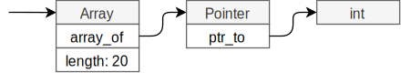

如果变量x具有上图所示的类型，x则为长度为20的数组类型，该数组的元素为指针，并且该指针指向int。

功能类型也可以用图形表示。下图显示了一个函数的类型，该函数带有两个参数，一个int和一个指向int的指针，并返回一个指向void的指针。

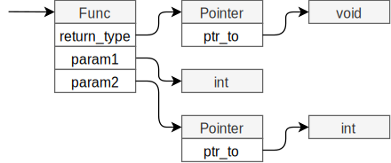

最后，让我给您一个更复杂的例子。下图显示了一个称为函数的指针的类型，该函数以一个int作为参数，并返回一个指向返回int的函数的指针。它的语言很复杂，但是您可以看到它的结构很简单，因为它在图中很长。


如果变量x具有上图所示的类型，x则为指针类型，该指针指向一个函数，该函数的参数类型为int，返回类型为指针类型，而指针为It指向函数，该函数的返回类型为int。

在编译器内部，使用与上图相同的方法表示类型。换句话说，与指针，数组和函数有关的复杂类型在编译器内部表示为一种数据结构，其中简单类型结构通过指针以与上图中相同的顺序连接。因此，毫不夸张地说这个数字是模具的真实数字。

### 类型符号

如果类型的含义如上所述由图表示，则很容易理解，但是每次理解该类型时都要绘制一个图很麻烦。在本节中，让我们考虑一种可以更紧凑地编写而又不影响图的清晰度的符号。

除非包括功能类型，否则在图中所有框将按字符串排列而不分支。因此，如果类型只有指针和数组，则应该能够通过在图中从左到右写出类型的名称来用字符来表示该图。

让我们考虑一下具体的符号。代表指针的框将由\*符号表示。另外，[n]让我们制定一条规则，即代表长度为n的数组的框应写出代表诸如int之类的内置类型的框的类型名称。然后，下图\*\*int可以用字符串表示。


由于指针，指针和整数从箭头的起点开始依次显示，\*\*int因此符号为。\*\*int给定相反的符号，您也可以绘制上面的图。换句话说，此文本表达式是一种表示法，使您可以在紧凑文本中写下与图形相同的信息。

下图[20] \*int可以用字符串表示。


对于函数，func(引数の型, ...) 返り値の型让我们写“ ”。例如，下图中所示的类型func(int, * int) * void写为。读者还应确保该符号与图形匹配。


最后，下图所示的类型* func(int) * func() int是。

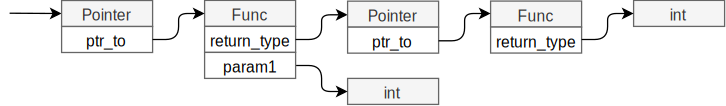

到目前为止描述的符号可能是一种类型中最直接，最简单的文本表示形式。实际上，编程语言Go中的类型的语法与此处描述的表示法完全相同。Go是使C的人们参与开发的语言，利用C中的Go的反射点，语法的类型是随便改进的8。

### 如何阅读C型

在本节中，让我们学习如何通过结合上面学习的类型符号和C类型符号来解密C类型。

C类型可以从一开始就分解为以下四个部分。

1. 基本类型
2. 星号代表一个指针
3. 括号中的标识符或嵌套类型
4. 函数和数组的括号

例如int x，基本类型int的指针没有星号，标识符没有x函数或数组括号。unsigned int \*x()基本类型是unsigned int代表指针的星号，\*标识符是x代表函数的括号()。void \*\*(\*x)()基本类型是void代表指针的星号，\*\*嵌套类型是\*x代表函数的括号，依此类推()。

#### 如何读取非嵌套类型

如果指针后面仅跟随一个标识符，则解密该类型相对容易。

没有函数或数组括号，类型符号及其含义为：含义将以与上述Go相同的符号书写。

| C型记号	| 意义 |
|--------|-----|
| int x | int |
| int *x | * int |
| int **x | **int |

如果有函数括号，则代表基本类型的星号和代表返回类型的指针。一个例子如下所示。

| C型记号 | 意义 |
|--------|-----|
| int x()	| func() int |
| int *x() | func() * int |
| int **x(int) | func(int) * * int |

该类型时解析为不存在的功能，即括号int x，int *x，int **x类型是的func(...)，你会看到的是，只是跟在后面。

同样，数组中的括号表示“ ...的数组”。一个例子如下所示。

| C型记号 | 意义 |
|--------|-----|
| int x[5] | [5] int |
| int *x[5] | [5] * int |
| int **x[4][5] | [4] [5] * * int |

例如int *x[5]，对于x类型，类型是长度为5的数组，该数组的元素是指针，并且指针指向int。与函数一样，您[...]将看到数组中没有括号的类型。

#### 如何读取嵌套类型

如果指针后跟括号而不是标识符，则括号表示嵌套类型。如果您有嵌套类型，则可以分别解析内部和外部括号，并在以后合并它们以获取整个类型。

例如，int (*x)()让我们分析该声明。

int (*x)()如果y您通过将整个第一个括号视为一个标识符（此处适当）来解释类型，则int y()括号外的类型为func() int。另一方面，*x如果考虑括号中的类型，* ___则表示类型。括号int中的类型没有基本类型，例如，因此它不是完美的类型，但是在这里，我决定使用___表示法来表示缺少的基本部分。

int (*x)()即，用括号括起来，两种类型分开外解析类型func() int和* ___我们能够获得。___通过将外部模具装配到内部模具的缺失部分中来完成整个模具。在这种情况下，* func() int是整体类型。换句话说int (*x)()，x是一个指针，该指针指向的类型是一个函数，而该函数的返回值为int。

让我再举一个例子。与void (*x[20])(int)您将第一个括号视为标识符的void y(int)模式相同，因此它func(int) void表示括号之外的类型。括号中的代表*x[20]牙齿[20] * ___。[20] * func(int) void这是当两者结合在一起的时候。也就是说，x是长度为20的数组类型，元素的类型为指针，指针指向int采用的函数，并且该函数返回的类型void。

您可以使用此处介绍的方法读取任何复杂类型。作为一个极端的例子，signal让我们阅读Unix函数类型。signal函数以其类型而闻名，乍一看您并不知道。的signal函数声明如下所示。

```c
void (*signal(int, void (*)(int)))(int);
```

即使是这样复杂的类型，也可以通过拆卸和阅读来解读。首先，让我们分别考虑第一个括号的内部和外部。考虑到以第一个括号为标识符的类型，其void y(int)模式与之相同，因此括号的外部func(int) void表示该类型。

括号中*signal(int, void (*)(int))的类型为。它没有基类型，没有星号表示指针，没有*标识符signal，带有一对括号的函数以及两个参数。因此，它是一个粗糙的类型func(引数1, 引数2) * ___。考虑参数类型：

* 第一个参数是int。它的类型很简单int。
* 第二个参数是void (\*)(int)。这是将第一个括号视为标识符时的类型，因为基本类型是void用\*括号括起来的嵌套类型，并且有一对括号代表该函数func(int) void。如果\*考虑括号的内部，则有一个星号表示一个指针，因此其类型为`* ___ です。結局のところ、第二引数の型はそれらの型が組み合わさった* func（int）void`。

如果func将上述参数类型放在的参数部分中，func(int, * func(int) void) * ___它将是该类型。最后，将圆括号内的类型与圆括号外的类型相结合，以得到最终结果func(int, * func(int) void) * func(int) void。

也就是说，signal是一个函数，它带有两个参数：

1. int
2. intvoid指向接受并返回的函数的指针

signal返回类型是一个指针，它指向一个int接受void并返回的函数。

>列：C型语法意图
>
>C类型语法的设计思想是，如果像使用类型时那样编写类型，则将更易于理解。例如，在此设计策略中，int *x[20]声明意味着*x[20]当您编写表达式时，您将确定类型，int从而使x该类型成为。int foo = *x[20]与x该类型匹配的类型是什么？可以说，这与解决问题是一样的。
>
>int *(*x[20])()int foo = *(*x[20])()如果您x将声明视为类型确定问题，而不会出现类型错误，则x必须首先是一个数组，并且该数组的元素\*应该可以使用取消引用。\*您可以将其视为一个函数。它返回指针，因为它将指针作为函数调用，并使用取消引用其返回值。
>
>C型语法听起来很废话，但作为设计策略是有意义的。但是，我不得不说这最终是一个糟糕的设计。

### 练习题

<div>
<table>
<thead>
<tr class="header">
<th>Cの型の表記</th>
<th>意味</th>
</tr>
</thead>
<tbody>
<tr class="odd">
<td><code>int x</code></td>
<td><code>int</code></td>
</tr>
<tr class="even">
<td><code>int *x</code></td>
<td><code>* int</code></td>
</tr>
<tr class="odd">
<td><code>int x[]</code></td>
<td><code>[] int</code></td>
</tr>
<tr class="even">
<td><code>int x()</code></td>
<td><code>func() int</code></td>
</tr>
<tr class="odd">
<td><code>int **x</code></td>
<td><code>* * int</code></td>
</tr>
<tr class="even">
<td><code>int (*x)[]</code></td>
<td><code>* [] int</code></td>
</tr>
<tr class="odd">
<td><code>int (*x)()</code></td>
<td><code>* func() int</code></td>
</tr>
<tr class="even">
<td><code>int *x[]</code></td>
<td><code>[] * int</code></td>
</tr>
<tr class="odd">
<td><code>int x[][]</code></td>
<td><code>[] [] int</code></td>
</tr>
<tr class="even">
<td><code>int *x()</code></td>
<td><code>func() * int</code></td>
</tr>
<tr class="odd">
<td><code>int ***x</code></td>
<td><code>* * * int</code></td>
</tr>
<tr class="even">
<td><code>int (**x)[]</code></td>
<td><code>* * [] int</code></td>
</tr>
<tr class="odd">
<td><code>int (**x)()</code></td>
<td><code>* * func() int</code></td>
</tr>
<tr class="even">
<td><code>int *(*x)[]</code></td>
<td><code>* [] * int</code></td>
</tr>
<tr class="odd">
<td><code>int (*x)[][]</code></td>
<td><code>* [] [] int</code></td>
</tr>
<tr class="even">
<td><code>int *(*x)()</code></td>
<td><code>* func() * int</code></td>
</tr>
<tr class="odd">
<td><code>int **x[]</code></td>
<td><code>[] * * Int</code></td>
</tr>
<tr class="even">
<td><code>int (*x[])[]</code></td>
<td><code>[] * [] int</code></td>
</tr>
<tr class="odd">
<td><code>int (*x[])()</code></td>
<td><code>[] * func() int</code></td>
</tr>
<tr class="even">
<td><code>int *x[][]</code></td>
<td><code>[] [] * int</code></td>
</tr>
<tr class="odd">
<td><code>int x[][][]</code></td>
<td><code>[] [] [] int</code></td>
</tr>
<tr class="even">
<td><code>int **x()</code></td>
<td><code>func() * * int</code></td>
</tr>
<tr class="odd">
<td><code>int (*x())[]</code></td>
<td><code>func() * [] int</code></td>
</tr>
<tr class="even">
<td><code>int (*x())()</code></td>
<td><code>func() * func() int</code></td>
</tr>
</tbody>
</table>
</div>

## 综上所述

本手册的文本以Markdown格式编写。我使用Pandoc将Markdown转换为HTML，使用Graphviz创建语法树图，并使用draw.io创建其他图。

## 附录1：x86-64指令集备忘单

本章总结了本书生产的编译器使用的x86-64指令集的功能。在本章中，为简洁起见，我们使用以下缩写。

* src，dst：两个大小相同的任意寄存器
* r8，r16，r32，r64：8位，16位，32位，64位寄存器
* imm：立即价值
* reg1:reg2：表示不能容纳在一个寄存器（例如128位）中的大量数字的表示法reg1，reg2其中两个寄存器分别作为高位和低位。

### 整数寄存器列表

表中汇总了64位整数寄存器的列表及其别名。

<div>
<table>
<thead>
<tr class="header">
<th style="text-align: left;">64</th>
<th style="text-align: left;">32</th>
<th style="text-align: left;">16</th>
<th style="text-align: left;">8</th>
</tr>
</thead>
<tbody>
<tr class="odd">
<td style="text-align: left;">RAX</td>
<td style="text-align: left;">EAX</td>
<td style="text-align: left;">AX</td>
<td style="text-align: left;">AL</td>
</tr>
<tr class="even">
<td style="text-align: left;">RDI</td>
<td style="text-align: left;">EDI</td>
<td style="text-align: left;">DI</td>
<td style="text-align: left;">DIL</td>
</tr>
<tr class="odd">
<td style="text-align: left;">RSI</td>
<td style="text-align: left;">ESI</td>
<td style="text-align: left;">SI</td>
<td style="text-align: left;">SIL</td>
</tr>
<tr class="even">
<td style="text-align: left;">RDX</td>
<td style="text-align: left;">EDX</td>
<td style="text-align: left;">DX</td>
<td style="text-align: left;">DL</td>
</tr>
<tr class="odd">
<td style="text-align: left;">RCX</td>
<td style="text-align: left;">ECX</td>
<td style="text-align: left;">CX</td>
<td style="text-align: left;">CL</td>
</tr>
<tr class="even">
<td style="text-align: left;">RBP</td>
<td style="text-align: left;">EBP</td>
<td style="text-align: left;">BP</td>
<td style="text-align: left;">BPL</td>
</tr>
<tr class="odd">
<td style="text-align: left;">RSP</td>
<td style="text-align: left;">ESP</td>
<td style="text-align: left;">SP</td>
<td style="text-align: left;">SPL</td>
</tr>
<tr class="even">
<td style="text-align: left;">RBX</td>
<td style="text-align: left;">EBX</td>
<td style="text-align: left;">BX</td>
<td style="text-align: left;">BL</td>
</tr>
<tr class="odd">
<td style="text-align: left;">R8</td>
<td style="text-align: left;">R8D</td>
<td style="text-align: left;">R8W</td>
<td style="text-align: left;">R8B</td>
</tr>
<tr class="even">
<td style="text-align: left;">R9</td>
<td style="text-align: left;">R9D</td>
<td style="text-align: left;">R9W</td>
<td style="text-align: left;">R9B</td>
</tr>
<tr class="odd">
<td style="text-align: left;">R10</td>
<td style="text-align: left;">R10D</td>
<td style="text-align: left;">R10W</td>
<td style="text-align: left;">R10B</td>
</tr>
<tr class="even">
<td style="text-align: left;">R11</td>
<td style="text-align: left;">R11D</td>
<td style="text-align: left;">R11W</td>
<td style="text-align: left;">R11B</td>
</tr>
<tr class="odd">
<td style="text-align: left;">R12</td>
<td style="text-align: left;">R12D</td>
<td style="text-align: left;">R12W</td>
<td style="text-align: left;">R12B</td>
</tr>
<tr class="even">
<td style="text-align: left;">R13</td>
<td style="text-align: left;">R13D</td>
<td style="text-align: left;">R13W</td>
<td style="text-align: left;">R13B</td>
</tr>
<tr class="odd">
<td style="text-align: left;">R14</td>
<td style="text-align: left;">R14D</td>
<td style="text-align: left;">R14W</td>
<td style="text-align: left;">R14B</td>
</tr>
<tr class="even">
<td style="text-align: left;">R15</td>
<td style="text-align: left;">R15D</td>
<td style="text-align: left;">R15W</td>
<td style="text-align: left;">R15B</td>
</tr>
</tbody>
</table>
</div>

ABI中的用法如下。我将✔添加到了从函数返回时不需要返回到原始值的寄存器中。

<div>
<table>
<thead>
<tr class="header">
<th>レジスタ</th>
<th>使い方</th>
<th style="text-align: right;"></th>
</tr>
</thead>
<tbody>
<tr class="odd">
<td>RAX</td>
<td>返り値 / 引数の数</td>
<td style="text-align: right;">✔</td>
</tr>
<tr class="even">
<td>RDI</td>
<td>第1引数</td>
<td style="text-align: right;">✔</td>
</tr>
<tr class="odd">
<td>RSI</td>
<td>第2引数</td>
<td style="text-align: right;">✔</td>
</tr>
<tr class="even">
<td>RDX</td>
<td>第3引数</td>
<td style="text-align: right;">✔</td>
</tr>
<tr class="odd">
<td>RCX</td>
<td>第4引数</td>
<td style="text-align: right;">✔</td>
</tr>
<tr class="even">
<td>RBP</td>
<td>ベースポインタ</td>
<td style="text-align: right;"></td>
</tr>
<tr class="odd">
<td>RSP</td>
<td>スタックポインタ</td>
<td style="text-align: right;"></td>
</tr>
<tr class="even">
<td>RBX</td>
<td>（特になし）</td>
<td style="text-align: right;"></td>
</tr>
<tr class="odd">
<td>R8</td>
<td>第5引数</td>
<td style="text-align: right;">✔</td>
</tr>
<tr class="even">
<td>R9</td>
<td>第6引数</td>
<td style="text-align: right;">✔</td>
</tr>
<tr class="odd">
<td>R10</td>
<td>（特になし）</td>
<td style="text-align: right;">✔</td>
</tr>
<tr class="even">
<td>R11</td>
<td>（特になし）</td>
<td style="text-align: right;">✔</td>
</tr>
<tr class="odd">
<td>R12</td>
<td>（特になし）</td>
<td style="text-align: right;"></td>
</tr>
<tr class="even">
<td>R13</td>
<td>（特になし）</td>
<td style="text-align: right;"></td>
</tr>
<tr class="odd">
<td>R14</td>
<td>（特になし）</td>
<td style="text-align: right;"></td>
</tr>
<tr class="even">
<td>R15</td>
<td>（特になし）</td>
<td style="text-align: right;"></td>
</tr>
</tbody>
</table>
</div>

进行函数调用时，call必须以16的倍数（与16对齐）的RSP来调用指令。不满足此要求的函数调用不符合ABI，并且某些函数可能会崩溃。

### 记忆体存取

<div>
<table>
<tbody>
<tr class="odd">
<td style="text-align: left;">mov dst, [r64]</td>
<td>r64が差すアドレスからdstに値をロード</td>
</tr>
<tr class="even">
<td style="text-align: left;">mov [r64], src</td>
<td>srcの値をr64が差すアドレスにストア</td>
</tr>
<tr class="odd">
<td style="text-align: left;">push r64/imm</td>
<td>RSPを8減らして、r64/immをRSPにストア</td>
</tr>
<tr class="even">
<td style="text-align: left;">pop r64</td>
<td>RSPからr64にロードして、RSPを8増やす</td>
</tr>
</tbody>
</table>
</div>

### 函数调用

<div>
<table>
<tbody>
<tr class="odd">
<td style="text-align: left;">call label</td>
<td>RIPをスタックにプッシュしてlabelにジャンプ</td>
</tr>
<tr class="even">
<td style="text-align: left;">call r64</td>
<td>RIPをスタックにプッシュしてr64のアドレスにジャンプ</td>
</tr>
<tr class="odd">
<td style="text-align: left;">ret</td>
<td>スタックをポップしてそのアドレスにジャンプ</td>
</tr>
<tr class="even">
<td style="text-align: left;">leave</td>
<td><code>mov rsp, rbp</code>の後<code>pop rbp</code>と同等</td>
</tr>
</tbody>
</table>
</div>

### 条件分支

<div>
<table style="width:82%;">
<colgroup>
<col style="width: 33%"></col>
<col style="width: 48%"></col>
</colgroup>
<tbody>
<tr class="odd">
<td style="text-align: left;">cmp reg1, reg2/imm<br />
je label</td>
<td>reg1 == reg2/immならlabelにジャンプ</td>
</tr>
<tr class="even">
<td style="text-align: left;">cmp reg1, reg2/imm<br />
jne label</td>
<td>reg1 != reg2/immならlabelにジャンプ</td>
</tr>
<tr class="odd">
<td style="text-align: left;">cmp reg1, reg2/imm<br />
jl label</td>
<td>reg1 &lt; reg2ならlabelにジャンプ<br />
（符号ありでの比較）</td>
</tr>
<tr class="even">
<td style="text-align: left;">cmp reg1, reg2/imm<br />
jle label</td>
<td>reg1 &lt;= reg2ならlabelにジャンプ<br />
（符号ありでの比較）</td>
</tr>
</tbody>
</table>
</div>

### 有条件的分配

<div>
<table>
<colgroup>
<col style="width: 36%"></col>
<col style="width: 63%"></col>
</colgroup>
<tbody>
<tr class="odd">
<td>cmp reg1, reg2/imm<br />
sete al<br />
movzb eax, al</td>
<td>RAX = (reg1 == reg2) ? 1 : 0</td>
</tr>
<tr class="even">
<td>cmp reg1, reg2/imm<br />
setne al<br />
movzb eax, al</td>
<td>RAX = (reg1 != reg2) ? 1 : 0</td>
</tr>
<tr class="odd">
<td>cmp reg1, reg2/imm<br />
setl al<br />
movzb eax, al<br />
</td>
<td>RAX = (reg1 &gt; reg2) ? 1 : 0<br />
（符号ありでの比較）</td>
</tr>
<tr class="even">
<td>cmp reg1, reg2/imm<br />
setle al<br />
movzb eax, al</td>
<td>RAX = (reg1 &gt;= reg2) ? 1 : 0<br />
（符号ありでの比較）</td>
</tr>
</tbody>
</table>
</div>

### 整数/逻辑运算

<div>
<table>
<colgroup>
<col style="width: 31%"></col>
<col style="width: 68%"></col>
</colgroup>
<tbody>
<tr class="odd">
<td>add dst, src/imm</td>
<td>dst = dst + src/imm</td>
</tr>
<tr class="even">
<td>sub dst, src/imm</td>
<td>dst = dst - src/imm</td>
</tr>
<tr class="odd">
<td>mul src</td>
<td>RDX:RAX = RAX * src</td>
</tr>
<tr class="even">
<td>imul dst, src</td>
<td>dst = dst * src</td>
</tr>
<tr class="odd">
<td>div r32</td>
<td>EAX = EDX:EAX / r32<br />
EDX = EDX:EAX % r32</td>
</tr>
<tr class="even">
<td>div r64</td>
<td>RAX = RDX:RAX / r64<br />
RDX = RDX:RAX % r64</td>
</tr>
<tr class="odd">
<td>idiv r32/r64</td>
<td>divの符号ありバージョン</td>
</tr>
<tr class="even">
<td>cqo</td>
<td>RAXを128ビットに符号拡張して<br />
RDX:RAXにストア</td>
</tr>
<tr class="odd">
<td>and dst, src</td>
<td>dst = src &amp; dst</td>
</tr>
<tr class="even">
<td>or dst, src</td>
<td>dst = src | dst</td>
</tr>
<tr class="odd">
<td>xor dst, src</td>
<td>dst = src ^ dst</td>
</tr>
<tr class="even">
<td>neg dst</td>
<td>dst = -dst</td>
</tr>
<tr class="odd">
<td>not dst</td>
<td>dst = ~dst</td>
</tr>
<tr class="even">
<td>shl dst, imm/CL</td>
<td>immかCLレジスタの値だけdstを左シフトする（レジスタでシフト量を指定する場合、CLしか使えない）</td>
</tr>
<tr class="odd">
<td>shr dst, imm/CL</td>
<td>immかCLレジスタの値だけdstを論理右シフトする<br />
シフトインされてきた上位ビットはゼロクリアされる</td>
</tr>
<tr class="even">
<td>sar dst, imm/CL</td>
<td>immかCLレジスタの値だけdstを算術右シフトする<br />
シフトインされてきた上位ビットは、もともとのdstの符号ビットと同じになる</td>
</tr>
<tr class="odd">
<td>lea dst, [src]</td>
<td>[src]のアドレス計算を行うが、メモリアクセスは行わずアドレス計算の結果そのものをdstにストア</td>
</tr>
<tr class="even">
<td>movsb dst, r8</td>
<td>r8を符号拡張してdstにストア</td>
</tr>
<tr class="odd">
<td>movzb dst, r8</td>
<td>r8を符号拡張せずにdstにストア</td>
</tr>
<tr class="even">
<td>movsw dst, r16</td>
<td>r16を符号拡張してdstにストア</td>
</tr>
<tr class="odd">
<td>movzw dst, r16</td>
<td>r16を符号拡張せずにdstにストア</td>
</tr>
</tbody>
</table>
</div>

## 附录2：使用Git进行版本控制

Git最初是为Linux内核版本控制而开发的。由于Linux内核是成千上万开发人员的庞大项目，因此Git具有许多功能来满足其复杂的工作流程。这些功能很有用，但是在您是唯一提交者的情况下，您无需掌握Git的功能即可进行个人开发。掌握Git方面有很多东西要学习，但是本书中只有几件事要记住。对于那些刚接触Git开发的人，我们在下面准备了一个备忘单。

* git add ファイル名

将新创建的文件添加到存储库

* git commit -A

一次提交对工作树所做的所有更改（编辑器将启动并输入提交消息）

* git reset --hard

撤消自上次提交以来对工作树所做的所有更改

* git log -p

查看过去的提交

* git push

向上游推送存储库，例如GitHub

### 使用Git的工作流程

对于那些版本控制系统的新手，让我解释一下Git和版本控制系统的概念。

Git是一个数据库管理工具，其中包含文件更改历史记录。该数据库称为存储库。如果从GitHub等克隆存储库，则将下载该存储库，然后将默认的最新目录树从该存储库扩展到当前目录及以下目录。

从存储库扩展的目录树称为“工作树”。您已经使用编辑器编辑并编译了工作树中的源文件，但是工作树本身不是存储库的一部分。工作树就像从zip文件中提取的文件一样，无论您对其进行了多少更改，原始存储库都将保持不变。

我对工作树所做的更改以称为“提交”的单元组合在一起，并在适当的时候写回到存储库中。这将更新数据库，并允许您随后进行其他更改。使用Git时，您将通过重复更改文件和提交的过程来进行开发。

### 提交时要记住的事情

请用日语正确编写提交消息。例如，单行消息（例如“添加*和/作为运算符，但不处理运算符优先级”）是可以的。

尽可能缩小提交单位。例如，如果您要修改代码，则需要进行一些重构，在这种情况下，您应该将重构作为单独的提交进行提交。您不想将两个或多个单独的功能组合到一个提交中。

您不必使用Git的高级功能。例如，您不需要使用分支。

确保将添加功能的代码与测试该功能的代码一起提交。另外，在提交时，请尝试先运行测试，以确保在提交之前没有破坏现有功能并且新功能可以正常工作。换句话说，让他们的目标是在签出存储库的任何时间点进行编译和测试。但是，如果您无意中提交了未通过测试的内容，则无需修改git的提交日志即可对其进行修复。只需将修复程序放入下一个提交中即可。

### Git的内部结构

阅读Git文档时有很多棘手的功能，但是如果您构建了一个Git原则上如何存储数据的模型，则更容易理解。因此，在这里我们将解释Git的内部结构。

Git是一种实现为用户程序的文件系统。Git数据库的结构与文件系统非常相似。但是，不同之处在于普通文件系统使用文件名来访问文件，而Git使用文件的哈希值作为名称。

名称由文件内容确定的机制称为内容可寻址机制。在内容可寻址文件系统中，如果内容具有相同的名称，则它们是相同的。同样，具有不同内容的文件不能具有相同的名称（相同的哈希值）。这可以通过使用加密安全的哈希函数来保证。在这样的文件系统中，不必单独命名文件，并且一旦确定了名称，文件的内容也就被唯一地确定。

提交也是Git内部的文件。除了提交消息之外，该文件还包含属于提交的文件的哈希值和先前提交的哈希值。

为了从Git的文件系统中检索文件，您需要知道所需文件的哈希值。

感觉就像鸡和鸡蛋的问题一样，如果不知道提交文件的哈希值就无法获取提交文件，但是实际上，存储库除了文件系统之外还具有提交文件的哈希值。的名称，可用于查找提交。例如，存储库da39a3ee5e...包含信息，例如名为“ master”的提交的哈希值（默认情况下，历史记录扩展为工作树）。该信息允许Git将属于master的文件扩展到工作树中。

“提交”在内部发生的是将更改后的文件添加到Git内的文件系统中，并包括这些文件的哈希值和上一次提交的哈希值。但是，提交文件的添加方式相同，最后，库存使用提交文件的哈希值进行更新。

例如，为了使master的最后一次提交不存在（最好不要这样做），请查看master指向的提交文件，获取上一次提交的哈希值，然后使用该哈希值。要做的就是覆盖高手。“分支”只是两个或多个提交的故事，这些提交具有与先前提交相同的提交，并且这两个提交都在清单中。

这些内容可寻址的版本控制系统也具有安全优势。提交的名称（提交文件的哈希值）包含属于该提交的所有文件的哈希值以及前一个提交文件的哈希值。先前的提交文件还包含先前的提交文件的哈希，因此最终到达最新提交的所有提交的哈希值都包含在最新提交的哈希值计算中，您将在那里。因此，原则上不可能在不更改哈希值的情况下秘密修改提交的内容和历史记录。这是一个有趣的属性。

学习Git的工作原理时，请始终牢记此可寻址内容的文件系统。我相信它会更容易理解。

## 附录3：使用Docker创建开发环境

本附录描述了如何使用Docker在macOS上构建和运行Linux应用程序。

Docker是为Linux提供虚拟环境的软件。在功能齐全的VM中，将模拟PC的硬件并在其上运行普通的OS，而在Docker中，Linux系统调用（仅）直接提供给虚拟环境。由于存在这种差异，与全功能虚拟化相比，Docker具有启动速度更快，整体重量更轻的优势。在将应用程序部署到云中的计算机时，经常使用Docker。

使用Docker在macOS上开发Linux应用程序时，需要考虑两个系统配置：

1. 在开发Linux应用程序时，将Docker内部的环境与Docker外部的环境视为完全不同的环境，所有工作都在Docker内部完成。
2. 一种配置，其中在Docker外部执行独立于平台的常规开发工作，例如源代码编辑和git操作，并且仅在Docker内部执行构建和测试命令。

以前的配置与将Mac分开准备Linux机器以进行开发的配置相同，因此配置很简单，但是设置有些复杂，因为必须准备Linux上的开发环境，包括编辑器等。另一方面，在后一种配置中，您不必“生活”在Docker中，因此不必费力设置环境，但是正确地在Docker的内部和外部使用会有些麻烦。

您可以选择以上两种配置中的任一种，但是在本文档中，我们将选择后一种配置，以避免为您的Linux环境解释设置步骤。因此，您将仅在Docker中仅在Linux环境中执行想要运行的命令。

### 设定程序

要使用Docker设置Linux开发环境，请首先下载并安装Docker Desktop for Mac。然后，您可以运行以下命令compilerbook来创建名为的Docker映像。

```
$ docker build -t compilerbook https://www.sigbus.info/compilerbook/Dockerfile
```

“ Docker映像”或“映像”是Linux环境所需的所有文件和设置的集合。Docker映像的实际启动称为“ Docker容器”或简称为“容器”（类似于可执行文件和进程之间的关系）。

要创建容器并docker run在其中执行命令，请将图像名称和命令作为命令参数。以下是在容器内执行ls /命令compilerbook的示例。

```
$ docker run --rm compilerbook ls /
bin
root
dev
etc
...
```

可以使容器在后台运行，但是由于我们的用法仅需要交互用法，因此我们为--rm它提供了一个选项，可以在命令完成后立即终止容器。因此，每次输入上述命令时，都会创建并销毁一个容器。

### 用容器构建

make为了在容器内运行并编译源文件，您需要使在Docker外部编辑的源文件对容器可见。

docker run在-v <source>:<dest>给出选项的格式时，即可以使外部环境的路径<source>以及在Docker<dest>中的显示为。-w您也可以在执行命令时指定当前目录。使用这些选项，可以使包含源文件的目录成为当前目录，make然后执行。

chibicc假设源文件位于一个名为您的主目录的子目录中。make test要从该目录的容器中运行，请运行以下命令：

```
$ docker run --rm -v $HOME/chibicc:/chibicc -w /chibicc compilerbook make test
```

确保如上所述执行构建和测试命令。

如果要在容器内启动shell并以交互方式使用它，请使用以下-it选项docker run执行。

```
$ docker run --rm -it -v $HOME/chibicc:/chibicc compilerbook
```

### 将新应用添加到容器

上面创建的Docker容器已安装了一组开发工具，但您可能需要安装其他应用程序。这是操作方法。

Docker容器是临时的。如果创建容器并从其中的外壳安装应用程序，则这些更改将不会写回到原始映像。Docker保证此属性每次都会从相同的新状态启动您的应用程序，但是如果您要更改映像，则此属性很麻烦。

如果要更改容器，然后将其写回映像，则需要显式docker commit执行命令。

例如，curl假设您要安装命令。在这种情况下，请首先创建一个容器，如下所示。

```
$ docker run -it compilerbook
```

--rm请注意，我们没有传递任何选项。然后按照以下说明从容器内部的外壳apt使用curl安装，并使用exit命令退出容器。

```
$ sudo apt update
$ sudo apt install -y curl
$ exit
```

docker run我在运行时--rm未添加任何选项，因此即使从容器的外壳退出后，该容器仍保持挂起状态。docker container ls -a您可以使用该命令来显示挂起的容器，如下所示：

```
$ docker container ls -a
CONTAINER ID        IMAGE               COMMAND             CREATED             STATUS                     PORTS               NAMES
a377e570d1da        compilerbook        "/bin/bash"         7 seconds ago       Exited (0) 5 seconds ago                       pedantic_noyce
```

compilerbooka377e570d1da您会看到有一个ID为执行该图像的容器。docker commit您可以使用命令将容器写回到映像。

```
$ docker commit a377e570d1da compilerbook
```

您可以使用上述步骤对图像进行更改。

暂停的容器，旧的映像等即使占用它们也会占用一些磁盘空间，这不是问题，但是，如果您有兴趣，docker system prune可以通过执行删除它们。