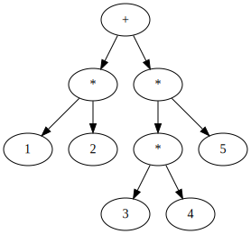

# 为那些想了解底层的人创建C编译器的简介

## 介绍

这本在线书正在编写中。它不是完整版本。反馈表

本书包含一些内容，其中有些内容过于贪婪，无法包含在一本书中。在本文档中，我们将创建一个程序，该程序将用C语言编写的源代码转换为汇编语言，即C编译器。编译器本身也是使用C开发的。近期目标是能够使用自托管，自制的编译器来编译自己的源代码。

在本书中，我决定深入研究本书中的各个主题，以使解释编译器的难度不会太快。原因如下。

编译器在概念上可以分为多个阶段，例如解析，中间路径和代码生成。普通的教科书方法涉及对每个主题进行章节介绍和解释，但是采用这种方法的书往往太狭窄和太深而无法跟上读者的步伐。

同样，对于每个阶段创建的开发方法，您都无法在所有阶段完成之前尝试运行编译器，因此，即使您的理解或代码在整个过程开始之前都是决定性的错误，您也可以注意到它。完成。首先，在我自己完成之前，我不知道下一阶段的预期输入是什么，因此我不知道上一阶段的输出。另一个问题是，很难保持动力，因为在完成代码之前，您无法编译任何代码。

在这本书中，我决定采用另一种方法来避免这种陷阱。在本书的前面，读者将使用非常简单的语言规范来实现“专有语言”。该语言非常简单，以至于您无需在实现编译器时就知道如何制作它。然后，读者将在本书中为“专有语言”添加功能，最终将其开发为与C匹配。

使用这种增量开发方法，您必须在进行精细提交的同时逐步进行编译器。从某种意义上说，在这种开发方法中，编译器总是在每次提交中“完成”。在某个阶段，它可能只是计算器级别，在某个阶段，它可能是C的一个相当有限的子集，在另一个阶段，它可能是几乎是C的语言，依此类推。关键是，在任何阶段，我们的目标都是要使用一种具有合理规格的语言，使其与当时的完善程度相匹配。在开发过程中，我们不会使某些功能脱颖而出并使它们成为C语言。

我们还将根据开发阶段依次说明数据结构，算法和计算机科学知识。

渐进式的开发将使您在阅读本书的任何时候都能全面了解如何在该级别上构建合理的语言。这比仅编译器创建的某些主题的极端偏见和详细状态要好得多。到本书结尾，您将对所有主题都有很好的了解。

这本书也是一本解释如何从头开始编写大型程序的书。编写大型程序的技能是一种独特的技能，与学习数据结构和算法不同，但是我认为没有很多书籍可以解释这种情况。另外，即使您对其进行了说明，除非您实际体验到它，否则您将无法理解开发方法的优缺点。本书的设计目的是使您将自己的语言开发为C的过程是一种良好开发方法的真实体验。

如果作者的计划成功了，那么通过阅读本书，读者不仅将了解编译器创建技术和CPU指令集，而且还将了解如何以小步长和软件方式编写大型程序，还应该学习测试技术，版本控制技术，甚至在进行雄心勃勃的项目（例如编译器编写）时的心态。

本书的目标读者是普通的C程序员。您不必是熟悉C语言规范的Super C程序员。如果您了解指针和数组，并且至少可以长时间阅读其他人编写的小型C程序，就足够了。

在编写本书时，我试图尽可能多地解释为什么选择这种设计，而不仅仅是解释语言规范和CPU规范。我还尝试通过使读者感兴趣的有关编译器，CPU，计算机行业及其历史的专栏来使阅读变得有趣。

创建一个编译器很有趣。最初，我自己的语言（仅是非常简单的一种语言）在我继续开发时迅速发展成为令人惊讶的C语言，因此它就像魔术一样工作。在实际开发中，令人惊讶的是，当时似乎编译不好的大型测试代码可以正确编译，并且不会出错。通过查看编译后的程序集，我无法立即理解此类代码。有时，您甚至可能会觉得编译器比作者具有更多的智能。即使您知道编译器是如何工作的，它还是一个使您怀疑为什么它如此工作的程序。我相信您一定会对它的魅力着迷。

现在，以此为序，让我们与作者一起深入了解编译器开发的世界！

>专栏：为什么使用C语言
>
>您为什么在本书中选择众多编程语言中的C？还是为什么不使用自己的语言？在这方面，绝对没有理由使用C，但是如果您必须选择某种语言来学习如何制作输出本机代码的编译器，则C不是一个非常合理的选择，我认为这是其中之一。
>
>您无法了解很多有关解释语言中的低层的知识。另一方面，在C语言中，通常将其编译为程序集，因此，通过创建编译器，您可以与C本身同时了解CPU的指令集和程序操作的机制。
>
>C的使用如此广泛，以至于编译器工作之后，您就可以编译并使用从网上下载的第三方源代码。例如，您可以构建并播放迷你Unix xv6。如果编译器足够成熟，那么您甚至应该能够编译Linux内核。在次要语言或自制语言中是不可能实现这种享受的。
>
>C++是一种静态类型的语言，可以编译为类似于C的本机语言，并且至少与C一样广泛地使用。但是，C ++具有如此庞大的语言规范，以致不可能轻易地创建一个自制的编译器，而且这不是一个现实的选择。
>
>在提高语言的设计感方面，设计和实现原始语言是不错的选择，但同时也有其缺陷。如果实现起来很麻烦，则可以通过在语言规范中避免实现来避免实现。对于像C这样的语言却不是这样，这些语言具有标准的语言规范。我认为在学习方面，约束力相对较好。

### 本书中的符号

函数或表达式（例如文本中的命令main或foo=3）make将以等宽字体显示，依此类推。

多行代码使用等宽字体显示在框架中，如下所示。

```c
int main() {
  printf("Hello world!\n");
  return 0;
}
```

对于打算由用户直接输入框架代码的Shell命令，以$开头的行表示提示。$在外壳中输入该行之后的行（$不要输入）。$除代表您输入的命令的输出外的其他行。例如，以下块是用户make输入字符串并按Enter时的执行示例。make命令的输出make: Nothing to be done for `all'.是。

```
$ make
make: Nothing to be done for `all'.
```

### 本文档假定的开发环境

本文档假定运行在所谓的普通PC（例如Intel和AMD）上的64位Linux环境。请安装诸如gcc之类的开发工具，并根据您使用的发行版进行预先制作。如果使用的是Ubuntu，则可以通过执行以下命令来安装本手册中使用的命令。

```
$ sudo apt update
$ sudo apt install -y gcc make git binutils libc6-dev
```

尽管macOS在汇编源代码级别与Linux相当兼容，但它并不完全兼容（具体来说，它不支持称为“静态链接”的功能）。根据本书的内容为macOS创建C编译器并不是没有可能，但是当您尝试使用它时，将会遭受各种详细的不兼容问题。不建议学习同时创建C编译器的技术以及macOS和Linux之间的差异。如果出了什么问题，很难说出哪一个是错的。

因此，本文档不包括macOS。对于macOS，请使用某种虚拟环境准备Linux环境。如果您不熟悉Linux虚拟环境，请参阅附录3了解如何使用Docker创建开发环境。

Windows在程序集源级别与Linux不兼容。但是，使用Windows 10可以像在单个应用程序上一样在Windows上运行Linux，并且通过使用它，可以继续在Windows上进行开发。Linux兼容环境是一个名为Windows Linux子系统（WSL）的应用程序。在Windows上练习本手册的内容时，请安装WSL并继续进行开发。

>专栏：交叉编译器
>
>运行编译器的计算机称为“主机”，运行编译器输出的代码的计算机称为“目标”。在本文档中，两者都是64位Linux环境，但是主机和目标不一定必须相同。
>
>具有不同主机和目标的编译器称为交叉编译器。例如，在运行Raspberry Pi可执行文件的Windows上运行的编译器是交叉编译器。当目标计算机性能较差或专用于运行编译器时，通常会使用交叉编译器。

### 关于作者

上山（@ rui314）。快速链接器lld的原始作者和当前维护者是lld的标准链接器，用于在许多操作系统和项目上创建可执行文件，例如Android（版本Q和更高版本），FreeBSD（12和更高版本），Nintendo Switch，Chrome和Firefox。它已被采用（因此，由我编写的工具创建的二进制文件很可能在您的计算机上）。他还是紧凑型C编译器8cc的作者。作文主要是关于要编写的软件说明。

>列：编译器，可编译一个编译器
>
>自我引用的情况（例如用C编写的C编译器）并不罕见。除了C之外，许多语言实现都是使用语言本身编写的。
>
>如果您已经具有X语言的实现，那么使用该语言本身创建新的X编译器就没有逻辑上的矛盾。如果您想自我托管，则可以简单地使用现有的编译器进行开发，并在完成编译后进行切换。这正是我们在本书中试图做的。
>
>但是，如果您没有现有的编译器怎么办？当时，我别无选择，只能用另一种语言写东西。当出于自托管的目的为X语言编写第一个编译器时，您需要使用不同于X的现有Y语言编写，而当编译器更完整时，则需要从Y重写编译器本身。语言到X语言。
>
>回到现代复杂编程语言的编译器，再用另一种编译器编译该语言的实现，依此类推，最终在计算机的早期人们直接使用了机器语言。你写了。我不知道汇编程序（某种意义上说是所有现有语言实现的最终祖先）是单个还是多个，但是毫无疑问，当前的编译器以很少的祖先开始。非编译器可执行文件通常是编译器生成的文件，因此几乎所有现有的可执行文件都是其原始汇编程序的间接后代。这是一个有趣的故事，就像生命的起源一样。

## 机器语言和汇编器

本章的目的是对构成计算机的组件以及应该从我们创建的C编译器输出的代码有一个大概的了解。我还没有深入了解具体的CPU指令。首先，了解该概念很重要。

### CPU和内存

组成计算机的组件可以大致分为CPU和内存。内存是可以保存数据的设备，CPU是在读取和写入内存时执行某些处理的设备。

从概念上讲，对于CPU来说，内存看起来就像是一个由大量可随机访问的字节组成的数组。当CPU访问内存时，将以数字方式指定有关要访问的内存字节数的信息，该数字值称为“地址”。例如，“从地址16到8字节读取数据”表示从存储器的第16个字节读取8个字节的数据，这看起来像一个字节数组。有时将同一件事称为“从地址16读取8个字节的数据”。

CPU执行的程序以及程序读取和写入的数据都存储在内存中。CPU将“当前正在执行的指令的地址”保存在CPU内，从该地址读取指令，在该地址执行写操作，然后读取并执行下一条指令。当前正在执行的指令的地址称为“程序计数器”（PC）或“指令指针”（IP）。将要由CPU执行的程序的形式本身称为“机器语言”（机器代码）。

程序计数器并不总是线性地前进到下一条指令。CPU“分支指令”类型的指令可用于将程序计数器设置为除以下指令以外的任何地址。此函数实现if语句和循环。将程序计数器设置到下一条指令以外的位置称为“跳转”或“分支”。

除了程序计数器外，CPU还具有少量的数据存储区。例如，Intel和AMD处理器具有16个区域，可以容纳64位整数。该区域称为“寄存器”。内存是CPU的外部设备，需要花费一些时间进行读取和写入，但是寄存器位于CPU内部，可以无延迟地进行访问。

许多机器语言都有一种格式，其中两个寄存器的值用于执行某些操作，并将结果写回到寄存器中。因此，在执行程序时，CPU从存储器中读取数据到寄存器中，在寄存器之间执行一些操作，然后将结果写回到存储器中，以便执行继续进行。

特定机器语言的指令统称为“指令集体系结构”（ISA）或“指令集”。不仅有一种指令集，而且您可以根据需要为每个CPU设计指令集。但是，指令集没有太多变化，因为没有机器语言兼容性就无法运行同一程序。PC使用Intel及其兼容芯片制造商AMD的称为x86-64的指令集。x86-64是主要的指令集之一，但x86-64并不是唯一一个主导市场的指令集。例如，iPhone和Android使用称为ARM的指令集。

>列：x86-64指令集名称
>
>x86-64有时被称为AMD64，Intel 64，x64等。历史上有这样一个事实，即同一指令集以这种方式具有多个名称。
>
>x86指令集由英特尔在1978年创建，但AMD将其扩展到64位。在2000年左右，当需要64位处理器时，英特尔正在全公司范围内开发一种全新的名为Itanium的指令集，而不敢在与之竞争的64位版本的x86上工作。借此机会，AMD制定并发布了64位版本x86的规范。那是x86-64。之后，AMD可能将x86-64重命名为AMD64，这可能是由于其品牌战略。
>
>在那之后，Itanium的失败就显而易见了，英特尔别无选择，只能制造64位版本的x86，但是到那时，已经有相当数量的实际AMD64芯片，所以类似。扩展指令集，英特尔已决定采用与AMD兼容的指令集。据说微软有压力要求保持兼容性。当时，英特尔采用了与AMD64几乎相同的指令集，名称为IA-32e。IA-32e（英特尔体系结构32扩展）的名称而不是64，似乎是通过不成功的指令集表明64位CPU的主要外壳是Itanium。之后，英特尔决定完全放弃Itanium，并将IA-32e重命名为通常的名称Intel 64。Microsoft讨厌太长的名称，或者称x86-64 x64。
>
>由于这些原因，x86-64具有许多不同的名称。
>
>开源项目通常更喜欢名称x86-64，其中不包含特定公司的名称。在本文档中，名称x86-64也被一致使用。

### 什么是汇编器？

由于机器语言是由CPU直接读取的，因此只考虑了CPU的便利性，而不考虑人类的操作便利性。如果不是不可能的话，用十六进制编辑器编写这些机器语言是一项艰巨的任务。组装工是在那里发明的。汇编语言是一种与机器语言一一对应的语言，但是人类比机器语言更容易阅读。

对于输出本机二进制文件而不是虚拟机或解释器的编译器，目标通常是输出程序集。看起来直接输出机器语言的编译器通常也会在输出汇编后在后台启动汇编器。本文档中创建的C编译器还输出程序集。

将汇编代码转换为机器语言有时是“编译的”，但有时特别是“汇编的”，以强调输入是汇编的。

读者可能在之前的某个地方看到过该组件。如果您还没有看到装配体，现在是个很好的时机。objdump使用命令来反汇编适当的可执行文件，并将该文件中包含的机器语言显示为程序集。以下是ls反汇编命令的结果。

```
$ objdump -d -M intel /bin/ls
/bin/ls:     file format elf64-x86-64

Disassembly of section .init:

0000000000003d58 <_init@@Base>:
  3d58:  48 83 ec 08           sub    rsp,0x8
  3d5c:  48 8b 05 7d b9 21 00  mov    rax,QWORD PTR [rip+0x21b97d]
  3d63:  48 85 c0              test   rax,rax
  3d66:  74 02                 je     366a <_init@@Base+0x12>
  3d68:  ff d0                 call   rax
  3d6a:  48 83 c4 08           add    rsp,0x8
  3d6e:  c3                    ret
...
```

在我的环境中，该ls命令包含约20,000种机器语言指令，因此反汇编的结果是一个长的指令，其中包含近20,000行。这里仅列出前几个。

每种机器语言的程序集基本上都由一行组成。让我们以下面的代码为例。

```
  3d58:  48 83 ec 08           sub    rsp,0x8
```

这行是什么意思？3d58是包含机器语言的内存地址。换句话说，ls执行该命令时，此行上的指令位于存储器的地址0x3d58中，并且当程序计数器为0x3d58时将执行该指令。接下来的四个十六进制数字是实际的机器语言。CPU读取该数据并作为指令执行。sub rsp,0x8那是与该机器指令相对应的程序集。CPU指令集将在不同的章节中进行说明，但是该指令是从称为RSP的寄存器中减去8（减=减）的指令。

### C及其对应的汇编器

#### 简单的例子

为了了解C编译器生成的内容，让我们将C代码与相应的汇编代码进行比较。考虑以下C程序为最简单的示例。

```c
int main() {
  return 42;
}
```

给定用于编写该程序的文件，您可以test1.c按如下所示对其进行编译，然后看到它main实际上返回了42。

```bash
$ cc -o test1 test1.c
$ ./test1
$ echo $?
42
```

在C语言中，main函数返回的值是整个程序的退出代码。该程序的退出代码将不被显示在屏幕上，但隐含的外壳$?，因为它是在一个名为变量设置，结束命令后，立即$?WOecho通过显示，查看命令我能做到这一点的退出代码。在这里您可以看到正确返回了42。

现在，与此C程序相对应的汇编程序如下。

```asm
.intel_syntax noprefix
.globl main
main:
        mov rax, 42
        ret
```

在此程序集中，main定义了全局标签，后跟main功能代码。在此，值42在寄存器RAX中设置main并从中返回。总共有16个寄存器可以保存整数，包括RAX，但是由于可以保证从函数返回时RAX中包含的值是函数的返回值，因此这里将其设置为RAX。它。

让我们实际组装并运行此组装程序。由于汇编文件的扩展名为，因此请在其中写入.s以上汇编代码test2.s并执行以下命令。

```sh
$ cc -o test2 test2.s
$ ./test2
$ echo $?
42
```

与C一样，42现在是退出代码。

粗略地说，C编译器是一种程序，test1.c它test2.s像读取C代码一样输出程序集。

#### 涉及函数调用的示例

作为一个稍微复杂的示例，让我们看一下将具有函数调用的代码转换为什么样的汇编。

函数调用不仅是跳转，还必须返回到被调用函数完成后最初执行的位置。最初执行的地址称为“返回地址”。如果只有一个函数调用，则返回地址应保存在CPU的相应寄存器中，但是由于可以尽可能深地进行函数调用，因此必须将返回地址保存在内存中。返回地址实际上存储在内存中的堆栈中。

只能使用一个保存栈顶地址的变量来实现栈。保持堆栈顶部的存储区域称为“堆栈指针”。x86-64支持仅堆栈指针寄存器，以及使用这些寄存器来支持使用函数进行编程的指令。将数据堆叠在堆栈上称为“推送”，而检索加载到堆栈上的数据称为“弹出”。

现在让我们看一个函数调用的例子。考虑下面的C代码。

```c
int plus(int x, int y) {
  return x + y;
}

int main() {
  return plus(3, 4);
}
```

与此C代码相对应的程序集如下所示：

```
.intel_syntax noprefix
.globl plus, main

plus:
        add rsi, rdi
        mov rax, rsi
        ret

main:
        mov rdi, 3
        mov rsi, 4
        call plus
        ret
```

第一行是指定程序集语法的指令。.globl从第二行开始的行告诉程序集，两个函数，plus和main对整个程序可见，而对文件范围不可见。暂时可以忽略这一点。

main请首先注意它。在C语言中，我们main从pluswith参数开始。在汇编器中，可以保证第一个参数将在RDI寄存器中，第二个参数将在RSI寄存器中，因此main值的精确设置在的前两行中。

call那就是调用函数的指令。具体来说，它call执行以下操作：

* call将下一条指令ret的地址（在这种情况下）压入堆栈
* call跳至作为以下参数的给定地址

因此，call执行该指令时，CPU将plus开始执行该功能。

plus注意功能。plus该功能有三个指令。

add是要添加的指令。在这种情况下，将RSI寄存器和RDI寄存器相加的结果写入RSI寄存器。由于x86-64整数算术指令通常仅接收两个寄存器，因此通过覆盖第一个参数的寄存器的值来保存结果。

该函数的返回值应该放在RAX中。因此，我们要将加法的结果放入RAX中，因此我们需要将值从RSI复制到RAX。我们在这里通过mov说明进行操作。mov是move的缩写，但并不是真正的move，它只是一个复制指令。

plus在函数的末尾，ret我们从函数调用并返回。具体来说，它ret执行以下操作：

* 从堆栈中弹出一个地址
* 跳到那个地址

也就是说ret，一条call撤消您所做操作并恢复执行调用函数的指令。以这种方式call和ret被定义为要被配对的指令。

plusmain该ret命令是从返回的命令。原来的C代码应该按原样返回plus返回值main。在这里，plusRAX中的返回值处于state main，因此通过按原样main返回，可以使它按原样返回值。

### 本章小结

本章概述了计算机内部的工作方式以及C编译器应该做什么。从汇编语言和机器语言的角度看，它看起来像是凌乱的数据块，与C语言相去甚远，但实际上，许多读者可能会认为它以一种直接的方式反映了C的结构。

objdump我不知道所示的汇编代码中各个指令的含义，因为我还没有在本书中介绍很多特定的机器语言，但是每个指令都做不到，我想您可以想象。在本章的阶段，足以让人有这种感觉。

本章要点如下。

* CPU通过读写存储器来推进程序的执行。
* CPU执行的程序和程序处理的数据都存储在内存中，CPU从内存中依次读取机器语言指令并执行指令。
* CPU有一个称为寄存器的小存储区，许多机器语言被定义为寄存器之间的操作。
* 汇编语言是一种使人类更容易阅读机器语言的语言，而C编译器通常会输出汇编语言。
* C函数也可以是程序集中的函数
* 使用堆栈实现函数调用

>专栏：在线编译器
>
>查看C代码及其编译结果是学习汇编语言的一种好方法，但是一遍又一遍地编辑和编译源代码以及检查其输出的汇编可能会令人厌烦。有很多很好的网站可以减少这种工作。那就是编译器资源管理器（俗称"godbolt"）。在Compiler Explorer的屏幕左半部分的文本框中输入代码，相应的程序集输出将实时显示在右半部分。如果您想查看您的C代码将被转换为哪种程序集，该站点非常适合您。

## 计算器级语言创建

在本章中，创建C编译器的第一步是支持四个算术运算和其他算术运算符，以便您可以编译如下表达式：

```
30 + (4 - 2) * -5
```

这似乎是一个孤独的目标，但这实际上是一个相当困难的目标。公式具有以下结构：括号中的公式优先于加法，乘法优先于加法，如果您不了解它，将无法正确计算。但是，作为输入给出的公式只是一串扁平字符，而不是结构化数据。为了正确评估表达式，必须分析字符序列并导出其中隐藏的结构。

没有任何先决条件知识，这些解析问题将很难解决。实际上，这些问题曾经被认为是困难的，尤其是在1950和1970年代，当时对它们进行了积极的研究并开发了各种算法。由于有了结果，只要您知道如何解析，解析就不再是一个难题。

在本章中，它是最常见的解析算法之一“递归下降解析器方法描述”（递归下降解析）。您每天使用的C / C ++编译器（例如GCC和Clang）也使用递归下降解析。

编程时经常需要读取具有某种结构的文本，而不仅仅是编译器。本章中学习的技术可以直接用于此类问题。在本章中学到的解析技术并不夸张，而是生物学技术。阅读本章以了解算法，并以程序员的身份将解析技巧放到您的工具箱中。

### 步骤1：创建一种语言来编译一个整数

考虑一下C语言的最简单子集。您想象什么语言？main它是仅具有功能的语言吗？还是只有一种表达的语言？最后，只有一个整数的语言可能是最简单的子集。

在这一步中，我们首先实现最简单的语言。

在此步骤中创建的程序是一个编译器，该编译器从输入中读取一个数字并输出以该数字结尾的程序集作为程序的退出代码。换句话说，输入就像42一个字符串，当读取它时，它将创建一个输出以下程序集的编译器。

```
.intel_syntax noprefix
.globl main

main:
        mov rax, 42
        ret
```

.intel_syntax noprefix这是一个汇编程序命令，用于从多种汇编编写方法中选择本文档中使用的Intel表示法。确保在您这次创建的编译器开始时将此行作为承诺包含在内。其他行如上一章所述。

读者在这里可能会认为“类似这样的程序不是编译器”。老实说，我是这样认为的。但是，该程序接受由一个数字组成的语言作为输入，并输出与该数字相对应的代码，从定义上来说，这是一个很好的编译器。修改后，即使是这样一个简单的程序也可能变得非常困难，因此让我们首先完成此步骤。

实际上，此步骤对于整个开发过程而言非常重要。这是因为我们将在这一步中所做的工作用作未来开发的框架。在此步骤中，除了创建编译器本身之外，您还将创建一个构建文件（Makefile），自动测试并设置一个git存储库。让我们逐一查看这些任务。

本文档中创建的C编译器名为9cc。cc是C编译器的缩写。数字9并不代表什么，但是我之前制作的C编译器名为8cc，所以我将其命名为9cc是因为它是下一个工作。当然，您可以给它取任何喜欢的名字。但是，不要事先考虑太多名称，您将无法开始构建编译器。您可以稍后更改名称，包括GitHub存储库，因此可以使用合适的名称开头。

>列：Intel表示法和AT＆T表示法
>
>除了本文档中使用的Intel表示法外，称为AT＆T表示法的汇编器表示法也主要在Unix上广泛使用。默认情况下，gcc和objdump输出程序集采用AT＆T表示法。
>
>在AT＆T表示法中，结果寄存器作为第二个参数。因此，在两个参数的指令中，参数以相反的顺序写入。用%前缀%rax写寄存器名称。用$前缀$42写数字，依此类推。
>
>同样，在引用内存时，请使用[]而不是()使用唯一的符号来编写表达式。以下是一些比较示例。
>```
>mov rbp, rsp   // Intel
>mov %rsp, %rbp // AT&T
>
>mov rax, 8     // Intel
>mov $8, %rax   // AT&T
>
>mov [rbp + rcx * 4 - 8], rax // Intel
>mov %rax, -8(rbp, rcx, 4)    // AT&T
>```
>
>对于这次我要制作的编译器，我决定使用Intel表示法以提高可读性。由于Intel的指令集手册使用Intel表示法，因此还有一个优点，就是可以按原样在代码中编写该手册的描述。AT＆T表示法和Intel表示法的表现力相同。无论使用哪种表示法，生成的机器语言指令序列都是相同的。

#### 创建编译器主体

通常，输入是作为文件提供给编译器的，但是由于在此处打开和读取文件很麻烦，因此我们会将代码直接提供给命令的第一个参数。将第一个参数读取为数字并将其嵌入固定短语组合中的C程序可以很容易地编写如下。

```c
#include <stdio.h>
#include <stdlib.h>

int main(int argc, char **argv) {
  if (argc != 2) {
    fprintf(stderr, "引数の個数が正しくありません\n");
    return 1;
  }

  printf(".intel_syntax noprefix\n");
  printf(".globl main\n");
  printf("main:\n");
  printf("  mov rax, %d\n", atoi(argv[1]));
  printf("  ret\n");
  return 0;
}
```

9cc9cc.c创建一个名为的空目录，并在其中创建包含上述内容的文件。之后，如下所示执行9cc并检查操作。

```
$ cc -o 9cc 9cc.c
$ ./9cc 123 > tmp.s
```

我正在创建9cc.c在第一行中编译9cc的可执行文件。第二行将123输入传递给9cc以生成一个程序集，并将其tmp.s写入一个名为的文件中。tmp.s让我们检查一下的内容。

```
$ cat tmp.s
.intel_syntax noprefix
.globl main
main:
  mov rax, 123
  ret
```

如您所见，它生成良好。您可以通过将生成的汇编文件传递给汇编器来创建可执行文件。

在Unix cc（或gcc）上，它应该是许多语言的前端，而不仅仅是C和C ++，并且应该根据给定文件的扩展名确定语言，然后启动编译器或汇编器。因此，在这里，您可以通过传递.s扩展名为“ to”的汇编器文件进行汇编，就像编译9cc时一样cc。以下是组装和执行生成的可执行文件的示例。

```
$ cc -o tmp tmp.s
$ ./tmp
$ echo $?
123
```

在外壳程序中，$?可以使用名为的变量访问上一个命令的退出代码。在上面的示例中，显示的数字123与赋予9cc的参数相同。换句话说，它运作良好。给它一个非123的数字，范围为0-255（Unix的退出代码应该为0-255），并查看9cc是否真正起作用。

#### 创建自动化测试

许多读者从未在他们的业余编程中编写过测试，但是在本书中，每次扩展编译器时，我们都会编写代码以测试新代码。起初编写测试可能会很麻烦，但是您很快就会发现自己对测试很感激。如果您不编写测试代码，则每次必须手动运行相同的测试来检查操作，但是手动进行操作要麻烦得多。

我认为编写测试很麻烦的印象来自测试框架的夸大和有时是教条式的测试思想。例如，诸如JUnit之类的测试框架具有许多有用的功能，但是部署和学习使用它们可能很棘手。因此，本章将不会介绍这样的测试框架。相反，我将在Shell脚本中编写一个非常简单的手写“测试框架”，并使用它来编写测试。

以下是用于测试的Shell脚本test.sh。shell函数assert接受两个参数，即输入值和期望的输出值，并实际汇编9cc结果并将实际结果与期望值进行比较。assert定义函数后，shell脚本将使用它来验证0和42是否正确编译。

```sh
#!/bin/bash
assert() {
  expected="$1"
  input="$2"

  ./9cc "$input" > tmp.s
  cc -o tmp tmp.s
  ./tmp
  actual="$?"

  if [ "$actual" = "$expected" ]; then
    echo "$input => $actual"
  else
    echo "$input => $expected expected, but got $actual"
    exit 1
  fi
}

assert 0 0
assert 42 42

echo OK
```

test.sh使用以上内容创建chmod a+x test.sh并执行以使其可执行。test.sh让我们实际运行它。如果没有错误发生，则如下所示：test.sh最后一个OK并退出以显示。

```
$ ./test.sh
0 => 0
42 => 42
OK
```

如果发生错误，test.sh将OK不会显示。而是test.sh显示失败测试的期望值和实际值，如下所示：

```
$ ./test.sh
0 => 0
42 expected, but got 123
```

如果要调试测试脚本，请-x使用选项bash运行脚本。-x使用该选项，bash将显示执行跟踪，如下所示。

```
$ bash -x test.sh
+ assert 0 0
+ expected=0
+ input=0
+ cc -o 9cc 9cc.c
+ ./9cc 0
+ cc -o tmp tmp.s
+ ./tmp
+ actual=0
+ '[' 0 '!=' 0 ']'
+ assert 42 42
+ expected=42
+ input=42
+ cc -o 9cc 9cc.c
+ ./9cc 42
+ cc -o tmp tmp.s
+ ./tmp
+ actual=42
+ '[' 42 '!=' 42 ']'
+ echo OK
OK
```

本书中使用的“测试框架”只是一个类似于上面的shell脚本。与完善的测试框架（例如JUnit）相比，该脚本似乎太简单了，但是此Shell脚本的简单性与9cc本身的简单性保持了平衡，所以就这么简单。对于自动化测试，您所要做的就是一次移动代码并机械比较结果，因此重要的是不要太费力地思考并首先进行测试。

#### 用make构建

在整本书中，读者将构建数百次甚至数千次9cc。每次创建9cc可执行文件然后运行测试脚本的任务都是相同的，因此将其留给工具很方便。make命令通常用于这些目的。

Makefile执行该命令后，make会读取当前目录中一个名为的文件，并执行在该目录中编写的命令。Makefile由以冒号结尾的规则和该规则的一系列命令组成。以下Makefile是使您要在此步骤中执行的命令自动化的操作。

```Makefile
CFLAGS=-std=c11 -g -static

9cc: 9cc.c

test: 9cc
        ./test.sh

clean:
        rm -f 9cc *.o *~ tmp*

.PHONY: test clean
```

在文件所在的9cc.c目录中使用Makefile文件名创建上述文件。然后，make您只需make test执行即可创建9cc，并通过执行来执行测试。由于make可以理解文件依赖关系，因此您无需9cc.c在进行更改之后且make test在make运行之前运行它。仅当9cc可执行文件早于9cc.c时，Make才会在运行测试之前构建9cc。

make clean这是擦除临时文件的规则。rm您可能需要手工暂存文件，但是由于它们不方便且意外地擦除了您不想擦除的文件，即使Makefile您必须写入这些实用程序也是如此。

请注意，缩进必须是制表符Makefile，Makefile作为编写时的警告。如果有4或8个空格，将发生错误。这只是一个不方便的语法，但是make是1970年代开发的一种旧工具，传统上就是这种方式。

cc确保-static将选项传递给。此选项在“动态链接”一章中进行了介绍。您现在不必考虑此选项的含义。

#### 用git进行版本控制

本文档使用git作为版本控制系统。在本书中，您将逐步创建一个编译器，但是对于每一步，请执行git commit并编写一条提交消息。提交消息可以用日语显示，因此请务必在单行摘要中总结您实际更改的内容。如果要编写一个或多个详细说明，请在第一行之后打开一个空白行，然后再编写说明。

只有您手动生成的文件才使用git进行版本控制。通过运行同一命令可以再次生成由于运行9cc而生成的文件，因此无需将它们包含在版本控制中。而是，包括这些文件会不必要地延长每次提交的更改，因此您应将它们从版本控制中删除，而不要将其放在存储库中。

在git中，.gitignore您可以在文件中编写要从版本控制中删除的文件的模式。9cc.c在相同的目录中，.gitignore创建以下内容，并将git设置为忽略临时文件，编辑器备份文件等。

```
*~
*.o
tmp*
a.out
9cc
```

如果您不熟悉git，请告诉git您的姓名和电子邮件地址。您在此处输入git的名称和电子邮件地址将记录在提交日志中。以下是设置作者姓名和电子邮件地址的示例。鼓励读者设置他们的姓名和电子邮件地址。

```
$ git config --global user.name "Rui Ueyama"
$ git config --global user.email "ruiu@cs.stanford.edu"
```

为了使用git进行提交，您首先git add需要使用来添加修改后的文件。由于这是第一次提交git init，因此请首先创建一个git存储库，然后使用来git add添加到目前为止已创建的所有文件。

```
$ git init
Initialized empty Git repository in /home/ruiu/9cc
$ git add 9cc.c test.sh Makefile .gitignore
```

然后git commit提交。

```
$ git commit -m "整数1つをコンパイルするコンパイラを作成"
```

-m（可选）指定提交消息。-m如果没有选项git，则启动编辑器。git log -p您可以通过执行以下命令来确认提交成功。

```
$ git log -p
commit 0942e68a98a048503eadfee46add3b8b9c7ae8b1 (HEAD -> master)
Author: Rui Ueyama <ruiu@cs.stanford.edu>
Date:   Sat Aug 4 23:12:31 2018 +0000

    整数1つをコンパイルするコンパイラを作成

diff --git a/9cc.c b/9cc.c
new file mode 100644
index 0000000..e6e4599
--- /dev/null
+++ b/9cc.c
@@ -0,0 +1,16 @@
+#include <stdio.h>
+#include <stdlib.h>
+
+int main(int argc, char **argv) {
+  if (argc != 2) {
...
```

最后，让我们将到目前为止创建的git存储库上载到GitHub。没有特别的理由上传到GitHub，但是没有理由不上传到GitHub，GitHub也可以用作代码的备份。要上传到GitHub，请创建一个新的存储库（在本示例中，我们创建了一个rui314使用user9cc调用的存储库），并使用以下命令将该存储库添加为远程存储库：

```
$ git remote add origin git@github.com:rui314/9cc.git
```

然后git push运行它以将您的存储库的内容推送到GitHub。git push运行后，在浏览器中打开GitHub并确保您的源代码已上传。

这样就完成了创建编译器的第一步。此步骤中的编译器是一个很容易调用编译器的程序，但是它是一个很好的程序，其中包含编译器的所有必要元素。从现在开始，我们将继续扩展此编译器，尽管它仍然令人难以置信，但我们会将其发展成为一个好的C编译器。首先，请您乐意完成第一步。

### 步骤2：创建一个可以加减的编译器

此步骤扩展了在上一步中创建的编译器，以接受包含加法和减法的表达式，例如and ，42以及值例如。2+115+20-4

5+20-421可以在编译时计算这样的表达式，并将结果数量（在本例中为）嵌入到程序集中，但这会使它看起来像是解释器而不是编译器，因此执行加减法需要输出程序集我不时做的事 大会说明添加和减法add和sub是。add接受两个寄存器，将它们的内容相加，然后将结果写入第一个参数的寄存器。sub它add与减法相同，但是您要进行减法。使用这些指令，5+20-4可以如下进行编译：

```
.intel_syntax noprefix
.globl main

main:
        mov rax, 5
        add rax, 20
        sub rax, 4
        ret
```

在上述程序mov集中，将RAX设置为5，然后将RAX加到20，然后减去4。ret执行时RAX的值5+20-4应为21。让我们运行它并检查它。tmp.s将上面的文件保存到，进行组装，然后尝试运行它。

```
$ cc -o tmp tmp.s
$ ./tmp
$ echo $?
21
```

如上所述正确显示了21。

那么，如何创建该程序集文件？如果您将带有加减法的表达式视为“语言”，则可以如下定义该语言。

* 开头有一个数字
* 后跟0个或多个“条款”
* 术语是指紧随其后的数字+，或者-是指紧随其后的数字。

如果仅将此定义放入C代码中，则将获得以下程序。

```c
#include <stdio.h>
#include <stdlib.h>

int main(int argc, char **argv) {
  if (argc != 2) {
    fprintf(stderr, "引数の個数が正しくありません\n");
    return 1;
  }

  char *p = argv[1];

  printf(".intel_syntax noprefix\n");
  printf(".globl main\n");
  printf("main:\n");
  printf("  mov rax, %ld\n", strtol(p, &p, 10));

  while (*p) {
    if (*p == '+') {
      p++;
      printf("  add rax, %ld\n", strtol(p, &p, 10));
      continue;
    }

    if (*p == '-') {
      p++;
      printf("  sub rax, %ld\n", strtol(p, &p, 10));
      continue;
    }

    fprintf(stderr, "予期しない文字です: '%c'\n", *p);
    return 1;
  }

  printf("  ret\n");
  return 0;
}
```

这是一个有点长的程序，但是前半部分的ret行与以前相同。读取术语的代码添加在中间。这一次，它不是只读取一个数字的程序，因此在读取数字之后，您必须知道已读取了多远。atoi不返回读取的字符数，因此您将不atoi知道下一节的读取位置。因此，strtol我在这里使用了C标准库的功能。

strtol读取数字后，更新第二个参数的指针，使其指向最后读取的字符旁边的字符。因此，在读取一个数值后，如果下一个字符是+箭头-，则p应该指向该字符。上面的程序使用该事实while在一个循环中一个接一个地读取术语，并在每次读取一个术语时输出一行汇编。

现在，让我们运行修改后的编译器。9cc.c更新make文件后，仅通过运行就可以创建一个新的9cc文件。执行示例如下所示。

```
$ make
$ ./9cc '5+20-4'
.intel_syntax noprefix
.globl main
main:
  mov rax, 5
  add rax, 20
  sub rax, 4
  ret
```

看来程序集的输出很好。要测试此新功能，test.sh让我们在下面添加一条测试线：

```
assert 21 "5+20-4"
```

完成此操作后，让我们将到目前为止的更改提交给git。为此，请执行以下命令。

```
$ git add test.sh 9cc.c
$ git commit
```

git commit执行时，编辑器将启动，因此请编写“添加加法和减法”，将其保存，然后退出编辑器。git log -p尝试使用该命令来确保提交已按预期执行。最后，git push运行提交并将其推送到GitHub，您就完成了！

### 步骤3：介绍词法分析器

上一步中创建的编译器有一个缺点。如果您的输入包含空格，那您会得到一个错误。例如，如果5 - 3给字符串提供诸如以下的空格，+或者-在尝试读取时会找到空格字符，则编译将失败。

```
$ ./9cc '5 - 3' > tmp.s
予期しない文字です: ' '
```

有几种方法可以解决此问题。一种明显的方式是，+箭头-是和Restaurant之前跳过一个空格字符。这种方法没有错，但是在这一步中，我们将以不同的方式解决它。该方法是在读取表达式之前将输入拆分为单词。

像日语和英语一样，数学表达式和编程语言可以被认为是由一系列单词组成的。例如，5+20-4在5，+，20，-，4其可以被认为是由五个字的。这个“单词”被称为“令牌”。标记之间的空白字符仅用于分隔标记，而不是单词的一部分。因此，将字符串拆分为令牌字符串时，删除空格是很自然的。将字符串分成令牌字符串称为“交谈”。

将字符串拆分为令牌字符串还有其他好处。将表达式划分为标记时，可以分类和键入标记。例如，+箭头-是，正如您所看到的+ya-就是这样的符号，一方面，123字符串并不表示123的数值。在标记化时，不仅将输入分成字符串，而且解释每个标记可减少在使用标记字符串时进行思考的需要。

在语法的表达的情况下即可以将电流相加和相减，令牌类型，+，，-是三个数字。另外，为了方便编译器实现，定义一个特殊的类型来标记令牌字符串的结尾使程序更简单（'\0'类似于以string结尾）。让我们使令牌成为一个由指针连接的链表，以便它可以处理任何长度的输入。

它有点长，但是这是带有标记生成器的编译器的改进版本。

```c
#include <ctype.h>
#include <stdarg.h>
#include <stdbool.h>
#include <stdio.h>
#include <stdlib.h>
#include <string.h>

// トークンの種類
typedef enum {
  TK_RESERVED, // 記号
  TK_NUM,      // 整数トークン
  TK_EOF,      // 入力の終わりを表すトークン
} TokenKind;

typedef struct Token Token;

// トークン型
struct Token {
  TokenKind kind; // トークンの型
  Token *next;    // 次の入力トークン
  int val;        // kindがTK_NUMの場合、その数値
  char *str;      // トークン文字列
};

// 現在着目しているトークン
Token *token;

// エラーを報告するための関数
// printfと同じ引数を取る
void error(char *fmt, ...) {
  va_list ap;
  va_start(ap, fmt);
  vfprintf(stderr, fmt, ap);
  fprintf(stderr, "\n");
  exit(1);
}

// 次のトークンが期待している記号のときには、トークンを1つ読み進めて
// 真を返す。それ以外の場合には偽を返す。
bool consume(char op) {
  if (token->kind != TK_RESERVED || token->str[0] != op)
    return false;
  token = token->next;
  return true;
}

// 次のトークンが期待している記号のときには、トークンを1つ読み進める。
// それ以外の場合にはエラーを報告する。
void expect(char op) {
  if (token->kind != TK_RESERVED || token->str[0] != op)
    error("'%c'ではありません", op);
  token = token->next;
}

// 次のトークンが数値の場合、トークンを1つ読み進めてその数値を返す。
// それ以外の場合にはエラーを報告する。
int expect_number() {
  if (token->kind != TK_NUM)
    error("数ではありません");
  int val = token->val;
  token = token->next;
  return val;
}

bool at_eof() {
  return token->kind == TK_EOF;
}

// 新しいトークンを作成してcurに繋げる
Token *new_token(TokenKind kind, Token *cur, char *str) {
  Token *tok = calloc(1, sizeof(Token));
  tok->kind = kind;
  tok->str = str;
  cur->next = tok;
  return tok;
}

// 入力文字列pをトークナイズしてそれを返す
Token *tokenize(char *p) {
  Token head;
  head.next = NULL;
  Token *cur = &head;

  while (*p) {
    // 空白文字をスキップ
    if (isspace(*p)) {
      p++;
      continue;
    }

    if (*p == '+' || *p == '-') {
      cur = new_token(TK_RESERVED, cur, p++);
      continue;
    }

    if (isdigit(*p)) {
      cur = new_token(TK_NUM, cur, p);
      cur->val = strtol(p, &p, 10);
      continue;
    }

    error("トークナイズできません");
  }

  new_token(TK_EOF, cur, p);
  return head.next;
}

int main(int argc, char **argv) {
  if (argc != 2) {
    error("引数の個数が正しくありません");
    return 1;
  }

  // トークナイズする
  token = tokenize(argv[1]);

  // アセンブリの前半部分を出力
  printf(".intel_syntax noprefix\n");
  printf(".globl main\n");
  printf("main:\n");

  // 式の最初は数でなければならないので、それをチェックして
  // 最初のmov命令を出力
  printf("  mov rax, %d\n", expect_number());

  // `+ <数>`あるいは`- <数>`というトークンの並びを消費しつつ
  // アセンブリを出力
  while (!at_eof()) {
    if (consume('+')) {
      printf("  add rax, %d\n", expect_number());
      continue;
    }

    expect('-');
    printf("  sub rax, %d\n", expect_number());
  }

  printf("  ret\n");
  return 0;
}
```

它不是很短，大约150行，但是我还没有做很多棘手的事情，因此您应该可以从上面阅读它。

让我解释一下上面代码中使用的一些编程技术。

* 我token决定将解析器读取的令牌列表示为全局变量。解析器token将通过遵循链接列表来通读输入。使用此类全局变量的编程样式可能看起来并不漂亮。但是，实际上，如果像我们在此处一样将输入令牌序列视为类似于标准输入的流，解析器代码似乎通常更易于阅读。因此，我们在这里采用了这种风格。
* token将代码直接触摸consumeYaexpect分为多个功能，例如，在其他功能中token则是不直接触摸。
* tokenize该函数正在建立一个链表。构建链接列表时，head通过创建虚拟元素，将新元素连接到该元素head->next并最后返回，可以更轻松地进行编码。该方法head浪费了分配给元素的大部分内存，但是您不必担心，因为分配局部变量的成本几乎为零。
* callocToothmalloc是一种以与分配内存相同的方式分配内存的功能。malloc与之不同，calloc零清除分配的内存。在这里，calloc我决定使用它来消除将元素清除为零的麻烦。

此改进的版本应允许您跳过空格，因此在一行上test.sh添加如下测试：

```
assert 41 " 12 + 34 - 5 "
```

Unix进程的退出代码应该是0到255之间的数字，因此在编写测试时，请确保整个表达式的结果在0到255之间。

将测试文件添加到您的git存储库中，完成此步骤。

### 步骤4：改善错误讯息

到目前为止，使用我所做的编译器，如果输入在语法上不正确，则只能告诉我某个地方有错误。让我们在此步骤中解决该问题。具体来说，它使您可以显示以下直观的错误消息。

```
$ ./9cc "1+3++" > tmp.s
1+3++
    ^ 数ではありません

$ ./9cc "1 + foo + 5" > tmp.s
1 + foo + 5
    ^ トークナイズできません
```

为了显示这样的错误消息，您需要能够知道发生错误时输入中的字节。因此user_input，让我们将整个程序字符串保存在一个名为的变量中，并定义一个新的错误显示函数，该函数接收一个指向字符串中间的指针。代码如下所示。

```c
// 入力プログラム
char *user_input;

// エラー箇所を報告する
void error_at(char *loc, char *fmt, ...) {
  va_list ap;
  va_start(ap, fmt);

  int pos = loc - user_input;
  fprintf(stderr, "%s\n", user_input);
  fprintf(stderr, "%*s", pos, " "); // pos個の空白を出力
  fprintf(stderr, "^ ");
  vfprintf(stderr, fmt, ap);
  fprintf(stderr, "\n");
  exit(1);
}
```

error_at由接收的指针是指向表示整个输入的字符串中间的指针。通过获取该指针与指向输入开头的指针之间的差，您可以看到错误在输入字节中的位置，因此可以^用突出标记该位置。

argv[1]在user_input以保存，以error("数ではありません")这样的代码error_at(token->str, "数ではありません")，如果更新的代码，比如，这一步就完成了。

如果您的编译器正常工作，则应在输入出现错误时编写有关该行为的测试，但是在此阶段，尤其要编写该测试，因为仅输出错误消息以帮助调试。不得不。

>列：源代码格式化程序
>
>就像在标点符号级别无法读取标点符号等带有错误的日语句子一样，源代码的缩进或源代码内容之前的空格也可能不正确，这在水平上并不是一个漂亮的代码。对于所谓的代码格式化琐碎部分，请小心地机械地应用某些规则，并编写易于阅读且不会分散注意力的代码。
>
>与多人一起开发时，您必须咨询并决定使用哪种格式，但是由于本书是由一个人开发的，因此您可以从一些主要格式中选择自己喜欢的格式。
>
>一些最近开发的语言提供了官方语言格式化程序，从而消除了关于选择哪种格式的不必要的讨论。例如，在Go语言中，有一个名为gofmt的命令，可用于清除源代码。gofmt不能选择格式样式，只能将其格式化为唯一的“ Go官方格式”。由于没有选择，Go完全解决了如何处理格式的问题。
>
>C和C++具有称为clang-format的格式化程序，但是我不特别建议在本书中使用这些工具。请谨慎写从一开始就看起来一致的代码，而不要以这种格式编写奇怪的代码并在以后对其进行格式化。

>列：由缩进错误引起的安全性错误
>
>源代码缩进错误已导致iOS和macOS出现严重的安全问题。越野车部分的代码如下所示。
>
>```c
>if ((err = ReadyHash(&SSLHashSHA1, &hashCtx)) != 0)
>    goto fail;
>if ((err = SSLHashSHA1.update(&hashCtx, &clientRandom)) != 0)
>    goto fail;
>if ((err = SSLHashSHA1.update(&hashCtx, &serverRandom)) != 0)
>    goto fail;
>if ((err = SSLHashSHA1.update(&hashCtx, &signedParams)) != 0)
>    goto fail;
>    goto fail;
>if ((err = SSLHashSHA1.final(&hashCtx, &hashOut)) != 0)
>    goto fail;
>```
>
>您知道错误在哪里吗？乍一看，该代码看起来像是一段普通的代码，但是如果仔细观察，则if语句中不包括底部的第二个goto语句，它是始终执行的goto语句。
>
>不幸的是，此代码是使用TLS证书验证功能编写的，因此大多数证书验证代码在goto语句中无条件地被跳过，从而使iOS / macOS非法。我应该接受该证书作为正确的证书（允许欺骗HTTPS网站）。该错误已在2014年发现并修复。这个错误称为go to fail错误，是因为有趣的说法是程序由于额外的go to fail而失败。

### 语法描述方法和递归下降解析

嗯，括号中的下列乘法和除法和重点，即*，/，()我想补充的语言，有一个很大的技术挑战是做出来。这是因为存在一个规则，即必须首先在公式中计算乘法和除法。例如，1+2*3表达式1+(2*3)必须(1+2)*3解释为，而不是。首先将哪个操作符“粘贴”的规则称为“操作符优先级” 。

您如何处理运算符优先级？随着创建至今编译器，令牌字符串从一开始就阅读和组件输出，所以如果你扩展它，因为它*是/和添加的，它1+2*3会(1+2)*3被编译为。

当然，现有的编译器会处理运算符的优先级。编译器的解析功能如此强大，只要符合语法标准，任何复杂的代码都可以正确解释。该编译器的行为甚至比人类更能理解，但是实际上，计算机不具有类似于人类的阅读理解能力，因此只能通过某种机械机制来进行解析。具体来说，它起作用的机制是什么？

在本章中，让我们从编码中休息一下，学习解析技术。本章按以下顺序描述解析技术：

1. 了解解析器输出的数据结构以首先获得最终目标
2. 学习定义语法规则的规则
3. 学习基于定义语法规则的规则编写解析器的技术

#### 用树形结构表示语法结构

在编程语言解析器实现中，输入通常是标记的平面序列，而输出是表示嵌套结构的树。本文档中创建的编译器也遵循该配置。

在C语言中，语法元素（例如if和）while可以嵌套。可以说，用树形结构表达这种事物是一种自然的表达方法。

公式具有首先计算括号内部或在加法和减法之前计算乘法和除法的结构。乍一看，这些结构可能看起来不像树，但实际上，树可以用来以非常简单的方式表示表达式的结构。例如，1*(2+3)可以认为该表达式由以下树表示。


如果采用从树尾开始计算的规则，则上述树表示将1乘以2 + 3的公式。换句话说，在上述树中，1*(2+3)特定的计算顺序由树本身的形状表示。

这是另一个例子。下面的树7-3-3是代表的树。


在上面的树中，应用规则“必须从左开始按顺序计算减法”的结果明确表示为树的形状。换句话说，上面的树(7-3)-3 = 1表示7-(3-3) = 7公式，而不是公式。如果是后一个方程，则表示它的树将在右侧而不是左侧更深。

必须从左侧计算出的运算符称为“左连接”运算符，而必须从右侧计算出的运算符称为“右连接”运算符。在C=中，除赋值外，大多数运算符都定义为左关联。

在树结构中，加深树可以表示任意数量的长表达式。下一个树是1*2+3*4*5代表的树。



像上面这样的树称为“语法树”。特别地，表示诸如括号之类的冗余元素的语法树被称为“抽象语法树”（AST），该冗余元素用于尽可能紧凑地分组而不将其留在树中。以上所有语法树都可以称为抽象语法树。

由于抽象语法树是编译器的内部表示形式，因此可以方便地对其进行适当定义。但是，算术运算符（如加法和乘法）被定义为左侧和右侧的运算，因此对于任何编译器而言，制作二叉树都是有意义的。另一方面，很自然地在函数主体中表示一个表达式，可以通过将所有子元素都平坦的树按顺序执行来表示任意数字。

解析的目标是构建抽象语法树。编译器将首先将输入的令牌字符串解析为抽象语法树，然后将该语法树转换为程序集。

#### 通过生产规则定义语法

现在让我们学习如何编写编程语言的语法。编程语言的大多数语法都是使用所谓的``生产规则''定义的。生产规则是递归定义语法的规则。

让我们考虑一下自然语言。语法嵌套在日语中。例如，如果您将句子“ flowers are beautiful”中的名词“ flower”替换为名词短语“ red flower”，则该句子将是正确的，并且“ red”将进一步扩展为“一点红色”。这仍然是正确的句子。您可以用另一句话来表达它，例如“我以为红色的花朵有些漂亮”。

这样的语法是由“主语”和“谓语”组成的“句子”或“”名词短语“由”名词“组成”或“形容词”之后是“名词短语”。然后，通过从“句子”开始并根据规则扩展，可以在定义的语法中创建无数有效的句子。

或者相反，对于已经存在的语句，可以通过考虑匹配字符串的扩展过程来考虑字符串具有什么结构。

最初，上述想法是为自然语言设计的，但是由于它们与计算机处理的数据具有非常高的亲和力，因此生成规则被用于计算机的各个部分，包括编程语言。

>专栏：乔姆斯基的生成语法
>
>生成语法的思想来自语言学家诺姆·乔姆斯基（Noam Chomsky）。他的想法对语言学和计算机科学产生了巨大影响。
>
>根据乔姆斯基的假设，人类之所以能够说话，是因为他们天生并且大脑中有自己的回路来获取生产规则。人类具有获取递归语言规则的能力，这使他们能够说一种语言。非人类动物没有语言的能力，但他将其归因于非人类动物的大脑中缺乏获取生产规则的回路。在该假设发表近60年后，Chomsky的主张没有得到证实或反驳，但仍被认为是令人信服的。

#### BNF生产规则说明

以紧凑且易于理解的方式描述生产规则的一种表示法是BNF（巴克斯-纳尔形式）和EBNF（扩展BNF），这是对它的扩展。在本书中，我们将使用EBNF解释C语法。本节首先介绍BNF，然后介绍EBNF的扩展。

在BNF中，每个生产规则都A = α₁α₂⋯以的形式表示。这意味着，符号A可以α₁α₂⋯扩展到。α₁α₂⋯是一个零个或多个符号的序列，可以同时包含不能进一步扩展的符号和可以进一步扩展的符号（在生产规则之一的左侧）。

不能进一步扩展的符号称为“终端符号”，位于任何生产规则左侧并且可以扩展的符号称为“非终端符号”。这样的生产规则定义的语法通常称为“上下文无关语法”。

非终结符可以匹配多个生产规则。例如，在同时存在两个规则A = α₁的A = α₂情况下，压力将施加在可能部署在任何一个规则中A的装置上。α₁α₂

生产规则的右侧可以为空。按照这种规则，左侧的符号将扩展为零长度的符号字符串（即什么也没有）。但是，在显示器上，省略右侧将很难理解其含义，因此，在这种情况下，通常在右侧写ε（ε）作为表示什么都没有的符号，这是正常的BNF规则。该规则也采用该规则。

"foo"编写字符串时，就好像用双引号将其引起来一样。该字符串始终是终端符号。

以上是基本的BNF规则。在EBNF中，除了BNF规则外，您还可以使用以下符号简明地写下复杂的规则。

| 怎么写	| 意义 |
|--------|-----|
| A* | A重复0次或更多次 |
| A? | A或ε |
| A \| B |	A或者B |
| ( ... ) | 分组 |

例如，A = ("fizz" | "buzz")*在Ais"fizz"或"buzz"string中重复零次或多次，即

* ""
* "fizz"
* "buzz"
* "fizzfizz"
* "fizzbuzz"
* "buzzfizz"
* "buzzbuzz"
* "fizzfizzfizz"
* "fizzfizzbuzz"
* ⋯⋯

可以扩展到任何一个。

>列：BNF和EBNF
>
>正常的BNF不扩展，*，?，|，( ... )不存在简洁的符号，例如，可以生成可被生成的语句语句和EBNF的BNF是一样的。这是因为可以通过如下重写将EBNF转换为BNF。
>
>| EBNF | 对应的BNF |
>|------|----------|
>| A = α* | A = αA 什么时候 A = ε |
>| A = α? | A = α 什么时候 A = ε |
>| A = α \| β | A = α 什么时候 A = β |
>| A = α (β₁β₂⋯) γ	A = α B γ | 什么时候 B = β₁β₂⋯ |
>
>例如，使用生成的规则进行A = αA盗窃A = ε，即A从ααα生成语句时开始，A → αA → ααA → αααA → ααα这将是部署的顺序。
>
>如您所见，诸如*和的?表示法只是一种快捷方式，但是简短的表示法更易于理解和期望，因此，如果您可以使用简短的表示法，则通常使用该表示法来简明扼要地编写。

#### 简单的生产规则

作为使用EBNF编写语法的示例，请考虑以下生产规则。

```
expr = num ("+" num | "-" num)*
```

num定义为在其他地方表示数值的符号。在这种语法expr中，首先num是一个，然后是零个或多个“+和num，或-大写num将是”存在一个。该规则实际上表示加法和减法表达式的语法。

当我们从expr开始扩展任何加减字符串（例如1或10+5arrow）时42-30+2，您可以创建类似这样的字符串。请检查以下部署结果。

```
expr → num → "1"
```

```
expr → num "+" num
     → "10" "+" "5"
```

```
expr → num "-" num "+" num
     → "42" "-" "30" "+" "2"
```

除了使用箭头以每个扩展顺序表示这些扩展步骤外，您还可以树状结构表示它们。上面的表达式的语法树如下所示。


1语法树


10+5语法树


42-30+2语法树

树状结构使您更容易查看哪个非终结符扩展为哪个符号。

与语法具有完美一对一匹配的语法树，包括输入中包含的所有标记，如上所示，有时被称为“具体语法树”。当您要将其与抽象语法树进行对比时，经常使用该术语。

在上面的具体语法树中，没有以树的形式表示从左算起加法和减法的规则。在这里说明的语法中，这种规则不是使用EBNF表示的，而是在语言规范中写为“但从左开始计算加法和减法”的附加条件。解析器将同时考虑EBNF和条件，读取表示表达式的令牌序列，并构建一个抽象语法树，该语法树正确表示表达式的评估顺序。

因此，在以上语法中，由EBNF表示的具体语法树的形状与作为解析器输出的抽象语法树的形状仅大致匹配。可以定义语法，以使抽象语法树和具体语法树具有尽可能相同的结构，但是这使语法变得多余，并且使得难以理解如何编写解析器。上面的语法是一种易于使用的语法表达方法，它在形式语法描述的严谨性与自然语言补充性的可理解性之间取得了平衡。

#### 用生产规则表示操作员优先级

生产规则是表达语法的强大工具。通过设计语法，运算符优先级也可以在生产规则中表达。语法如下所示。

```
expr = mul ("+" mul | "-" mul)*
mul  = num ("*" num | "/" num)*
```

在以前的规则中expr，num它已经直接部署到了，但是这次expr是mul通过num现在部署的规则进行的。mul在该乘法和除法的生产操作规程，加法和减法expr是，mul可以这么说，已被用作的部分之一。在此语法中，乘法和除法首先坚持的规则在语法树中自然表达。让我们看一些具体的例子。


1*2+3语法树


1+2*3语法树


1*2+3*4*5语法树

在上面的树结构中，乘法总是出现在树的末尾，而不是加法。作为事实上，那里是没有规则返回mul到expr，所以这是不可能做出与另外一棵树乘法下，但即便如此，优先级可以表达以及树结构，这样一个简单的规则。感觉很奇怪。读者还应通过将生产规则与语法树实际匹配，尝试验证语法树是否正确。

#### 生产规则，包括递归

递归语法也可以用生成语法正常编写。下面是一个语法生成规则，在四个算术运算中添加了优先级括号。

```
expr    = mul ("+" mul | "-" mul)*
mul     = primary ("*" primary | "/" primary)*
primary = num | "(" expr ")"
```

将上述语法与先前的语法进行比较，可以认为，或者说，可能会出现到目前为止num所允许的语法。换句话说，在这种新语法中，括号内的表达式将被视为与到目前为止的单个数字相同的“粘性”。让我们来看一个例子。primarynum"(" expr ")"

下一个树是1*2其语法树。


1*2语法树

下一个树是1*(2+3)其语法树。


1*(2+3)语法树

如果比较两棵树，可以看到只有mul的右分支primary的扩展结果不同。primary可以将扩展结果末尾出现的规则扩展为单个数字或扩展为括号中包含的任何表达式，这些规则可以正确地反映在树结构中。能够使用如此简单的生产规则处理括号的优先级是否有点感动？

#### 递归下降解析

给定C语言生产规则，可以通过稳定扩展从生产规则的角度机械生成任何正确的C程序。但是我们想要在9cc中做的恰恰相反。我想知道扩展过程，即语法树的结构，该语法树从外部作为字符串提供给C程序，并在扩展时成为输入的字符串。

实际上，对于某些生产规则，给定规则，您可以机械地编写代码，以找到与从该规则生成的语句匹配的语法树。这里描述的“递归下降解析方法”就是这样一种技术。

以四个算术运算的语法为例。重印了四个算术运算的语法。

```
expr    = mul ("+" mul | "-" mul)*
mul     = primary ("*" primary | "/" primary)*
primary = num | "(" expr ")"
```

编写具有递归下降解析器的解析器时，基本策略是将这些非终结符中的每一个照原样映射到每个函数。因此解析器expr，mul，primary它将有三个函数。顾名思义，每个函数都会解析一系列标记。

让我们在代码中具体考虑一下。传递到解析器的输入是令牌序列。由于我们想从解析器中创建一个抽象语法树并返回它，因此让我们定义抽象语法树的节点类型。节点类型如下所示。

```c
// 抽象構文木のノードの種類
typedef enum {
  ND_ADD, // +
  ND_SUB, // -
  ND_MUL, // *
  ND_DIV, // /
  ND_NUM, // 整数
} NodeKind;

typedef struct Node Node;

// 抽象構文木のノードの型
struct Node {
  NodeKind kind; // ノードの型
  Node *lhs;     // 左辺
  Node *rhs;     // 右辺
  int val;       // kindがND_NUMの場合のみ使う
};
```

lhs并且rhs每一个都表示左侧和右侧，即，意味着左侧和右侧。

还要定义一个创建新节点的函数。在此语法的四个算术运算中，有两种类型的运算符，即接收左侧和右侧的二进制运算符以及一个数值，因此请根据这两种类型准备两个函数。

```c
Node *new_node(NodeKind kind, Node *lhs, Node *rhs) {
  Node *node = calloc(1, sizeof(Node));
  node->kind = kind;
  node->lhs = lhs;
  node->rhs = rhs;
  return node;
}

Node *new_node_num(int val) {
  Node *node = calloc(1, sizeof(Node));
  node->kind = ND_NUM;
  node->val = val;
  return node;
}
```

现在，让我们使用这些函数和数据类型编写一个解析器。+箭头-应该是左联想运算符。解析左关联运算符的函数按以下方式编写为模式。

```c
Node *expr() {
  Node *node = mul();

  for (;;) {
    if (consume('+'))
      node = new_node(ND_ADD, node, mul());
    else if (consume('-'))
      node = new_node(ND_SUB, node, mul());
    else
      return node;
  }
}
```

consume这就是我们在上一步中定义的函数，该函数读取输入的一个标记，并在输入流中的下一个标记与参数匹配时返回true。

expr请仔细阅读该功能。expr = mul ("+" mul | "-" mul)*您可以看到生产规则直接映射到函数调用和循环。在上述expr函数返回的抽象语法树中，运算符是左关联的，即返回节点的左分支更深。

exprmul我们还要定义该函数正在使用的函数。*由于它/是左联想运算符，因此可以用相同的模式进行描述。功能如下所示。

```c
Node *mul() {
  Node *node = primary();

  for (;;) {
    if (consume('*'))
      node = new_node(ND_MUL, node, primary());
    else if (consume('/'))
      node = new_node(ND_DIV, node, primary());
    else
      return node;
  }
}
```

上面代码中的函数调用关系mul = primary ("*" primary | "/" primary)*直接对应于生产规则。

最后，primary让我们定义一个函数。primary由于它不是左联想运算符，因此它不会成为上述模式的代码，而是通过直接使primary = "(" expr ")" | num与函数调用相对应的生产规则，primary来描述函数。

```c
Node *primary() {
  // 次のトークンが"("なら、"(" expr ")"のはず
  if (consume('(')) {
    Node *node = expr();
    expect(')');
    return node;
  }

  // そうでなければ数値のはず
  return new_node_num(expect_number());
}
```

现在我们拥有所有功能，我们真的可以解析令牌序列了吗？看起来似乎并不明显，但是在使用这组函数时，您可以正确地解析标记序列。1+2*3以公式为例。

第一个被称为expr。我们假设该表达式是一个整体expr（在本例中是），然后开始读取输入。然后，expr→交通mul→交通primary和函数调用是由等，1令牌被读取，expr该会返回一个代表1作为返回值语法树。

然后，expr在consume('+')因为这个公式是真实的，+令牌被消耗的，mul但是会被再次调用。此阶段的其余输入2*3为。

mul从primary，调用2的令牌像以前一样被调用，但是这次mul它不会立即返回。mul由于consume('*')in中的表达式为true ，因此mul再次primary调用3以读取令牌。结果mul是2*3一个表示的语法树。

在返回目的地，将expr表示1的语法树和表示的语法树2*3组合以1+2*3构造表示的语法树，该语法树是expr的返回值。换句话说，它1+2*3能够正确解析。

下图显示了函数调用关系和每个函数读取的令牌。在下图中，有一个1+2*3相应的expr层，expr表示读取整个输入的调用。expr上面mul有两个，但它们是1大写的，2*3另一个mul代表呼叫。


这是一个稍微复杂的例子。下图显示1*2+(3+4)了解析时的函数调用关系。


对于不熟悉递归的程序员，上述递归函数可能会造成混淆。老实说，即使我本来应该非常习惯递归，也觉得这种代码就像是一种魔术。递归代码感到奇怪，即使您知道它是如何工作的，也可能就是这样。尝试一遍又一遍地追踪代码，以确保其有效。

如上所述将一种生产规则映射到一个函数的解析方法称为“递归下降解析”。在上面的解析器中，通过仅预读一个令牌来确定要调用或返回的函数，而像这样仅预读一个令牌的递归下降解析器是LL（1）称为解析器。LL（1）解析器可以编写的语法称为LL（1）语法。

### 堆栈机

上一章介绍了将令牌序列转换为抽象语法树的算法。通过选择语法，考虑到运营商的优先*雅/，但+箭头-相比，我总是使我们能够创建一个抽象语法树是倾向于前者的分支来了，这棵树我怎么把它转换组装？本章介绍如何执行此操作。

首先，让我们考虑为什么无法以与加法和减法相同的方式转换成装配体。在可以加法和减法的编译器中，RAX用作结果寄存器，并在那里执行加法和减法。换句话说，编译后的程序仅保留一个中间计算结果。

但是，当包括乘法和除法时，并不总是只有一个中间计算结果。以2 * 3 + 4 * 5为例。由于必须计算双方才能进行加法运算，因此在加法运算之前必须先计算2 * 3和4 * 5。换句话说，在这种情况下，除非可以保留中间的两个计算结果，否则无法执行整个计算。

一台叫做“堆栈机”的计算机可以很容易地计算出这些东西。让我们远离解析器创建的抽象语法树，了解堆栈计算机。

#### 堆栈机概念

堆栈机是具有堆栈作为数据存储区的计算机。因此，在堆栈计算机上，两个基本操作是“推入堆栈”和“从堆栈弹出”。推入将新元素放在堆栈的顶部。Pop从堆栈顶部删除元素。

堆栈机上的算术指令作用于堆栈顶部的元素。例如，堆栈机ADD指令从堆栈顶部弹出两个元素，将其添加，然后将结果压入堆栈（为避免与x86-64指令混淆，虚拟堆栈机指令我将使用所有大写字母编写） ）。换句话说，ADD是一条指令，该指令将一个堆栈中的两个元素替换为一个元素，这是将它们加在一起的结果。

SUB，MUL，DIV指令，ADD以相同的方式如，堆栈顶部的两个元件，它们相减，相乘，将所述指令以替换元件分割中的一个。

PUSH指令应将自变量的元素堆叠在堆栈的顶部。我们不会在这里使用它，POP但是您可以考虑一条指令，从堆栈顶部删除一个元素并将其丢弃。

现在考虑使用这些指令来计算2 * 3 + 4 * 5。使用上面定义的堆栈机，您应该能够使用以下代码来计算2 * 3 + 4 * 5：

```
// 2*3を計算
PUSH 2
PUSH 3
MUL

// 4*5を計算
PUSH 4
PUSH 5
MUL

// 2*3 + 4*5を計算
ADD
```

让我们仔细看一下这段代码。假定堆栈中预先包含一些值。该值在这里并不重要，因此显示为“⋯”。堆栈应从图中的顶部延伸到底部。

前两个PUSH将2和3压入堆栈，因此MUL当紧接的第二个堆栈被执行时，堆栈的状态如下：

| 栈的状态 |
|--|
| ··· |
| 2   |
| 3   |

MUL删除堆栈顶部的两个值3和2，并将它们相乘，将6推入堆栈。因此MUL，执行后，堆栈状态如下。

| 栈的状态 |
|--|
| ··· |
| 6   |

然后PUSH按4和5，因此MUL在执行第二个之前，堆栈应如下所示：

| 栈的状态 |
|--|
| ··· |
| 6   |
| 4   |
| 5   |

如果在此处MUL运行，则将5和4删除并替换为乘以20的结果。所以MUL执行后看起来像这样：

| 栈的状态 |
|--|
| ··· |
| 6   |
| 20   |

请注意，2 * 3和4 * 5计算在堆栈上很好。如果ADD在此状态下运行，将计算20 + 6并将结果推入堆栈，因此堆栈应以下一个状态结束：

| 栈的状态 |
|--|
| ··· |
| 26   |

假设堆栈机的计算结果是堆栈顶部剩余的值，则26是2 * 3 + 4 * 5的结果，因此可以正确地计算公式。

堆栈机不仅可以计算此公式，还可以计算具有多个中间结果的任何公式。使用堆栈机，只要您保证执行一个结果就可以在堆栈上保留一个元素，那么任何子表达式都可以通过上述方式成功编译。

>专栏：CISC和RISC
>
>x86-64是从1978年推出的8086逐渐演变而来的指令集，是典型的“ CISC ”风格的处理器。CISC处理器的功能是：机器语言操作可以占用存储器地址和寄存器，机器语言指令的长度是可变的，并且复杂的操作方便汇编程序员使用，它具有许多由指令执行的指令。
>
>“ RISC ”（风险）是1980年代为CISC发明的。RISC处理器的特征是，操作始终仅在寄存器之间执行，内存上唯一的操作是加载到寄存器中并从寄存器中存储，机器语言指令的长度对于所有指令和汇编都是相同的。具有便于程序员使用的复合指令，仅具有由编译器生成的简单指令，依此类推。
>
>x86-64是CISC少数幸存者之一，除x86-64之外，几乎所有主要处理器都基于RISC。具体来说，ARM，PowerPC，SPARC，MIPS，RISC-V（风险五）等都是RISC处理器。
>
>RISC没有像x86-64这样的内存寄存器操作。也没有寄存器别名。不存在在特定指令中专门使用特定整数寄存器的规则。在这种指令集成为主流的现代人看来，x86-64指令集看起来是过时的。
>
>RISC处理器由于其简单的设计而易于加速，并且已主导了处理器行业。那么为什么x86-64能够生存呢？市场对可利用现有软件资产的高速x86处理器的巨大需求，以及英特尔和与英特尔兼容的芯片制造商的技术创新可以满足这些需求。英特尔在CPU的指令解码器内部将x86指令转换为某种RISC指令，从而在内部将x86转换为RISC处理器。这使得可以应用与RISC成功加速到x86相同的技术。

#### 编译到堆栈机

本节介绍如何将抽象语法树转换为堆栈计算机代码。只要有可能，就可以解析一个由四个算术运算组成的表达式，以构建一个抽象语法树，使用x86-64指令将其编译到堆栈计算机中并执行它。换句话说，您将能够编写可以执行四个算术运算的编译器。

在堆栈计算机上，无论计算什么子表达式，无论是什么子表达式，结果值之一都将保留在堆栈顶部。例如，考虑下面的一棵树。


用于添加的抽象语法树

AYaB被赋予了抽象零件树的表示，它实际上意味着某种类型的节点。但是，在编译整个树时，其特定类型和树形状并不重要。要编译此树，请执行以下操作：

1. 编译左子树
2. 编译右子树
3. 输出代码替换堆栈上的两个值并加上它们的结果

执行1的代码后，无论特定的代码是什么，堆栈顶部应有一个值表示左子树的结果。类似地，在2中运行代码之后，您应该在堆栈顶部拥有一个值，该值代表右子树的结果。因此，为了计算整棵树的值，可以将两个值替换为总值。

如您所见，当在堆栈计算机上编译抽象语法树时，您会递归地思考，并且在沿着该树下降时会输出越来越多的程序集。对于刚接触递归概念的读者来说似乎有点困难，但是递归是处理诸如树之类的自相似数据结构时的经典技术。

让我们具体考虑以下示例。


加法和乘法的抽象语法树

代码生成功能在树的根节点接收节点。

按照上述步骤，该函数要做的第一件事是编译左子树。换句话说，您将编译数字2。计算2的结果原为2，因此该子树的编译结果PUSH 2为。

然后，代码生成功能尝试编译正确的子树。这将递归地编译子树的左侧，并PUSH 3输出结果。接下来，我们将编译子树的右侧，并将PUSH 4其输出。

之后，代码生成函数返回递归调用，并输出与子树的运算符类型匹配的代码。第一个输出是用其乘积替换堆栈顶部的两个元素的代码。然后，输出用它们的总和替换堆栈顶部的两个元素的代码。结果，将输出以下组件。

```
PUSH 2
PUSH 3
PUSH 4
MUL
ADD
```

使用此技术，您可以将抽象语法树机械地拖放到程序集中。

#### 如何在x86-64上实现堆栈机

到目前为止，我们已经讨论了虚拟堆栈机。实际的x86-64是寄存器机，而不是堆栈机。x86-64操作通常在两个寄存器之间定义，而不是在堆栈顶部的两个值之间定义。因此，为了在x86-64上使用堆栈计算机技术，寄存器计算机需要以某种方式模拟堆栈计算机。

用套准机模拟堆栈机相对容易。堆栈机上的一条指令可以使用多条指令来实现。

让我解释一下具体的方法。

首先，准备一个指向堆栈第一个元素的寄存器。该寄存器称为堆栈指针。如果要在堆栈顶部弹出两个值，请取出堆栈指针指向的两个元素，然后仅更改从中取出堆栈指针的元素。同样，在压入时，您可以更改堆栈指针的值并写入其指向的内存区域。

在设计x86-64 RSP寄存器时，请牢记将它们用作堆栈指针。x86-64push箭头pop指令，例如在更改其值的同时隐式使用RSP作为堆栈指针，是访问RSP指向的内存的指令。因此，当像堆栈计算机一样使用x86-64指令集时，将RSP用作堆栈指针很简单。现在，1+2假设x86-64为堆栈计算机，让我们编译表达式。x86-64组件如下所示。

```
// 左辺と右辺をプッシュ
push 1
push 2

// 左辺と右辺をRAXとRDIにポップして足す
pop rdi
pop rax
add rax, rdi

// 足した結果をスタックにプッシュ
push rax
```

由于x86-64没有命令“将RSP指向的两个元素相加”，因此您需要将其加载到寄存器中，进行添加，然后将结果压入堆栈。add这就是上面的说明。

同样，2*3+4*5如果您尝试在x86-64上实现它，将如下所示。

```
// 2*3を計算して結果をスタックにプッシュ
push 2
push 3

pop rdi
pop rax
mul rax, rdi
push rax

// 4*5を計算して結果をスタックにプッシュ
push 4
push 5

pop rdi
pop rax
mul rax, rdi
push rax

// スタックトップの2つの値を足す
// つまり2*3+4*5を計算する
pop rdi
pop rax
add rax, rdi
push rax
```

这样，即使在x86-64上，x86-64堆栈操作指令也允许您运行与堆栈计算机非常接近的代码。

以下gen函数按原样是此技术的C函数实现。

```c
void gen(Node *node) {
  if (node->kind == ND_NUM) {
    printf("  push %d\n", node->val);
    return;
  }

  gen(node->lhs);
  gen(node->rhs);

  printf("  pop rdi\n");
  printf("  pop rax\n");

  switch (node->kind) {
  case ND_ADD:
    printf("  add rax, rdi\n");
    break;
  case ND_SUB:
    printf("  sub rax, rdi\n");
    break;
  case ND_MUL:
    printf("  imul rax, rdi\n");
    break;
  case ND_DIV:
    printf("  cqo\n");
    printf("  idiv rdi\n");
    break;
  }

  printf("  push rax\n");
}
```

在解析或代码生成中，这不是特别重要的一点，但是由于idiv上面的代码中使用了带有棘手规范的指令，因此让我们对其进行解释。

idiv是一个签名的除法指令。如果x86-64idiv具有简单明了的规范，我希望在上面的代码中idiv rax, rdi编写它，但是在x86-64中没有除法指令会占用这两个寄存器。取而代之的是，idiv隐式地将RDX和RAX取为128位整数，将其除以自变量寄存器的64位值，将商除以RAX，将余数除以RDX。设置。cqo您可以使用一条指令将RAX中包含的64位值扩展为128位并将其设置为RDX和RAX，因此上述代码在idiv调用之前进行cqo调用。

好了，这就是堆栈机解释的结尾。通过阅读本文，您应该能够将复杂的解析和解析所得的抽象语法树放入您的机器代码中。要利用这些知识，让我们回到创建编译器的任务！

>列：优化编译器
>
>我在本章中曾经描述过的x86-64程序集似乎效率很低。例如push，pop一条指令将一个数字放在堆栈上，mov如果将它直接写入寄存器作为该值的指令，那么它应该是一条指令。某些阅读器可能会被鼓励从此类组件中删除冗余并对其进行优化。但是不要屈服于这种诱惑。在最开始的代码生成中，希望优先考虑编译器的易于实现和输出冗余代码。
>
>如有必要，您可以在以后将优化路径添加到9cc。再次扫描生成的程序集并将出现在特定模式中的指令序列替换为另一指令序列并不困难。例如，“push用pop牙齿mov替换后立即”或“是连续的add，但是如果要在同一寄存器中添加立即数（大地坐标），则将其立即add替换之和的值相加之一”，即这样的规则可以机械地应用，以更有效的代码替换冗余代码，而无需更改其含义。
>
>混合代码生成和优化会使编译器复杂化。一旦从一开始就很难编写代码，以后就很难添加优化路径。正如Donald Knuth所说：“过早的优化是万恶之源。” 即使在您的编译器中，也请确保仅考虑实现的难易程度。不用担心，输出中明显的冗余可以在以后删除。

### 步骤5：创建一种可以执行四种算术运算的语言

在本章中，我们将修改在上一章之前创建的编译器，并将其扩展为处理包括优先级括号在内的四个算术运算的表达式。我们具有所有必要的部分，因此仅需编写少量新代码。main尝试更改编译器功能以使用新创建的解析器和代码生成器。该代码应类似于以下代码。

```c
int main(int argc, char **argv) {
  if (argc != 2) {
    error("引数の個数が正しくありません");
    return 1;
  }

  // トークナイズしてパースする
  user_input = argv[1];
  token = tokenize(user_input);
  Node *node = expr();

  // アセンブリの前半部分を出力
  printf(".intel_syntax noprefix\n");
  printf(".globl main\n");
  printf("main:\n");

  // 抽象構文木を下りながらコード生成
  gen(node);

  // スタックトップに式全体の値が残っているはずなので
  // それをRAXにロードして関数からの返り値とする
  printf("  pop rax\n");
  printf("  ret\n");
  return 0;
}
```

到此阶段时，您应该可以将括号中的表达式编译为加，减，乘，除和优先级。让我们添加一些测试。

```
assert 47 '5+6*7'
assert 15 '5*(9-6)'
assert 4 '(3+5)/2'
```

在这里，最多说明的方便，同时*，/，()而是成为了故事的脉络，如实现，实际上会越好，以避免一旦实施。最初，有一个可以加减的函数，因此首先尝试引入一个抽象语法树和一个使用它而不破坏该函数的代码生成器。那时不需要新的测试，因为我们没有添加任何新功能。在这之后，*，/，()，请进入包括测试来实现。

>列：9cc中的内存管理
>
>到目前为止，读完本书之后，您可能会想知道此编译器中的内存管理是什么样的。到目前为止的代码使用calloc（malloc的变体），但没有免费调用。也就是说，分配的内存不会释放。这不是遗漏吗？
>
>实际上，“内存管理策略不执行内存管理”的设计是我在考虑各种折衷之后有意选择的设计。
>
>这种设计的优点是，通过不释放内存，您可以像垃圾收集器使用某种语言一样编写代码。这不仅消除了编写内存管理代码的需要，而且从根本上消除了与手动内存管理相关的神秘错误。
>
>另一方面，当考虑在像普通PC这样的计算机上运行时，由不释放引起的问题实际上很少。编译器是一个短暂的程序，仅读取单个C文件并输出程序集。OS会自动释放程序末尾保留的所有内存。因此，唯一的问题是总共分配了多少内存，但是我的实际测量显示，即使编译相当大的C文件，内存使用也仅约为100 MiB。因此，不免费是一种切实有效的策略。例如，D语言编译器DMD也采用仅分配而不放弃相同思想的策略。

### 步骤6：一元加号和一元减号

执行减法的-运算符可以写在单个术语之前，也可以写在5-3两个术语之间-3。类似地，可以将+运算符+3写成好像省略了左侧。像这样仅取一个术语的运算符称为“一元运算符”。另一方面，采用两个项的运算符称为“二元运算符”。

的C+以及-另外，获得的指针&取消引用指针，*虽然一元运算符，如存在，在这一步+，并-您决定只实现。

一元+和一元-是，二项+箭头-是相同的符号，因为定义不同。第二项-被定义为从左侧减去右侧的操作，但是由于一元词-首先没有左侧-，因此第二项的定义实际上是没有意义的。在C语言中，一元-定义为将右手边的正负取反的运算。一元运算+符是按原样返回右侧的运算符。这不是必须的运算符，-但是除了一元运算符之外，它还存在。

+这-是合理的，认为有多个运营商使用相同的名称，诸如一元和二元，具有相似和不同的定义。可以通过上下文区分一元还是二进制。包含一元+/的-新语法为：

```
expr    = mul ("+" mul | "-" mul)*
mul     = unary ("*" unary | "/" unary)*
unary   = ("+" | "-")? primary
primary = num | "(" expr ")"
```

以上是一个新的语法，unary有越来越多的新的非终结符，mul但primary反而unary成为了使用。X?是XEBNF语法，表示出现0或1次的可选元素。unary = ("+" | "-")? primary在规则中，可能带有或不带有一个unary非终结符的符号表示以下内容。+-primary

-3确保表达式，如，和-(3+5)，-3*+5符合这一新的语法。下面-3*+5显示了语法树。


-3 * + 5语法树

让我们更改解析器以遵循此新语法。与往常一样，将语法直接映射到函数调用应该可以完成解析器更改。unary解析功能如下所示。

```c
Node *unary() {
  if (consume('+'))
    return primary();
  if (consume('-'))
    return new_node(ND_SUB, new_node_num(0), primary());
  return primary();
}
```

在这里，我决定更换+x与x使用，并-x与在角度阶段0-x。因此，此步骤不需要更改代码生成器。

编写一些测试，检查代码以添加一元+/ -，就可以了。编写测试时，请尝试将测试结果保持在0-255的范围内。-10+20像这样的表达式-使用一元数，但总值是一个正数，因此请使用这些测试。

>专栏：一元加法和语法的好坏
>
>一元+运算符在原始C编译器中不存在，并在1989年由ANSI（美国国家标准学会）标准化C语言时正式添加到该语言中。只要是有一元，那肯定是最好有-一元+，因为它具有更高的对称性，但在现实中，一元+不具有特定的用途。
>
>另一方面，+将一元加到语法上有副作用。假设不熟悉C的人+=意外地i =+ 3写了一个运算符，就好像它是被编写的一样。+没有一元，这只是一个无效的表达式，+但是由于一元，它的i = +3解释与我编写的解释相同，并且i被编译器静默接受为将3分配给的合法赋值表达式。
>
>ANSI的C语言标准委员会在理解了上述问题后，+决定在该语言中添加一元语言，您如何看待读者？如果您当时属于C标准化委员会，您是否同意？你不同意吗？

### 步骤7：比较运算子

在这一<节，<=，>，>=，==，，!=和实现。这些比较运算符似乎具有特殊含义，但是实际上，以一种相同的方式+杀死-它的是一种普通的二进制运算符，该运算符返回一个整数以接收两个整数。+返回两边相加的结果，例如，==如果两边相同，则为1；如果两边不同，则为0。

#### 更改令牌生成器

到目前为止，我们已经处理过的所有符号标记的长度均为一个字符，并且我们已经假设在代码中，但是==为了处理诸如此类的比较运算符，我们需要对代码进行概括。让我们将len成员Token保存在struct中，以便可以将字符串的长度保存在token中。新结构的类型如下所示。

```c
struct Token {
  TokenKind kind; // トークンの型
  Token *next;    // 次の入力トークン
  int val;        // kindがTK_NUMの場合、その数値
  char *str;      // トークン文字列
  int len;        // トークンの長さ
};
```

在进行此更改的同时，我们需要对诸如之类的函数进行更改，consume并对其expect进行改进，以使它们采用字符串而不是字母。更改示例如下所示。

```c
bool consume(char *op) {
  if (token->kind != TK_RESERVED ||
      strlen(op) != token->len ||
      memcmp(token->str, op, token->len))
    return false;
  token = token->next;
  return true;
}
```

在对多字符符号进行标记时，必须首先对最长的标记进行标记。例如，字符串的其余部分（>如果它从头开始），首先strncmp(p, ">=", 2)是>=不首先从可能性中进行检查，>从而由此检查了可能性是否开始，>=但是作为两个标记的不正确>准备=将被Talk It亲吻。

#### 新语法

要向解析器添加对比较运算符的支持，请考虑使用比较运算符的语法是什么样的。到目前为止出现的运算符按优先级升序排列，如下所示。

1. == !=
2. < <= > >=
3. + -
4. * /
5. 一+元一元-
6. ()

优先级可以用生成语法表示，并且将具有不同优先级的运算符映射到不同的非终结符。expr是的，mul如果以同样的方式考虑语法，则新语法加一个比较运算符如下。

```
expr       = equality
equality   = relational ("==" relational | "!=" relational)*
relational = add ("<" add | "<=" add | ">" add | ">=" add)*
add        = mul ("+" mul | "-" mul)*
mul        = unary ("*" unary | "/" unary)*
unary      = ("+" | "-")? primary
primary    = num | "(" expr ")"
```

equality在==资本!=，并relational为<，<=，>，>=代表了。这些非终结符可以使用解析左关联运算符的模式直接映射到函数。

请注意，在上面的语法中equality，expr和equality被分隔以指示整个表达式为。我可以写右边expr的侧equality右侧直接，但我觉得上面的语法可能是更容易阅读。

>列：简单详细的代码和高级简洁的代码
>
>递归下降解析编写的代码几乎完全与生产规则相对应，因此解析相似规则的函数看起来很相似。我写了这么远relational，equality，add，mul也应该有同样的功能的神色。
>
>考虑如何使用元编程技术（例如C宏，C ++模板，高阶函数和代码生成）成功抽象出此类函数共有的模式是一个自然的想法。实际上，这样做是可能的。但是，这本书不敢做这样的事情。原因如下。
>
>即使有些冗长，简单的代码也易于理解。如果您以后决定对类似的功能进行类似的更改，那么实际上没什么大不了的。另一方面，高度抽象的代码可能是深奥的，因为您需要首先了解其抽象机制，然后才能使用它。例如，如果我是通过编写使用元编程来生成递归下降解析的函数的函数来开始编写本书的，那么这本书就更加困难了。
>
>您不必总是以编写简洁明了的代码为目标。为此，很容易使代码变得更难，甚至更难。
>
>由于编写代码的人会成为代码方面的专家，因此从专家的角度来看，简单而精简的代码很容易成为好代码，但是大多数代码阅读者与作者有相同的感觉。您不必一开始就那么熟练，因此您需要对自己作为代码编写者的感受持怀疑态度。根据需要编写“看起来更好的简单代码”是创建易于理解和维护的程序的重要技术之一。

#### 汇编代码生成

在x86-64上，使用cmp指令进行比较。下面的代码从堆栈中弹出两个整数，进行比较，如果相同则将1设置为RAX，否则将0设置为RAX。

```
pop rdi
pop rax
cmp rax, rdi
sete al
movzb rax, al
```

这段代码是简短的汇编，但是有点混乱，所以让我们逐步看一下代码。

前两行将值弹出堆栈。第三行比较这些弹出的值。比较结果将流向何处？在x86-64上，比较指令的结果在特殊的“标志寄存器”中设置。标志寄存器是每次执行整数运算或比较运算指令时都会更新的寄存器，例如结果是否为0，是否发生溢出等位，结果是否小于0等位，等。我在等。

由于标志寄存器不是普通的整数寄存器，因此，如果要在RAX中设置比较结果，则需要将标志寄存器的特定位复制到RAX。sete命令是这样做的。如果sete前cmp一条指令中检查的两个寄存器的值相同，则指令在指定的寄存器（在这种情况下为AL）中设置1。否则，将其设置为0。

AL是一个新的寄存器名称，到目前为止还没有出现在本书中，但是AL实际上只是另一个指向RAX的低8位的名称寄存器。因此sete，如果将值设置为AL，RAX将自动更新。但是，通过AL更新RAX时，高56位保持其原始值，因此，如果要将整个RAX设置为0或1，则需要将高56位清零。movzb命令是这样做的。sete如果可以将指令直接写入RAX会很好，但是sete由于规范中只能将8位寄存器用作参数，因此在比较指令中，决定使用两个指令将值设置为RAX，例如：这个。


sete可以通过使用其他指令代替来实现其他比较运算符。<在setl，<=中setle，!=中setne，请使用。

>并且>=您不需要代码生成器的支持。双方由解析器<Ya互换，<=请替换为as。

>列：标志寄存器和硬件
>
>这种x86-64规范（其中值比较隐式存储在与普通整数寄存器不同的特殊寄存器中）一开始似乎令人困惑。实际上，某些RISC处理器不喜欢具有标志寄存器，而具有将值比较结果设置为常规寄存器的指令集。例如，RISC-V就是这样的指令集。
>
>但是，从硬件实现的角度来看，对于简单的实现而言，创建标志寄存器非常容易。换句话说，当执行整数运算时，结果布线将分支并连接到另一个逻辑，并且结果是否为零（是否所有行均为0）或结果是否为负（最高有效）。通过检查该位的行是否为1来将其与标志寄存器的每个位连接。带有标志寄存器的CPU正是以这种方式实现的，并且每次执行整数运算时也会更新标志寄存器。
>
>在这种机制中，cmp不仅addYasub标志寄存器也被更新。实际上，cmp该实体sub应该是仅更新标志寄存器的特殊指令。sub rax, rdi之后，如果查看标志寄存器，则可以看到RAX和RDI之间的幅度关系，但是由于在这种sub情况下RAX将被更新，因此cmp准备不写入整数寄存器。
>
>对于软件而言，“同时计算某些东西”总是要花费额外的时间，但是在硬件中，分支线和使用额外的晶体管不会浪费时间，因此每次更新标志寄存器的成本不会增加目前仅适用于简单的硬件实现。

## 拆分编译和链接

到现在为止，我们一直在开发一种只有一个C文件和一个测试Shell脚本的文件结构。并不是说此配置存在问题，而是源代码越来越长，所以让我们将其拆分为多个C文件以提高可见性。在此步骤中，一个名为9cc.c的文件分为以下五个文件。

* 9cc.h：头文件
* main.c：main功能
* parse.c：解析器
* codegen.c： 代码生成器

main由于该函数很小，因此最好放入另一个C文件，但从语义上讲parse.c，codegen.c它不属于任何一个，并且可以分成一个单独的文件。

在本章中，我们将说明拆分编译的概念及其意义，然后说明具体过程。

### 什么是拆分编译？

#### 拆分编译及其需求

拆分编译是在多个源文件中编写程序并分别编译的过程。在拆分编译中，编译器读取程序的一部分，然后输出相应的部分，而不是整个程序。包含无法单独执行的程序片段的文件称为“目标文件”（扩展名.o）。在拆分编译中，最终将目标文件连接在一起以创建一个文件。将目标文件组合成一个可执行文件的程序称为“链接器”。

了解为什么需要单独编译。实际上，从技术上讲，无需拆分源。如果您一次将所有源代码传递给编译器，则从逻辑上讲，编译器可以在没有链接器帮助的情况下输出完整的可执行文件。

但是，以这种方式，编译器确实需要知道程序正在使用的所有代码。例如printf，标准库中的函数通常是标准库的作者用C编写的函数，但是为了省略链接步骤，每次也必须将此类函数的源代码提供给编译器的输入。我会来的。一遍又一遍地编译相同的函数通常只是浪费时间。因此，标准库通常以预编译的目标文件格式分发，因此您不必每次都重新编译。换句话说，即使一个程序由一个源代码组成，只要使用标准库，它实际上也会使用拆分编译。

如果没有拆分编译，只更改一行就可以重新编译整个代码。编译成千上万的代码行可能要花费数十秒的时间。在一个大型项目中，源代码可能有超过一千万行，因此将其作为一个单元进行编译不会一天之内就结束。还需要以100 GiB为单位的内存。这样的构建过程是不切实际的。

另一个问题是，简单地将所有函数和变量一起写在一个文件中对人类来说是很难管理的。

由于上述原因，需要拆分编译。

>列：链接器的历史记录
>
>自计算机诞生以来，就需要链接器能够将多个零散的机器语言例程拼接成一个程序。在1947年John Mauchly（第一台数字计算机，ENIAC的项目负责人）中，我们将该程序描述为一个程序，以重新定位从磁带2读取的子程序。
>
>即使在最早的计算机中，我也只想编写一个通用子例程一次，并在各种程序中使用它，但是在那种情况下，我需要一个将程序片段组合成可执行程序的链接器。由于1947年是一个尚未使用汇编程序并且直接用机器语言编写代码的时代，因此链接程序实际上是程序员希望在汇编程序之前创建的程序。

#### 对头文件及其内容的需求

在拆分编译中，编译器仅看到程序中的一部分代码，但是编译器无法编译程序的任何小片段。例如，考虑以下代码。

```c
void print_bar(struct Foo *obj) {
  printf("%d\n", obj->bar);
}
```

在上面的代码中，如果知道结构Foo的类型，则可以输出与此代码相对应的程序集，但否则将无法编译此函数。

单独编译时，每个文件必须包含足够的信息才能编译单个C文件。但是，如果您编写的所有代码都写在另一个文件中，则一开始它不会是拆分编译，因此您需要在某种程度上对信息进行整理。

例如，考虑需要包含哪些信息才能输出在另一个C文件中调用函数的代码。编译器需要以下信息：

* 我们首先需要标识符是函数名称的信息。
* 编译器输出的函数调用的代码以固定call顺序在寄存器中设置其参数，并使用一条指令跳转到另一个函数的开头。根据参数类型，它还将整数转换为浮点数。如果参数类型或数字不正确，您还应该显示一条错误消息。因此，我们需要函数参数的数量和每个参数的类型。
* 编译调用函数时，无需为调用函数编写任何代码，因为在调用函数之前发生的任何事情都将简单地返回给调用者。
* call在拆分编译时不知道call要跳转到的地址，但是汇编器暂时输出一条指令跳转到地址0 ，并且在目标文件中，“目标文件的第X个字节是名为Y的函数” 。您可以保留信息“使用地址修复”。链接器查看该信息，确定可执行文件的布局，然后对程序片段进行二进制修补以更正跳转目标地址（此操作称为“重新定位”）。因此，您需要函数的名称来单独编译它，而不需要函数的地址。

总结上述要求，{ ... }如果省略函数主体，则您有足够的信息来调用该函数。省略此类函数主体的函数称为该函数的“声明”。该声明仅告诉编译器的类型和名称，不包含该函数的代码。例如，以下是strncmp声明。

```c
int strncmp(const char *s1, const char *s2, size_t n);
```

通过查看以上一行，编译器strncmp可以知道它的存在和类型。包含函数代码的声明称为“定义”。

在函数声明中，extern添加一个关键字来表示该声明，

```c
extern int strncmp(const char *s1, const char *s2, size_t n);
```

但是，在使用函数的情况下，extern不必添加它，因为可以通过省略函数体来区分声明和定义。

由于参数仅需要知道类型，因此可以在声明中省略名称，但是为了便于理解，通常在声明中写入名称。

作为另一个示例，请考虑结构的类型。如果您有多个使用相同结构的C文件，则必须在每个C文件中编写相同的结构声明。如果仅一个C文件使用该结构，则其他C文件不需要知道其存在。

在C中，以这种方式编译其他C文件时所需的声明放在一起放在头文件中（扩展名.h）。foo.h如果在其中写入声明，然后将其写入另一个需要#include "foo.h"该声明的C文件中，则#include该行将foo.h替换为该文件的内容。

typedef等等还用于教导编译器类型信息。如果这些文件也用在多个C文件中，则需要将它们写在头文件中。

特别是在编译器读取声明时，它不会打印任何程序集。声明是使用包含在另一个文件中的函数或变量所需的信息，并且它本身并未定义函数或变量。

根据到目前为止的拆分编译故事，您可以看到诸如“printf使用时#include <stdio.h>写为咒语”之类的故事实际上正在做什么。C标准库被隐式传递给链接器，该链接器允许链接器printf链接包含函数调用的目标文件以创建可执行文件。另一方面，printf默认情况下，编译器对此没有特别的了解。printf它不是内置函数，也没有规范会自动读取标准库的头文件，因此编译器在启动它后立即对其printf一无所知。在这种状态下，通过包含C标准库随附的头文件，printf编译器可以知道的存在和类型，并可以printf编译函数的调用。

>列：一遍编译器和前向声明
>
>在C语言中，即使将所有功能一起写入一个文件中，也可能需要声明。C语言规范允许编译器从头开始按顺序编译每个函数，而不必读取整个文件。因此，每个函数必须只能编译直到文件中出现的信息。因此，如果要使用文件末尾定义的函数，则需要事先编写该函数的声明。这样的声明称为“前向声明”。
>
>通过设计函数写入文件的顺序，可以省略大多数前向声明，但是如果要编写相互递归的函数，则前向声明是必不可少的。
>
>C规范允许您在不读取整个文件的情况下进行编译，这在主内存很小的时代就很有意义，但是现在它已经过时了。如果编译器更聪明，则应该能够避免在同一文件中编写定义的声明。但是，这种行为应该是语言规范的一部分，因此您需要牢记。

#### 链接错误

当您最终将目标文件一起传递给链接器时，它们必须仅包含足够的信息以构成整个程序。

如果您的程序foo仅包含函数声明而没有定义，foo则可以正常编译单个C文件，包括调用它们的代码。但是，当链接器最终尝试创建一个完整的程序时，会发生错误，因为没有foo要通过其地址进行更正的部分，foo因此没有办法对其进行更正。

在时的错误链接称为链接错误。

如果多个目标文件包含相同的函数或变量，也会发生链接错误。这是因为链接器不确定如果有重复项，则选择哪个。当您不小心在头文件中写入定义时，经常会发生类似的重复错误。这是因为头文件包含在多个C文件中，因此，如果头文件中有一个定义，则其状态与在多个C文件中重复定义的状态相同。要消除此类错误，请仅在头文件中写入声明，然后将实体移至C文件之一。

>列：重复的定义和链接错误
>
>当存在重复的定义时，链接程序可以选择一个并忽略其余的定义。在这样的链接器中，重复的定义不会导致错误。
>
>即使在实际的目标文件中，也可以为每个定义选择是否允许重复，并且内联函数和C++模板扩展结果以允许重复的形式包含在目标文件中。目标文件的格式和链接器的行为异常复杂，并且有许多例外，但是这种行为是例外。默认情况下，重复定义通常会导致错误。

#### 全局变量的声明和定义

我们的编译器中还没有全局变量，因此我们还没有给出与全局变量相对应的程序集示例，但是全局变量与程序集级别的函数几乎相同。因此，像函数一样，全局变量在定义和声明之间有区别。如果变量的主体在多个C文件中重复，则通常会导致链接错误。

默认情况下，全局变量分配在不可执行的内存区域中，因此跳转到该位置将导致程序因段错误而崩溃，但是在其他方面，数据和代码之间基本上没有区别。您可以像全局变量一样在运行时将函数作为数据读取，也可以通过更改内存属性以允许执行并跳转到数据的方式将数据作为代码运行。

让我们在真实的代码中看到，函数和全局变量本质上只是驻留在内存中的数据。在下面的代码中，main标识符定义为全局变量。main的内容是x86-64的机器语言。

```c
char main[] = "\x48\xc7\xc0\x2a\x00\x00\x00\xc3";
```

foo.c将上面的C代码保存在一个名为的文件中，进行编译，objdump并用于检查内容。objdump默认情况下，全局变量的内容仅以十六进制显示，但是如果-D传递选项，则可以强制将数据反汇编为代码。

```
$ cc -c foo.c
$ objdump -D -M intel foo.o
Disassembly of section .data:

0000000000000000 <main>:
   0:   48 c7 c0 2a 00 00 00    mov    rax,0x2a
   7:   c3                      ret
```

-Wl,--omagic可以通过传递compile-time选项来更改将数据映射到禁止区域的默认行为。让我们使用此选项来生成可执行文件。

```
$ cc -static -Wl,--omagic -o foo foo.o
```

由于函数和变量只是程序集中的标签，并且属于同一名称空间，因此链接器不在乎将多个目标文件组合在一起时是哪个函数和哪个数据。因此，即使main将其定义为C级别的数据，该main链接也将成功执行，就好像它是一个函数一样。

让我们运行生成的文件。

```
$ ./foo
$ echo $?
42
```

如上所述，正确返回了值42。main被调用的全局变量的内容作为代码执行。

在C语法中，对于全局变量，extern添加是一个声明。以下是int类型的全局变量foo的声明。

```c
extern int foo;
```

foo编写包含以下内容的程序时，应将以上行写在头文件中。然后，您foo将在其中一个C文件中进行定义。下面是foo定义。

```c
int foo;
```

在C中，对于没有初始化表达式给出的全局变量都应该与0进行初始化，因此它是有意义的，这些变量被初始化所用0 {0, 0, ...}，"\0\0\0\0..."等是相同的。

int foo = 3当像这样编写初始化表达式时，仅在定义中写入初始化表达式。该声明旨在仅告诉编译器变量的类型，因此不需要特定的初始化表达式。编译器在看到全局变量的声明时不会专门输出程序集，因此它不需要知道如何动态地初始化其内容。

如果省略初始化表达式，extern则全局变量的声明和定义只是存在或不存在，因此它们看起来相似，但是声明和定义不同。在这里跟踪。

列：Intel CPU F00F错误

在1997年之前，英特尔奔腾处理器F0 0F C7 C8存在一个严重的错误，该错误导致执行4字节指令时CPU完全挂起。

没有与此4字节指令相对应的正式汇编指令，但是如果您敢将其编写为汇编，则它将是lock cmpxchg8b eax一条指令。0F C7 C8这是cmpxchg8b eax一条指令，它是一条指令（状态的中间状态对于多核中的另一个核来说是无法观察的形式），以在8字节寄存器的值和存储器之间交换原子。F0这lock是称为前缀的附加信息，具有使紧随其后的指令原子化的作用。但是，由于它原本cmpxchg8b是原子的，因此lock cmpxchg8b eax是一种冗长且非法的指令编写方式。因此，这样的汇编指令应该在语法上是不存在的，并且F0 0F C7 C8字节串不会出现在普通程序中，并且在批量生产处理器之前，英特尔并未意识到这一错误。

利用将主要功能作为数据编写的技巧，可以在下一行用C语言编写重现F00F错误的代码。

```c
char main[] = "\xf0\x0f\xc7\xc8";
```

尽管此功能在现代x86上是无害的，但在1997年的Pentium中，此单行程序使任何人都可以轻松挂起整个系统。

F00F错误对于个人PC而言并不是什么大问题，但是如果您使用它来共享CPU（例如我们现在谈论的云），那将是致命的。但是，起初似乎无法修复F00F错误，只能恢复和更换CPU，但是此后，在OS内核的异常处理程序级别创建了一个棘手的方法来避免该错误，这是幸运的。最重要的是，我能够避免产品更换。

## C标准库和存档文件

### 步骤8：文件拆分和Makefile修改

#### 文件分割

尝试使用本章开头所示的配置拆分文件。9cc.h那是头文件。根据程序配置，可以.c为每个.h文件准备一个文件，但是即使有额外的声明也没有特别的危害，因此有必要在这里如此精细地管理依赖项。请9cc.h准备一个文件，并将其#include "9cc.h"包括在所有C文件中。

#### Makefile更改

现在，Makefile即使您将程序更改为多个文件，也让我们对其进行更新。下面Makefile是编译和链接位于当前目录中的所有.c文件，以创建名为9cc的可执行文件的过程。假定只有一个文件9cc.h作为项目头文件，并且该头文件包含在所有.c文件中。

```Makefile
CFLAGS=-std=c11 -g -static
SRCS=$(wildcard *.c)
OBJS=$(SRCS:.c=.o)

9cc: $(OBJS)
        $(CC) -o 9cc $(OBJS) $(LDFLAGS)

$(OBJS): 9cc.h

test: 9cc
        ./test.sh

clean:
        rm -f 9cc *.o *~ tmp*

.PHONY: test clean
```

Makefile请注意，缩进必须是制表符。

make是一种高性能的工具，您不必精通它，但是如果您Makefile可以阅读上述内容，则它在各种情况下都将很有用。因此，本节Makefile将对以上内容进行说明。

Makefile现在，用冒号分隔的行和零个或更多命令的制表符缩进的行构成一个规则。冒号之前的名称称为“目标”。冒号后面的零个或多个文件名称为相关文件。

make foo当你运行，make将foo尝试创建一个名为文件。如果指定的目标文件已经存在，则仅在目标文件早于从属文件时才make重新运行目标规则。结果，实现了仅在源代码改变时才重新生成二进制文件的操作。

.PHONY是代表虚拟目标的特殊名称。make testYamake clean是testYa clean，例如，我并不是要为了创建文件而运行，通常make是因为不知道是testYa，clean如果文件名如偶然存在，则make test杀死make clean不再做任何事情，我将结束向上。.PHONY通过指定这些虚拟目标，您实际上并不想创建具有该名称的文件，无论指定的目标文件是否存在，都应执行rule命令make。

CFLAGS并且SRCS，OBJS它是一个变量。

CFLAGS是make的内置规则可识别的变量，您可以在其中编写命令行选项以传递给C编译器。在这里，传递以下标志。

* -std=c11：讲述用C11（C的最新标准）编写的源代码
* -g：输出错误信息
* -static：静态链接

SRCS右侧使用wildcard的函数是make提供的函数，并且将其扩展为与该函数的参数匹配的文件名。$(wildcard *.c)当前已main.c parse.c codegen.c部署。

OBJS在右侧，我们使用了一个变量替换规则，该规则创建了一个值，该值将SRC中的.c替换为.o。SRCS是main.c parse.c codegen.c这样，OBJS牙齿main.o parse.o codegen.o也会。

考虑到这一点，make 9cc让我们追踪一下运行时会发生什么。由于make尝试生成指定为参数的目标9cc，因此制作文件是命令的最终目标（如果没有参数，则选择第一个规则，因此在这种情况下，将指定为9cc。不必这样做）。 。make遵循该依赖关系，并尝试构建丢失或过时的文件。

9cc依赖文件是与当前目录中的.c文件相对应的.o文件。如果最后一次运行make的.o文件仍然存在，并且.c时间戳比相应文件新，则make不会费心重新执行同一命令。仅当文件.o不存在或.c较新时，才运行编译器.o来生成文件。

$(OBJS): 9cc.h该规则表明所有.o文件都9cc.h依赖。因此9cc.h，如果您进行更改，.o则将重新编译所有文件。

>列：静态关键字的各种含义
>
>Cstatic关键字用于两个主要目的：
>
> 1. static附加一个局部变量，以便即使退出该函数也可以保存该值
> 2. static附加全局变量或函数以使变量或函数的范围成为文件范围。
> 
>尽管它们没有共同点，但是它们使用相同的关键字，这是学习C时的困惑点之一。理想情况下，use 1应该使用了另一个关键字，例如persistentuse 2 private。更理想的情况是，最好private默认使用2public并将其附加到全局范围内的变量和函数。
>
>C重用关键字的原因是与过去编写的代码资产兼容。private例如，如果您在语言中添加了新的关键字，则将无法编译使用该关键字作为变量或函数名称的现有程序。C讨厌它，并决定在不同的上下文中重用现有的关键字，而不是添加更多的关键字。
>
>在1970年代的某个时候，static如果我决定添加新的关键字而不是重复使用它们，那么我就不必更改很多代码，而是思考我会怎么做，这是一个难题。

